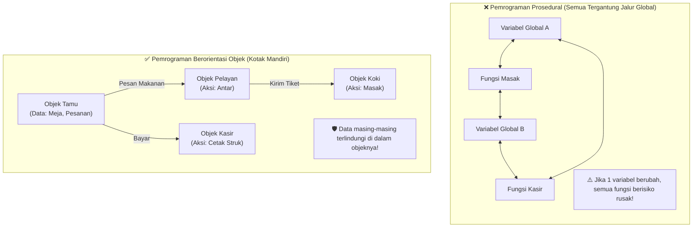

# 🍳 MODUL 0: MENGAPA KITA BUTUH OOP?
> **Tingkat**: Zero Level (Fondasi Mental Model)  
> **Tujuan**: Memahami *alasan* OOP diciptakan, bahaya "kode spageti", serta cara membedah dunia nyata menjadi Atribut & Method tanpa pusing koding dulu.

---

## 1. Cerita Pembuka: Dapur Warung vs Restoran Bintang Lima

Bayangkan Anda membuka sebuah warung makan kecil:
* Di awal, menunya hanya **Nasi Goreng**.
* Anda sendiri yang berbelanja, mencatat pesanan, memasak di wajan, mencuci piring, dan melayani pembayaran di kasir.
* Semuanya berjalan lancar karena alurnya sederhana. Ini adalah gambaran **Pemrograman Prosedural** (langkah demi langkah dari baris 1 sampai baris akhir).

### Masalah Muncul Ketika Bisnis Membesar... 💥
Tiba-tiba warung Anda viral! Pengunjung membludak dari 5 orang menjadi 500 orang per hari. Menunya bertambah: ada Steak, Sushi, Es Kopi, dan Pizza.
* Jika Anda tetap memakai cara lama (satu orang mengerjakan semua hal dari atas ke bawah), apa yang terjadi?
* Wajan gosong, pesanan tertukar, piring kotor menumpuk, dan Anda pingsan karena stres.
* Dalam dunia koding, kondisi kacau ini disebut **"Spaghetti Code"** (kode yang ruwet, variabel saling tabrakan, dan jika diubah sedikit saja, bagian lain langsung rusak).

### Solusi Dunia Nyata: Berorientasi Objek (OOP)! 🏢
Bagaimana restoran bintang lima menangani 500 tamu sekaligus?  
Mereka membagi sistem menjadi **Objek-Objek yang memiliki peran dan tugas mandiri**:
1. **Objek Pelayan**: Tugasnya mencatat pesanan dan mengantar makanan ke meja.
2. **Objek Koki**: Tugasnya memasak bahan makanan di dapur.
3. **Objek Kasir**: Tugasnya menerima pembayaran dan mencetak struk.
4. **Objek Meja/Tamu**: Memiliki data nomor meja, status kursi, dan tagihan.

Ketika tamu memesan, **Pelayan tidak perlu tahu resep bumbu rahasia Koki**. Koki pun **tidak perlu tahu berapa uang kembalian di Kasir**. Masing-masing objek bekerja sama dengan rapi melalui komunikasi yang teratur.

> **Inilah esensi OOP**: Memecah program raksasa yang rumit menjadi kumpulan **objek mandiri** yang saling bekerja sama, persis seperti cara dunia nyata bekerja!

---

## 2. Visualisasi Arsitektur: Prosedural vs OOP



---

## 3. Dua Anatomi Dasar Segala Objek di Alam Semesta

Di dunia nyata, coba lihat benda apa saja di sekitar Anda: Smartphone Anda, Kucing peliharaan, atau Mobil.  
Segala hal di dunia ini selalu memiliki **DUA HAL**:

```text
┌────────────────────────────────────────────────────────┐
│                      SEBUAH OBJEK                      │
├───────────────────────────┬────────────────────────────┤
│   1. CIRI-CIRI / DATA     │   2. PERILAKU / TINDAKAN   │
│       (Kata Benda/Sifat)  │        (Kata Kerja)        │
│   👉 Disebut: ATRIBUT     │    👉 Disebut: METHOD      │
└───────────────────────────┴────────────────────────────┘
```

Mari kita bedah beberapa contoh:

### Contoh A: Kucing 🐱
* **Atribut (Data/Ciri)**:
  * Nama: `"Mimi"`
  * Warna Bulu: `"Oranye"`
  * Energi: `100`
* **Method (Aksi/Perilaku)**:
  * `makan()` $\rightarrow$ Menambah energi.
  * `tidur()` $\rightarrow$ Mengistirahatkan tubuh.
  * `mengeong()` $\rightarrow$ Mengeluarkan suara *"Meoww!"*.

### Contoh B: Rekening Bank 💳
* **Atribut (Data/Ciri)**:
  * Nomor Rekening: `"123-456-789"`
  * Nama Pemilik: `"Budi Santoso"`
  * Saldo: `Rp 5.000.000`
* **Method (Aksi/Perilaku)**:
  * `setor_uang(jumlah)` $\rightarrow$ Saldo bertambah.
  * `tarik_uang(jumlah)` $\rightarrow$ Saldo berkurang (jika cukup).
  * `cek_saldo()` $\rightarrow$ Menampilkan sisa uang.

---

## 4. Perbandingan Head-to-Head: Prosedural vs OOP

| Aspek Perbandingan | Pemrograman Prosedural | Pemrograman Berorientasi Objek (OOP) |
| :--- | :--- | :--- |
| **Fokus Utama** | Langkah-langkah instruksi (*Step 1 $\rightarrow$ Step 2*) | Kumpulan objek mandiri yang saling berkolaborasi |
| **Penyimpanan Data** | Variabel sering berceceran secara global atau dalam list terpisah | Data dibungkus rapi di dalam objek pemiliknya |
| **Keamanan Data** | Rentan diubah atau tertukar secara tidak sengaja oleh baris lain | Aman (terenkapsulasi), hanya bisa diakses lewat jalur resmi |
| **Kemudahan Rawat** | Makin panjang kode, makin rawan jadi "kode spageti" | Sangat rapi, modular, jika 1 objek rusak, yang lain aman |
| **Kapan Digunakan?** | Skrip kecil, otomatisasi sederhana, rumus matematika singkat | Aplikasi nyata, web, game, sistem bisnis, skala menengah-besar |

---

## 5. Studi Kasus Nyata: Mengapa Cara Lama (Prosedural) Berbahaya?

Katakanlah kita ingin membuat game petualangan sederhana yang memiliki beberapa **Pahlawan (Hero)**.

### ❌ Cara Prosedural (Banyak Variabel Terpisah)
```python
# Data pahlawan 1
hero1_nama = "Layla"
hero1_hp = 100
hero1_attack = 20

# Data pahlawan 2
hero2_nama = "Zilong"
hero2_hp = 120
hero2_attack = 25
```
**Mengapa cara ini mimpi buruk?**
1. **Bagaimana jika ada 100 Hero?** Apakah Anda akan membuat `hero1_nama`, `hero2_nama`, sampai `hero100_nama`?
2. **Bagaimana jika pakai List?** `nama = ["Layla", "Zilong"]`, `hp = [100, 120]`. Jika `Layla` gugur dan dihapus dari list `nama`, tetapi lupa dihapus dari list `hp`, maka data `Zilong` akan berantakan tertukar dengan data `Layla`! (Bisa dicoba di file `01_masalah_prosedural.py`).
3. **Data Tidak Aman**: Siapa saja bisa tiba-tiba menulis `hero1_hp = -99999` tanpa aturan.

### ✅ Cara OOP (Membungkus Data & Aksi Menjadi Satu)
```python
class Hero:
    def __init__(self, nama, hp, attack):
        self.nama = nama
        self.hp = hp
        self.attack = attack

    def serang(self, musuh):
        musuh.hp -= self.attack
        print(f"{self.nama} menyerang {musuh.nama}! Sisa HP {musuh.nama}: {musuh.hp}")

# Melahirkan objek dengan mudah dan rapi:
layla = Hero("Layla", 100, 20)
zilong = Hero("Zilong", 120, 25)

layla.serang(zilong)
```
Lihat betapa alaminya kode di atas! Membaca `layla.serang(zilong)` terasa seperti membaca kalimat bahasa manusia: *"Layla menyerang Zilong"*.

---

## 6. Kamus Mini Istilah OOP (Bahasa Manusiawi)

Sebelum melangkah ke Modul 1, simpan 4 istilah sakti ini di kepala Anda:

1. **Class (Kelas)**: **Cetakan / Blueprint**.  
   *Contoh*: Cetakan kue donat, denah rumah, formulir kosong KTP.
2. **Object / Instance (Objek)**: **Benda Nyata Hasil Cetakan**.  
   *Contoh*: Kue donat cokelat yang siap dimakan, rumah fisik nomor 12, KTP asli milik Budi.
3. **Attribute (Atribut)**: **Data / Ciri-Ciri Objek**.  
   *Contoh*: Warna donat, luas tanah rumah, NIK KTP.
4. **Method (Metode)**: **Aksi / Kemampuan Objek**.  
   *Contoh*: Dimakan, dinyalakan lampunya, diperbarui masa berlakunya.

---

## 7. 🎯 Kuis Kilat Cek Pemahaman Mandiri

Coba uji intuisi Anda! Tebaklah sebelum membuka kuncinya:

#### Soal 1:
> Jika kita membuat objek **Sepeda Motor**, manakah di bawah ini yang merupakan **Atribut**?  
> A. Menyalakan mesin  
> B. Menginjak rem  
> C. Kapasitas bensin (liter) & warna bodi  
> D. Membunyikan klakson  

<details>
<summary>👉 Klik untuk melihat Jawaban Soal 1</summary>

**Jawaban: C (Kapasitas bensin & warna bodi)**  
*Penjelasan*: Kapasitas bensin dan warna adalah data/ciri-ciri (kata benda/sifat). Pilihan A, B, dan D adalah kata kerja (Method).
</details>

---

#### Soal 2:
> Dalam analogi kue donat:  
> Apakah adonan cetakan besi disebut **Class** atau **Object**?

<details>
<summary>👉 Klik untuk melihat Jawaban Soal 2</summary>

**Jawaban: Class**  
*Penjelasan*: Cetakan besi adalah *Class* (cetak biru pembuat). Donat matang yang keluar dari cetakan itulah yang disebut *Object*. Dari 1 cetakan besi (*Class*), kita bisa mencetak 1.000 donat (*Object*).
</details>

---

## 8. 🛠️ Berkas Latihan di Modul Ini
Untuk mencoba langsung kodenya, silakan buka file berikut di terminal:
1. `01_masalah_prosedural.py` $\rightarrow$ Melihat langsung bahaya data tercecer.
2. `02_solusi_oop.py` $\rightarrow$ Melihat perbandingan solusi rapi dengan OOP.
3. `03_latihan_mandiri.py` $\rightarrow$ Latihan membedah objek smartphone di tangan Anda!
4. `03_solusi_latihan.py` $\rightarrow$ Kunci jawaban lengkap latihan smartphone.
