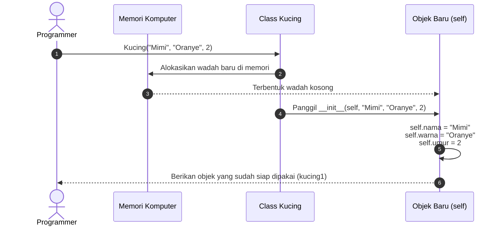

# 🏗️ MODUL 1: MELAHIRKAN OBJEK PERTAMA
> **Tingkat**: Zero Level (Fondasi Sintaks)  
> **Tujuan**: Memahami cara menulis `class`, melahirkan objek (*instansiasi*), membongkar misteri fungsi `__init__` (Constructor), dan memahami siapa sebenarnya `self`.

---

## 1. Cerita Pembuka: Cetakan Wafel & Kue yang Siap Disantap

Bayangkan Anda berada di dapur pembuat kue wafel:
* Di atas meja, ada **satu cetakan besi wafel** dengan motif kotak-kotak.
* Cetakan besi itu sendiri tidak bisa dimakan. Cetakan itu hanyalah **alat / pola / panduan bentuk**.
* Dari satu cetakan besi itu, Anda menuangkan adonan dan memanggangnya:
  * Wafel pertama diberi *topping* cokelat keju.
  * Wafel kedua diberi *topping* stroberi madu.
  * Wafel ketiga diberi *topping* matcha almond.

```text
┌─────────────────────────┐
│  CETAKAN BESI (CLASS)   │ ──(Dituang adonan & dipanggang)──> Lahir 3 Kue Wafel Berbeda (OBJECT)
└─────────────────────────┘                                    1. Wafel Cokelat Keju
                                                               2. Wafel Stroberi Madu
                                                               3. Wafel Matcha Almond
```

Dalam dunia pemrograman:
* **Class** = Cetakan besi wafel (Hanya ada 1 cetak biru di kode program).
* **Object (Instance)** = Kue wafel fisik hasil panggangan (Bisa dibuat puluhan, ratusan, bahkan ribuan objek berbeda di dalam memori komputer).

---

## 2. Sintaks Dasar: Menulis Class Pertama Anda

Mari kita buat cetakan untuk seekor **Kucing**:

```python
class Kucing:
    # 1. Constructor: Momen kelahiran kucing
    def __init__(self, nama: str, warna: str, umur: int):
        self.nama = nama
        self.warna = warna
        self.umur = umur

    # 2. Method: Kemampuan yang dimiliki kucing
    def bersuara(self):
        print(f"{self.nama} bersuara: Meooong~!")

    def perkenalan(self):
        print(f"Halo, namaku {self.nama}, buluku {self.warna}, usiaku {self.umur} tahun.")
```

### Cara Melahirkan Objek (Instansiasi):
Cukup panggil nama kelasnya seperti memanggil fungsi:

```python
# Melahirkan objek kucing pertama
kucing1 = Kucing("Mimi", "Oranye", 2)

# Melahirkan objek kucing kedua
kucing2 = Kucing("Blacky", "Hitam", 3)

# Memanggil kemampuan (Method) masing-masing kucing:
kucing1.bersuara()     # Output: Mimi bersuara: Meooong~!
kucing2.bersuara()     # Output: Blacky bersuara: Meooong~!

kucing1.perkenalan()   # Output: Halo, namaku Mimi, buluku Oranye, usiaku 2 tahun.
kucing2.perkenalan()   # Output: Halo, namaku Blacky, buluku Hitam, usiaku 3 tahun.
```

---

## 3. Membongkar Misteri `__init__` (Constructor)

Apa itu `__init__` dan mengapa ada garis bawah ganda (*double underscore* alias **dunder**)?

1. **Artinya "Initialize" (Inisialisasi / Mempersiapkan)**:
   * Begitu Anda menulis `kucing1 = Kucing("Mimi", "Oranye", 2)`, Python di belakang layar langsung memanggil fungsi `__init__` secara otomatis.
   * `__init__` adalah tempat di mana data bawaan lahir (seperti nama, warna, umur) dipasangkan ke tubuh objek baru tersebut.
2. **Kenapa ada dua garis bawah (`__`) di depan dan belakang?**
   * Di Python, fungsi dengan format `__nama__` disebut **Dunder / Magic Method**.
   * Ini adalah tanda khusus dari Python bahwa fungsi tersebut **memiliki tugas otomatis dari sistem**, bukan fungsi biasa yang dipanggil manual.

---

## 4. Memecahkan Teka-Teki Paling Terkenal di Python: Siapa Itu `self`?

Bagi orang awam yang baru belajar Python, kata `self` sering terasa aneh dan membingungkan:  
*"Kenapa `self` harus selalu ditulis di baris pertama setiap fungsi di dalam class?"*

### Analogi Ruang Kelas 🏫
Bayangkan seorang guru berdiri di depan kelas yang berisi murid bernama **Budi**, **Siti**, dan **Joko**.  
Guru berkata: *"Hai murid-murid, angkat tangan kalian!"*
* Bagaimana Budi tahu bahwa yang harus ia angkat adalah tangannya sendiri (`budi.tangan`), bukan tangan Siti?
* Bagaimana Siti tahu bahwa yang ia gerakkan adalah tangannya sendiri?
* Karena masing-masing individu memiliki kesadaran terhadap **dirinya sendiri** (*self*)!

### Apa yang Terjadi di Balik Layar Python? 🕵️‍♂️
Ketika Anda menulis:
```python
kucing1.bersuara()
```
Secara diam-diam, Python sebenarnya menerjemahkannya menjadi:
```python
Kucing.bersuara(kucing1)   # Python otomatis menyisipkan objek kucing1 ke parameter pertama!
```

Karena Python **selalu menyisipkan objek itu sendiri sebagai argumen pertama**, maka setiap method di dalam class **wajib menyediakan penampung di posisi pertama**. Konvensi baku di dunia Python menamainya: **`self`**.

```text
┌────────────────────────────────────────────────────────┐
│  self = "Objek mana yang saat ini sedang diproses"     │
├────────────────────────────────────────────────────────┤
│  Saat dipanggil oleh kucing1 -> self adalah kucing1    │
│  Saat dipanggil oleh kucing2 -> self adalah kucing2    │
└────────────────────────────────────────────────────────┘
```

---

## 5. Visualisasi Alur Instansiasi Objek (Mermaid)



---

## 6. ⚠️ Awas 3 Jebakan Klasik Pemula!

Hampir 90% pemula mengalami setidaknya satu dari tiga error berikut:

### ❌ Jebakan 1: Typo Satu Underscore pada `_init_`
* **Kesalahan**: Menulis `def _init_(self):` (hanya satu garis bawah).
* **Akibat**: Python menganggap itu fungsi biasa, bukan constructor. Akibatnya, saat Anda membuat objek, atribut `nama` tidak pernah dipasang dan memicu error `AttributeError: 'Kucing' object has no attribute 'nama'`.
* **Solusi**: Pastikan ada **dua** underscore di kiri dan kanan: `def __init__(self):`.

### ❌ Jebakan 2: Lupa Menulis `self` pada Method
* **Kesalahan**:
  ```python
  def bersuara():    # LUPA SELF!
      print("Meong")
  ```
* **Akibat**: Memicu error legendaris:  
  `TypeError: bersuara() takes 0 positional arguments but 1 was given`
* **Solusi**: Setiap fungsi di dalam class wajib punya `self` sebagai parameter pertama: `def bersuara(self):`.

### ❌ Jebakan 3: Lupa Tanda Kurung `()` Saat Memanggil Method
* **Kesalahan**: Menulis `kucing1.bersuara` tanpa tanda kurung `()`.
* **Akibat**: Kucing tidak bersuara, melainkan muncul teks aneh di terminal:  
  `<bound method Kucing.bersuara of <__main__.Kucing object at 0x...>>`
* **Solusi**: Method adalah aksi (kata kerja), jadi wajib diakhiri tanda kurung untuk menjalankannya: `kucing1.bersuara()`.

---

## 7. 🎯 Kuis Kilat Cek Pemahaman Mandiri

#### Soal 1:
> Perhatikan baris kode ini:
> ```python
> class Mobil:
>     def klakson(self):
>         print("Tiiiin!")
>
> sedan = Mobil()
> sedan.klakson()
> ```
> Saat `sedan.klakson()` dieksekusi, parameter `self` berisi apa?

<details>
<summary>👉 Klik untuk melihat Jawaban Soal 1</summary>

**Jawaban: Objek `sedan` itu sendiri.**  
*Penjelasan*: Python secara otomatis menyisipkan objek yang sedang memanggil (`sedan`) ke dalam parameter `self`.
</details>

---

#### Soal 2:
> Apa akibatnya jika Anda lupa menulis `self.` di depan nama variabel di dalam `__init__`, contoh:
> ```python
> def __init__(self, nama):
>     nama = nama  # Bukan self.nama = nama
> ```

<details>
<summary>👉 Klik untuk melihat Jawaban Soal 2</summary>

**Jawaban: Variabel `nama` akan langsung hilang dari ingatan objek begitu `__init__` selesai!**  
*Penjelasan*: Tanpa awalan `self.`, variabel tersebut hanya dianggap variabel lokal sementara di dalam fungsi. Agar data itu menempel permanen di tubuh objek, wajib ditulis `self.nama = nama`.
</details>

---

## 8. 🛠️ Berkas Latihan di Modul Ini
Silakan buka dan jalankan file berikut untuk bereksperimen langsung:
1. `01_dasar_class_object.py` $\rightarrow$ Praktik membuat class, atribut, dan method pertama.
2. `02_jebakan_pemula.py` $\rightarrow$ Melihat langsung 3 error pemula dan cara memperbaikinya.
3. `03_latihan_mandiri.py` $\rightarrow$ Latihan membuat class `Kucing` dan menu `Kopi`.
4. `03_solusi_latihan.py` $\rightarrow$ Kunci jawaban lengkap latihan.
