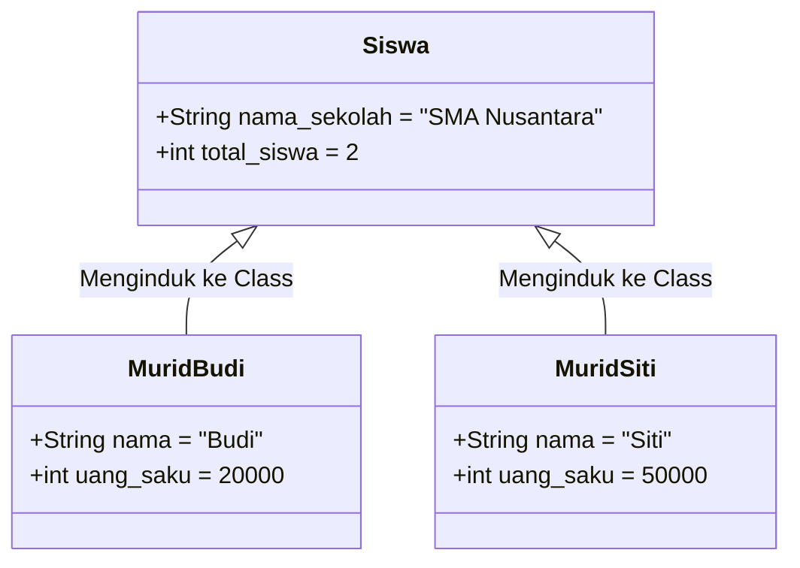

# 🏷️ MODUL 2: VARIABEL MILIK SIAPA?
> **Tingkat**: Zero Level (Fondasi Arsitektur Data)  
> **Tujuan**: Memahami perbedaan mutlak antara **Instance Attribute** (milik pribadi objek) dan **Class Attribute** (milik bersama seluruh cetakan), serta mewaspadai jebakan fatal "kebocoran data antarpengguna".

---

## 1. Cerita Pembuka: Warna Baju Pribadi vs Nama Sekolah

Bayangkan sebuah sekolah bernama **"SMA Nusantara"**:
* Setiap siswa yang bersekolah di sana memiliki hal-hal pribadi:
  * Budi memakai sepatu ukuran 42 dan membawa uang saku Rp 20.000.
  * Siti memakai sepatu ukuran 37 dan membawa uang saku Rp 50.000.
  * Uang saku dan ukuran sepatu adalah **Milik Pribadi (Instance Attribute)**. Jika Budi membelanjakan uangnya, uang saku Siti tidak akan berkurang!
* Namun, ada satu hal yang berlaku sama untuk semua siswa:
  * Nama sekolah mereka adalah **"SMA Nusantara"**.
  * Alamat sekolah dan kepala sekolahnya sama persis untuk semua murid.
  * Nama sekolah adalah **Milik Bersama (Class Attribute)**.

```text
┌────────────────────────────────────────────────────────┐
│             CLASS ATTRIBUTE (Milik Bersama)            │
│             Nama Sekolah: "SMA Nusantara"              │
└────────────────────────────────────────────────────────┘
          ▲                                    ▲
          │                                    │
┌───────────────────────┐            ┌───────────────────────┐
│   OBJEK SISWA 1       │            │   OBJEK SISWA 2       │
│ (Instance Attribute)  │            │ (Instance Attribute)  │
│ Nama: "Budi"          │            │ Nama: "Siti"          │
│ Uang Saku: Rp 20.000  │            │ Uang Saku: Rp 50.000  │
└───────────────────────┘            └───────────────────────┘
```

---

## 2. Perbedaan Cara Menulis di Kode Python

Perhatikan di mana variabel tersebut diletakkan:

```python
class Siswa:
    # 1. CLASS ATTRIBUTE: Ditulis langsung di dalam class (di luar fungsi)
    nama_sekolah = "SMA Nusantara"
    total_siswa = 0  # Bisa dipakai untuk menghitung berapa murid yang sudah terdaftar!

    def __init__(self, nama: str, uang_saku: int):
        # 2. INSTANCE ATTRIBUTE: Ditulis di dalam __init__ dengan awalan self.
        self.nama = nama
        self.uang_saku = uang_saku
        
        # Setiap kali siswa baru lahir, tambah penghitung siswa sekolah:
        Siswa.total_siswa += 1
```

### Cara Mengaksesnya:
```python
# Melahirkan murid
murid1 = Siswa("Budi", 20_000)
murid2 = Siswa("Siti", 50_000)

# Mengakses Instance Attribute (harus lewat nama objek):
print(murid1.nama)       # Output: Budi
print(murid2.nama)       # Output: Siti

# Mengakses Class Attribute (Direkomendasikan langsung lewat Nama Class):
print(Siswa.nama_sekolah)  # Output: SMA Nusantara
print(Siswa.total_siswa)   # Output: 2 (Otomatis terhitung ada 2 murid!)
```

---

## 3. Tabel Perbandingan Cepat

| Pembeda | Instance Attribute (`self.variabel`) | Class Attribute (`Class.variabel`) |
| :--- | :--- | :--- |
| **Lokasi Penulisan** | Di dalam `__init__()` (atau method) | Langsung di tubuh `class` (di luar method) |
| **Kepemilikan** | Milik spesifik satu objek individu | Milik bersama seluruh objek dari class tersebut |
| **Nilai di Memori** | Unik / berbeda untuk setiap objek | Mengarah ke satu nilai yang sama di memori |
| **Cara Akses Terbaik** | `nama_objek.variabel` | `NamaClass.variabel` |
| **Kegunaan Populer** | Nama, saldo, umur, koordinat, password | Menghitung total objek, nilai konstanta (PI, PPN, UMR, Nama Bank) |

---

## 4. ⚠️ JEBAKAN MAUT PEMULA: Bencana Kebocoran Data (Shared Mutable Leak)

Ini adalah salah satu bug paling berbahaya di Python yang sering membuat pemula frustrasi berhari-hari!

### Skenario Nyata: Keranjang Belanja Toko Online 🛒
Bayangkan kita membuat aplikasi belanja e-commerce:

```python
# ❌ KESALAHAN FATAL: Menaruh List di Class Level!
class AkunBelanjaSalah:
    keranjang = []  # <--- BAHAYA! Ini adalah CLASS ATTRIBUTE bertipe List!

    def __init__(self, nama_user: str):
        self.nama_user = nama_user

    def tambah_barang(self, barang: str):
        self.keranjang.append(barang)
```

**Lihat malapetaka yang terjadi saat dijalankan:**
```python
user_anton = AkunBelanjaSalah("Anton")
user_budi = AkunBelanjaSalah("Budi")

# Anton memasukkan Laptop ke keranjang belanjanya:
user_anton.tambah_barang("Laptop Gaming")

# Cek keranjang belanja milik Budi:
print(user_budi.keranjang)  
# Output: ['Laptop Gaming']  <--- BENCANA! Budi bisa melihat belanjaan Anton!
```
*Mengapa ini terjadi?*  
Karena `keranjang` adalah **Class Attribute**, wadah list tersebut hanya ada **SATU** di memori komputer dan dipakai bersama oleh semua pengguna!

### ✅ Solusi yang Benar:
Jika data harus bersifat pribadi untuk setiap user, **selalu deklarasikan di dalam `__init__` dengan `self.`**:

```python
class AkunBelanjaBenar:
    def __init__(self, nama_user: str):
        self.nama_user = nama_user
        self.keranjang = []  # ✅ AMAN: Setiap user mendapat list keranjang baru miliknya sendiri!

    def tambah_barang(self, barang: str):
        self.keranjang.append(barang)
```

---

## 5. Visualisasi Alur Memori (Mermaid)



---

## 6. Apa yang Terjadi Jika Kita Menimpa Class Attribute dari Objek?

Ini juga salah satu keunikan Python yang wajib Anda ketahui:

```python
class Mobil:
    roda = 4  # Class attribute

m1 = Mobil()
m2 = Mobil()

# Jika kita menimpa lewat objek m1:
m1.roda = 3  # (Misal: bemo roda 3)

print(m1.roda)     # Output: 3 (Hanya m1 yang berubah, membuat instance attribute bayangan)
print(m2.roda)     # Output: 4 (m2 tetap aman menggunakan nilai bawaan class)
print(Mobil.roda)  # Output: 4 (Nilai cetakan aslinya tidak rusak)
```

---

## 7. 🎯 Kuis Kilat Cek Pemahaman Mandiri

#### Soal 1:
> Kita ingin membuat aplikasi perbankan. Ada dua variabel: `suku_bunga_tahunan = 0.05` dan `saldo = 500000`.  
> Manakah yang sebaiknya dijadikan **Class Attribute**, dan mana yang **Instance Attribute**?

<details>
<summary>👉 Klik untuk melihat Jawaban Soal 1</summary>

**Jawaban:**  
* `suku_bunga_tahunan` $\rightarrow$ **Class Attribute** (karena bunga standar bank berlaku sama untuk seluruh nasabah).  
* `saldo` $\rightarrow$ **Instance Attribute** (karena saldo adalah rahasia pribadi masing-masing nasabah yang berbeda-beda).
</details>

---

#### Soal 2:
> Kapan kita boleh meletakkan tipe data `list` atau `dict` langsung di badan class (Class Attribute)?  
> A. Kapan saja, tidak ada bedanya.  
> B. Hanya jika list tersebut memang ditujukan untuk dipakai bersama (misal: daftar cabang resmi kantor).  
> C. Tidak pernah boleh sama sekali.  

<details>
<summary>👉 Klik untuk melihat Jawaban Soal 2</summary>

**Jawaban: B**  
*Penjelasan*: Boleh jika datanya memang bersifat global/kolektif untuk semua objek (seperti daftar cabang kantor atau daftar server pusat). Namun jika datanya milik pribadi objek (seperti riwayat transaksi, barang belanjaan, atau inventaris), wajib ditaruh di dalam `__init__`.
</details>

---

## 8. 🛠️ Berkas Latihan di Modul Ini
Silakan buka dan jalankan file berikut di terminal:
1. `01_instance_vs_class_attr.py` $\rightarrow$ Praktik menghitung total objek otomatis dengan Class Attribute.
2. `02_jebakan_kebocoran_data.py` $\rightarrow$ Demonstrasi nyata kebocoran data keranjang belanja dan solusinya.
3. `03_latihan_mandiri.py` $\rightarrow$ Tantangan membuat sistem Manajemen Karyawan Perusahaan.
4. `03_solusi_latihan.py` $\rightarrow$ Kunci jawaban lengkap latihan.
