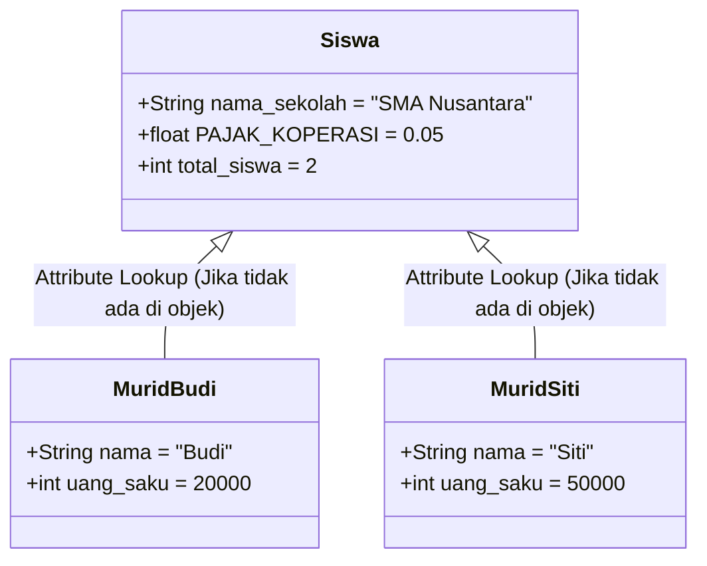

# 🏷️ MODUL 2: VARIABEL MILIK SIAPA?
> **Tingkat**: Zero Level (Fondasi Arsitektur Data)  
> **Tujuan**: Memahami perbedaan mutlak antara **Instance Attribute** (milik pribadi objek) dan **Class Attribute** (milik bersama seluruh cetakan), membongkar misteri pencarian atribut dengan `__dict__`, menghindari jebakan "Shadowing", serta mencegah kebocoran data antarpengguna.

---

## 1. Cerita Pembuka: Warna Baju Pribadi vs Nama Sekolah

Bayangkan sebuah sekolah bernama **"SMA Nusantara"**:
* Setiap siswa yang bersekolah di sana memiliki hal-hal pribadi:
  * Budi memakai sepatu ukuran 42 dan membawa uang saku Rp 20.000.
  * Siti memakai sepatu ukuran 37 dan membawa uang saku Rp 50.000.
  * Uang saku dan ukuran sepatu adalah **Milik Pribadi (Instance Attribute)**. Jika Budi membelanjakan uangnya, uang saku Siti tidak akan berkurang!
* Namun, ada satu hal yang berlaku sama untuk semua siswa:
  * Nama sekolah mereka adalah **"SMA Nusantara"**.
  * Alamat sekolah dan kepala sekolahnya sama persis untuk semua murid.
  * Nama sekolah adalah **Milik Bersama (Class Attribute)**.

```text
┌────────────────────────────────────────────────────────┐
│             CLASS ATTRIBUTE (Milik Bersama)            │
│             Nama Sekolah: "SMA Nusantara"              │
└────────────────────────────────────────────────────────┘
          ▲                                    ▲
          │                                    │
┌───────────────────────┐            ┌───────────────────────┐
│   OBJEK SISWA 1       │            │   OBJEK SISWA 2       │
│ (Instance Attribute)  │            │ (Instance Attribute)  │
│ Nama: "Budi"          │            │ Nama: "Siti"          │
│ Uang Saku: Rp 20.000  │            │ Uang Saku: Rp 50.000  │
└───────────────────────┘            └───────────────────────┘
```

---

## 2. Perbedaan Cara Menulis di Kode Python

Perhatikan di mana variabel tersebut diletakkan:

```python
class Siswa:
    # 1. CLASS ATTRIBUTE: Ditulis langsung di dalam class (di luar fungsi)
    nama_sekolah = "SMA Nusantara"
    PAJAK_KOPERASI = 0.05  # Konvensi HURUF BESAR untuk konstanta yang bernilai tetap!
    total_siswa = 0        # Bisa dipakai untuk menghitung total murid yang sudah terdaftar!

    def __init__(self, nama: str, uang_saku: int):
        # 2. INSTANCE ATTRIBUTE: Ditulis di dalam __init__ dengan awalan self.
        self.nama = nama
        self.uang_saku = uang_saku
        
        # Setiap kali siswa baru lahir, tambah penghitung siswa sekolah:
        Siswa.total_siswa += 1
```

### Cara Mengaksesnya:
```python
# Melahirkan murid
murid1 = Siswa("Budi", 20_000)
murid2 = Siswa("Siti", 50_000)

# Mengakses Instance Attribute (harus lewat nama objek):
print(murid1.nama)       # Output: Budi
print(murid2.nama)       # Output: Siti

# Mengakses Class Attribute (Direkomendasikan langsung lewat Nama Class):
print(Siswa.nama_sekolah)  # Output: SMA Nusantara
print(Siswa.total_siswa)   # Output: 2 (Otomatis terhitung ada 2 murid!)
```

---

## 3. Melihat "Isi Kantong" Objek dengan `__dict__` 🎒

Bagaimana cara Python tahu variabel mana yang milik objek dan mana yang milik kelas?  
Python menyimpannya dalam kamus tersembunyi bernama `__dict__`:

```python
print(murid1.__dict__)
# Output: {'nama': 'Budi', 'uang_saku': 20000}
```

Perhatikan! Di dalam `murid1.__dict__`, **TIDAK ADA** variabel `nama_sekolah`.  
*Lalu kenapa `murid1.nama_sekolah` bisa dicetak?*  
Inilah cara kerja **Hierarki Pencarian Python (Attribute Lookup)**:
1. Python memeriksa kantong pribadi objek (`murid1.__dict__`). Jika ketemu, pakai itu!
2. Jika tidak ada di kantong pribadi, Python naik ke atas mencari di lemari kelas (`Siswa.__dict__`).
3. Jika di lemari kelas juga tidak ada, barulah Python memunculkan pesan error `AttributeError`.

---

## 4. ⚠️ Awas Jebakan "Shadowing" (Menimpa Variabel Tanpa Sengaja)

Apa yang terjadi jika Anda ingin mengubah nama sekolah, tetapi salah menulis `self` alih-alih `Siswa`?

```python
# ❌ KESALAHAN UMUM:
murid1.nama_sekolah = "SMA Bintang Jaya"

print(murid1.nama_sekolah)  # Output: SMA Bintang Jaya
print(murid2.nama_sekolah)  # Output: SMA Nusantara (Loh, murid 2 kok tidak ikut berubah?)
print(Siswa.nama_sekolah)   # Output: SMA Nusantara (Sekolah aslinya juga tidak berubah!)
```

**Mengapa ini terjadi?**  
Karena perintah `murid1.nama_sekolah = ...` tidak mengubah nilai di Class, melainkan membuat variabel baru di kantong pribadi `murid1` yang "membayangi" (*shadowing*) variabel aslinya!

> **Aturan Emas**:  
> Jika Anda bermaksud mengubah Class Attribute untuk **seluruh objek**, selalu panggil nama kelasnya langsung:  
> `Siswa.nama_sekolah = "SMA Bintang Jaya"` ✅

---

## 5. ⚠️ BENCANA BESAR: Kebocoran Data (Shared Mutable Leak)

Ini adalah salah satu bug paling berbahaya di Python yang sering membuat pemula frustrasi berhari-hari!

### Skenario Nyata: Keranjang Belanja Toko Online 🛒
Bayangkan kita membuat aplikasi belanja e-commerce:

```python
# ❌ KESALAHAN FATAL: Menaruh List di Class Level!
class AkunBelanjaSalah:
    keranjang = []  # <--- BAHAYA! Ini adalah CLASS ATTRIBUTE bertipe List!

    def __init__(self, nama_user: str):
        self.nama_user = nama_user

    def tambah_barang(self, barang: str):
        self.keranjang.append(barang)
```

**Lihat malapetaka yang terjadi saat dijalankan:**
```python
user_anton = AkunBelanjaSalah("Anton")
user_budi = AkunBelanjaSalah("Budi")

# Anton memasukkan Laptop ke keranjang belanjanya:
user_anton.tambah_barang("Laptop Gaming")

# Cek keranjang belanja milik Budi:
print(user_budi.keranjang)  
# Output: ['Laptop Gaming']  <--- BENCANA! Budi bisa melihat belanjaan Anton!
```
*Mengapa ini terjadi?*  
Karena `keranjang` adalah **Class Attribute**, wadah list tersebut hanya ada **SATU** di memori komputer dan dipakai bersama oleh semua pengguna!

### ✅ Solusi yang Benar:
Jika data harus bersifat pribadi untuk setiap user, **selalu deklarasikan di dalam `__init__` dengan `self.`**:

```python
class AkunBelanjaBenar:
    def __init__(self, nama_user: str):
        self.nama_user = nama_user
        self.keranjang = []  # ✅ AMAN: Setiap user mendapat list keranjang baru miliknya sendiri!

    def tambah_barang(self, barang: str):
        self.keranjang.append(barang)
```

---

## 6. Tabel Perbandingan Cepat

| Pembeda | Instance Attribute (`self.variabel`) | Class Attribute (`Class.variabel`) |
| :--- | :--- | :--- |
| **Lokasi Penulisan** | Di dalam `__init__()` (atau method) | Langsung di tubuh `class` (di luar method) |
| **Kepemilikan** | Milik spesifik satu objek individu | Milik bersama seluruh objek dari class tersebut |
| **Penyimpanan** | Masuk ke `objek.__dict__` | Masuk ke `Class.__dict__` |
| **Cara Ubah Data** | `nama_objek.variabel = ...` | `NamaClass.variabel = ...` |
| **Konvensi Nama** | Huruf kecil (`self.saldo`) | Huruf besar jika konstan (`Class.PAJAK`) |
| **Kegunaan Populer** | Nama, saldo, umur, koordinat, password | Menghitung total objek, nilai konstanta (PPN, UMR, Server IP) |

---

## 7. Visualisasi Alur Memori (Mermaid)



---

## 8. 🎯 Kuis Kilat Cek Pemahaman Mandiri

#### Soal 1:
> Kita ingin membuat aplikasi perbankan. Ada dua variabel: `SUKU_BUNGA_TAHUNAN = 0.05` dan `saldo = 500000`.  
> Manakah yang sebaiknya dijadikan **Class Attribute**, dan mana yang **Instance Attribute**?

<details>
<summary>👉 Klik untuk melihat Jawaban Soal 1</summary>

**Jawaban:**  
* `SUKU_BUNGA_TAHUNAN` $\rightarrow$ **Class Attribute** (karena bunga standar bank berlaku sama untuk seluruh nasabah, dan ditulis huruf besar karena konstan).  
* `saldo` $\rightarrow$ **Instance Attribute** (karena saldo adalah rahasia pribadi masing-masing nasabah yang berbeda-beda).
</details>

---

#### Soal 2:
> Jika kita mengeksekusi `print(objek.__dict__)`, apakah Class Attribute akan muncul di dalam kamus tersebut?

<details>
<summary>👉 Klik untuk melihat Jawaban Soal 2</summary>

**Jawaban: Tidak!**  
*Penjelasan*: `objek.__dict__` hanya berisi variabel-variabel pribadi (Instance Attributes) yang menempel langsung pada objek tersebut. Class Attribute tersimpan terpisah di `NamaClass.__dict__`.
</details>

---

## 9. 🛠️ Berkas Latihan di Modul Ini
Silakan buka dan jalankan file berikut di terminal:
1. `01_instance_vs_class_attr.py` $\rightarrow$ Praktik menghitung objek, bedah `__dict__`, dan bedah jebakan "Shadowing".
2. `02_jebakan_kebocoran_data.py` $\rightarrow$ Demonstrasi nyata kebocoran keranjang belanja dan solusinya.
3. `03_latihan_mandiri.py` $\rightarrow$ Tantangan membuat sistem Manajemen Karyawan Perusahaan.
4. `03_solusi_latihan.py` $\rightarrow$ Kunci jawaban lengkap latihan.
