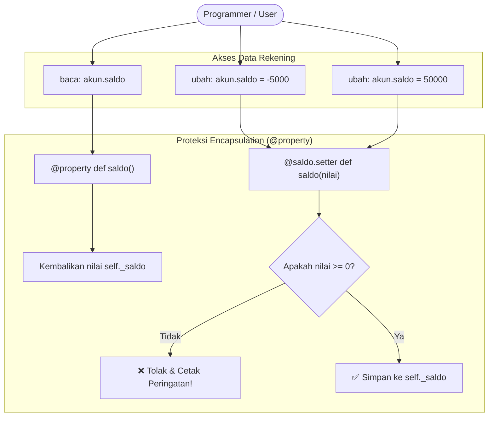

# 🛡️ MODUL 3: PILAR 1 – ENCAPSULATION & GAYA ELEGAN `@property`
> **Tingkat**: Core Level (4 Pilar Utama OOP)  
> **Tujuan**: Memahami esensi **Encapsulation** (pembungkusan data), mengenal 3 tingkatan akses di Python (*Public*, *Protected*, *Private*), membongkar rahasia *Name Mangling*, dan menguasai cara elegan Pythonic mengontrol data menggunakan decorator `@property`.

---

## 1. Cerita Pembuka: Kap Mesin Mobil & Saklar Lampu

Bayangkan Anda sedang mengendarai sebuah mobil:
* Di hadapan Anda, ada **pedal gas**, **pedal rem**, dan **setir kemudi**.
* Anda **tidak perlu** (dan tidak boleh!) membuka kap mesin lalu menarik kabel busi atau menyemprotkan bensin manual ke ruang bakar mesin hanya untuk mempercepat mobil.
* Mesin mobil, piston, oli, dan komponen kelistrikan dibungkus rapi di balik kap mesin yang terkunci rapat.

```text
┌─────────────────────────────────────────────────────────────────┐
│                    KAP MESIN TERKUNCI (ENCAPSULATION)           │
│  [Ruang Bakar] [Kabel Busi] [Injeksi Bensin] [Piston Silinder]  │
└─────────────────────────────────────────────────────────────────┘
                                ▲
              (Hanya boleh diakses lewat perantara aman)
                                │
               ┌────────────────┴────────────────┐
               │    PEDAL GAS (INTERFACE RESMI)  │
               └─────────────────────────────────┘
```

Dalam dunia pemrograman:
* Menyembunyikan kerumitan dan melindungi data rahasia di dalam tubuh objek disebut **Encapsulation** (Pembungkusan).
* Tujuannya ada dua:
  1. **Keamanan Data**: Mencegah data vital diubah sembarangan dari luar (misal: saldo rekening diubah jadi minus).
  2. **Kemudahan Penggunaan**: Pengguna objek cukup berinteraksi dengan tombol-tombol resmi tanpa pusing logika di dalamnya.

---

## 2. Tiga Tingkat Akses Data di Python

Berbeda dengan bahasa seperti Java atau C++ yang memiliki kata kunci kaku `public`, `protected`, dan `private`, Python menggunakan **konvensi garis bawah (underscore)**:

| Jenis Hak Akses | Contoh Sintaks | Arti & Filosofi Dunia Nyata |
| :--- | :--- | :--- |
| **Public** | `self.nama` | **Bebas Diakses**: Siapa saja boleh melihat dan mengubah dari luar. |
| **Protected** | `self._saldo` | **Peringatan Sopan Santun (1 Underscore)**: *"Tolong jangan utak-atik dari luar kecuali Anda adalah bagian dari keluarga (class turunan)!"*. |
| **Private** | `self.__pin` | **Sangat Rahasia (2 Underscore)**: Python mengunci namanya menggunakan mekanisme *Name Mangling* agar tidak bisa diakses langsung dari luar. |

### Contoh Kode:
```python
class Rekening:
    def __init__(self, nama: str, saldo: int, pin: str):
        self.nama = nama       # Public: Boleh dilihat siapa saja
        self._saldo = saldo    # Protected: Sebaiknya jangan diubah langsung
        self.__pin = pin       # Private: Rahasia mutlak!
```

---

## 3. Membongkar Rahasia *Name Mangling* di Python 🕵️‍♂️

Jika Anda mencoba mengakses atribut private:
```python
akun = Rekening("Budi", 1_000_000, "1234")
print(akun.__pin)
# 💥 ERROR: AttributeError: 'Rekening' object has no attribute '__pin'
```
*Apakah Python benar-benar menghapus atau mengunci rapat `__pin`?*  
Ternyata tidak! Python menganut filosofi terkenal:  
> *"We are all consenting adults here"* (Kita semua orang dewasa yang bertanggung jawab).

Python hanya **mengubah nama variabelnya di balik layar** menjadi:  
`_NamaClass__namaVariabel` (disebut **Name Mangling**).

Jika Anda penasaran, Anda masih bisa mengintipnya lewat:
```python
print(akun._Rekening__pin)  # Output: 1234 (Ternyata ada di sini!)
```
Tujuan *Name Mangling* bukan untuk enkripsi militer anti-hacker, melainkan **mencegah tabrakan nama** (*name collision*) dan memberi sinyal keras kepada sesama programmer bahwa atribut tersebut tidak boleh disentuh sembarangan.

---

## 4. Cara Kuno vs Gaya Elegan Python (`@property`)

### ❌ Cara Kuno Ala Bahasa Java (Kaku & Banyak Kode)
Di masa lalu, orang membuat fungsi pembuka (`getter`) dan pengubah (`setter`) secara manual:
```python
class AkunKuno:
    def __init__(self, saldo):
        self._saldo = saldo

    def get_saldo(self):          # Getter kaku
        return self._saldo

    def set_saldo(self, nilai):   # Setter kaku
        if nilai >= 0:
            self._saldo = nilai
        else:
            print("Saldo tidak boleh minus!")
```
Pengguna harus mengetik: `akun.set_saldo(500000)` dan `print(akun.get_saldo())`. Terasa kaku dan tidak alami di Python!

---

### ✅ Gaya Elegan Pythonic: Menggunakan Decorator `@property`
Python memiliki fitur sakti: kita bisa mengakses method seolah-olah dia adalah variabel biasa!

```python
class RekeningModern:
    def __init__(self, pemilik: str, saldo_awal: int):
        self.pemilik = pemilik
        self._saldo = saldo_awal  # Protected

    # 1. GETTER ELEGAN (@property): Membaca data
    @property
    def saldo(self):
        """Membaca saldo seperti variabel biasa: akun.saldo"""
        return self._saldo

    # 2. SETTER ELEGAN (@saldo.setter): Mengubah data dengan validasi ketat
    @saldo.setter
    def saldo(self, nilai_baru: int):
        """Dipanggil otomatis saat seseorang menulis: akun.saldo = nilai_baru"""
        if nilai_baru < 0:
            print("❌ GAGAL: Saldo tidak boleh bernilai negatif!")
        else:
            self._saldo = nilai_baru
            print(f"✅ Saldo berhasil diupdate menjadi: Rp {self._saldo:,}")
```

### Keajaiban Saat Dijalankan:
```python
budi = RekeningModern("Budi", 100_000)

# Membaca saldo (terasa seperti membaca variabel biasa!):
print(budi.saldo)  # Output: 100000

# Mencoba mengisi saldo ilegal (minus):
budi.saldo = -50000  # Otomatis ditolak oleh setter! Output: ❌ GAGAL: Saldo tidak boleh bernilai negatif!

# Mengisi saldo yang valid:
budi.saldo = 250000  # Output: ✅ Saldo berhasil diupdate menjadi: Rp 250,000
```
Sintaksnya bersih seperti variabel biasa (`budi.saldo`), tetapi **keamanannya terjamin 100% oleh fungsi setter di balik layar!**

---

## 5. Properti Hanya-Baca (Read-Only Property)

Bagaimana jika kita ingin membuat data yang **hanya bisa dibaca tetapi tidak boleh diubah selamanya oleh siapa pun**?  
Cukup pasang `@property` **tanpa membuat setter-nya**!

```python
class User:
    def __init__(self, nik: str, nama: str):
        self._nik = nik
        self.nama = nama

    @property
    def nik(self):
        return self._nik  # Hanya ada getter!

u = User("3201019901010001", "Budi")
print(u.nik)     # Output: 3201019901010001 (Bisa dibaca)
u.nik = "123"    # 💥 ERROR: AttributeError: can't set attribute 'nik' (Dilarang diubah!)
```

---

## 6. ⚠️ JEBAKAN MAUT PEMULA: Bencana `RecursionError`

Salah satu error yang paling sering membuat pemula pusing saat belajar `@property` adalah:  
`RecursionError: maximum recursion depth exceeded`.

### Penyebab Terjadinya:
```python
class SalahTotal:
    def __init__(self, saldo):
        self.saldo = saldo

    @property
    def saldo(self):
        return self.saldo  # 💥 SALAH: Memanggil getter dirinya sendiri tanpa henti!

    @saldo.setter
    def saldo(self, nilai):
        self.saldo = nilai  # 💥 SALAH BESAR: Memanggil setter dirinya sendiri berputar-putar!
```

### ✅ Cara Menghindarinya:
Variabel penyimpan data asli **harus memiliki nama yang berbeda** (biasanya diawali satu underscore, misal `_saldo`):

```python
@property
def saldo(self):
    return self._saldo  # ✅ BENAR: Mengambil dari _saldo

@saldo.setter
def saldo(self, nilai):
    self._saldo = nilai  # ✅ BENAR: Menyimpan ke _saldo
```

---

## 7. Diagram Alur Kerja `@property` (Mermaid)



---

## 8. 🎯 Kuis Kilat Cek Pemahaman Mandiri

#### Soal 1:
> Manakah penulisan atribut di bawah ini yang memicu mekanisme *Name Mangling* di Python?  
> A. `self.rahasia`  
> B. `self._rahasia`  
> C. `self.__rahasia`  
> D. `self.__rahasia__`  

<details>
<summary>👉 Klik untuk melihat Jawaban Soal 1</summary>

**Jawaban: C (`self.__rahasia`)**  
*Penjelasan*: Dua garis bawah di awal tanpa garis bawah di akhir memicu Name Mangling menjadi `_NamaClass__rahasia`. Jika ada dua garis bawah di depan dan belakang (D), itu adalah Magic/Dunder method bawaan Python.
</details>

---

#### Soal 2:
> Bagaimana cara membuat sebuah atribut menjadi **Read-Only** (hanya bisa dibaca dan tidak bisa diubah nilainya)?  
> A. Pasang decorator `@property` tanpa membuat decorator `@nama.setter`.  
> B. Menggunakan kata kunci `const`.  
> C. Menulis nama atribut dengan huruf kapital.  

<details>
<summary>👉 Klik untuk melihat Jawaban Soal 2</summary>

**Jawaban: A**  
*Penjelasan*: Cukup pasang `@property` untuk fungsi getternya saja. Jika ada yang mencoba mengubah nilainya (`objek.atribut = ...`), Python otomatis menolak dengan error `AttributeError: can't set attribute`.
</details>

---

## 9. 🛠️ Berkas Latihan di Modul Ini
Silakan buka dan jalankan file berikut di terminal:
1. `01_dasar_encapsulation.py` $\rightarrow$ Praktik Public, Protected, Private, dan pembuktian Name Mangling.
2. `02_property_decorator.py` $\rightarrow$ Praktik modern `@property`, setter validasi, read-only property, dan simulasi RecursionError.
3. `03_latihan_mandiri.py` $\rightarrow$ Tantangan membuat sistem Dompet Digital (E-Wallet) aman.
4. `03_solusi_latihan.py` $\rightarrow$ Kunci jawaban lengkap latihan.
