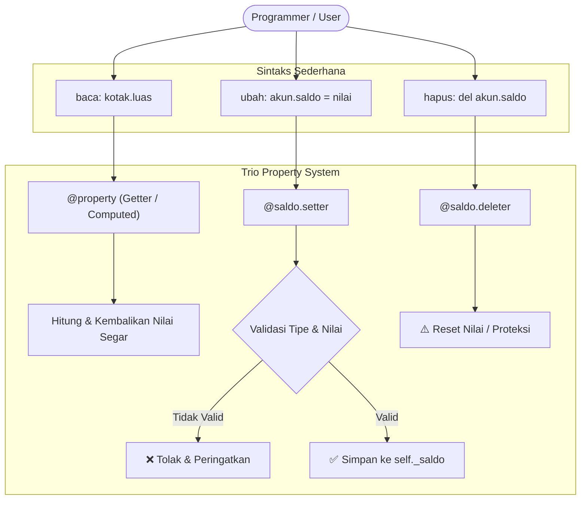

# 🛡️ MODUL 3: PILAR 1 – ENCAPSULATION & GAYA ELEGAN `@property`
> **Tingkat**: Core Level (4 Pilar Utama OOP)  
> **Tujuan**: Memahami esensi **Encapsulation** (pembungkusan data), mengenal 3 tingkatan akses di Python (*Public*, *Protected*, *Private*), membongkar rahasia *Name Mangling*, menguasai trio lengkap `@property` (*Getter*, *Setter*, *Deleter*), serta memanfaatkan *Computed Property* untuk mencegah data basi.

---

## 1. Cerita Pembuka: Kap Mesin Mobil & Saklar Lampu

Bayangkan Anda sedang mengendarai sebuah mobil:
* Di hadapan Anda, ada **pedal gas**, **pedal rem**, dan **setir kemudi**.
* Anda **tidak perlu** (dan tidak boleh!) membuka kap mesin lalu menarik kabel busi atau menyemprotkan bensin manual ke ruang bakar mesin hanya untuk mempercepat mobil.
* Mesin mobil, piston, oli, dan komponen kelistrikan dibungkus rapi di balik kap mesin yang terkunci rapat.

```text
┌─────────────────────────────────────────────────────────────────┐
│                    KAP MESIN TERKUNCI (ENCAPSULATION)           │
│  [Ruang Bakar] [Kabel Busi] [Injeksi Bensin] [Piston Silinder]  │
└─────────────────────────────────────────────────────────────────┘
                                ▲
              (Hanya boleh diakses lewat perantara aman)
                                │
               ┌────────────────┴────────────────┐
               │    PEDAL GAS (INTERFACE RESMI)  │
               └─────────────────────────────────┘
```

Dalam dunia pemrograman:
* Menyembunyikan kerumitan dan melindungi data rahasia di dalam tubuh objek disebut **Encapsulation** (Pembungkusan).
* Tujuannya ada dua:
  1. **Keamanan Data**: Mencegah data vital diubah sembarangan dari luar (misal: saldo rekening diubah jadi minus).
  2. **Kemudahan Penggunaan**: Pengguna objek cukup berinteraksi dengan tombol-tombol resmi tanpa pusing logika di dalamnya.

---

## 2. Tiga Tingkat Akses Data di Python

Berbeda dengan bahasa seperti Java atau C++ yang memiliki kata kunci kaku `public`, `protected`, dan `private`, Python menggunakan **konvensi garis bawah (underscore)**:

| Jenis Hak Akses | Contoh Sintaks | Arti & Filosofi Dunia Nyata |
| :--- | :--- | :--- |
| **Public** | `self.nama` | **Bebas Diakses**: Siapa saja boleh melihat dan mengubah dari luar. |
| **Protected** | `self._saldo` | **Peringatan Sopan Santun (1 Underscore)**: *"Tolong jangan utak-atik dari luar kecuali Anda adalah bagian dari keluarga (class turunan)!"*. |
| **Private** | `self.__pin` | **Sangat Rahasia (2 Underscore)**: Python mengunci namanya menggunakan mekanisme *Name Mangling* agar tidak bisa diakses langsung dari luar. |

### Contoh Kode:
```python
class Rekening:
    def __init__(self, nama: str, saldo: int, pin: str):
        self.nama = nama       # Public: Boleh dilihat siapa saja
        self._saldo = saldo    # Protected: Sebaiknya jangan diubah langsung
        self.__pin = pin       # Private: Rahasia mutlak!
```

---

## 3. Membongkar Rahasia *Name Mangling* di Python 🕵️‍♂️

Jika Anda mencoba mengakses atribut private:
```python
akun = Rekening("Budi", 1_000_000, "1234")
print(akun.__pin)
# 💥 ERROR: AttributeError: 'Rekening' object has no attribute '__pin'
```
*Apakah Python benar-benar menghapus atau mengunci rapat `__pin`?*  
Ternyata tidak! Python menganut filosofi terkenal:  
> *"We are all consenting adults here"* (Kita semua orang dewasa yang bertanggung jawab).

Python hanya **mengubah nama variabelnya di balik layar** menjadi:  
`_NamaClass__namaVariabel` (disebut **Name Mangling**).

Jika Anda penasaran, Anda masih bisa mengintipnya lewat:
```python
print(akun._Rekening__pin)  # Output: 1234 (Ternyata ada di sini!)
```
Tujuan *Name Mangling* bukan untuk enkripsi militer anti-hacker, melainkan **mencegah tabrakan nama** (*name collision*) dan memberi sinyal keras kepada sesama programmer bahwa atribut tersebut tidak boleh disentuh sembarangan.

---

## 4. Gaya Elegan Pythonic: Menggunakan Decorator `@property`

Python memiliki cara yang jauh lebih elegan daripada membuat fungsi kaku `get_saldo()` dan `set_saldo()`:

```python
class RekeningModern:
    def __init__(self, pemilik: str, saldo_awal: int):
        self.pemilik = pemilik
        self._saldo = saldo_awal  # Protected

    # 1. GETTER ELEGAN (@property): Membaca data
    @property
    def saldo(self):
        """Membaca saldo seperti variabel biasa: akun.saldo"""
        return self._saldo

    # 2. SETTER ELEGAN (@saldo.setter): Mengubah data dengan validasi tipe & nilai
    @saldo.setter
    def saldo(self, nilai_baru: int):
        if not isinstance(nilai_baru, (int, float)):
            print("❌ GAGAL: Saldo harus berupa angka!")
        elif nilai_baru < 0:
            print("❌ GAGAL: Saldo tidak boleh bernilai negatif!")
        else:
            self._saldo = int(nilai_baru)
            print(f"✅ Saldo berhasil diupdate menjadi: Rp {self._saldo:,}")

    # 3. DELETER ELEGAN (@saldo.deleter): Mengatur aksi saat 'del akun.saldo'
    @saldo.deleter
    def saldo(self):
        print("⚠️ Saldo tidak dihapus, melainkan di-reset ke Rp 0!")
        self._saldo = 0
```

### Keajaiban Saat Dijalankan:
```python
budi = RekeningModern("Budi", 100_000)

print(budi.saldo)        # Output: 100000 (Membaca bersih)
budi.saldo = -50000      # Ditolak! Saldo tidak boleh negatif
budi.saldo = "banyak"    # Ditolak! Saldo harus berupa angka
budi.saldo = 250000      # Berhasil diupdate ke Rp 250,000

del budi.saldo           # Deleter aktif: Reset ke 0
print(budi.saldo)        # Output: 0
```

---

## 5. Kekuatan Super: Computed Property (Atribut Hitungan Otomatis)

Salah satu kegunaan paling menakjubkan dari `@property` adalah **mencegah data basi / desinkronisasi**:

```python
class PersegiPanjang:
    def __init__(self, panjang: float, lebar: float):
        self.panjang = panjang
        self.lebar = lebar

    # COMPUTED PROPERTY: Dihitung saat diminta (selalu segar & akurat!)
    @property
    def luas(self) -> float:
        return self.panjang * self.lebar

    @property
    def keliling(self) -> float:
        return 2 * (self.panjang + self.lebar)
```

```python
kotak = PersegiPanjang(10, 5)
print(kotak.luas)      # Output: 50

# Jika panjangnya berubah:
kotak.panjang = 20
print(kotak.luas)      # Output: 100 (OTOMATIS AKURAT tanpa perlu kita hitung ulang manual!)
```

---

## 6. Properti Hanya-Baca (Read-Only Property)

Jika Anda ingin data **hanya bisa dibaca tetapi tidak boleh diubah selamanya**, cukup buat `@property` **tanpa membuat setter-nya**:

```python
class User:
    def __init__(self, nik: str, nama: str):
        self._nik = nik
        self.nama = nama

    @property
    def nik(self):
        return self._nik  # Hanya ada getter!

u = User("3201019901010001", "Budi")
print(u.nik)     # Output: 3201019901010001
u.nik = "123"    # 💥 ERROR: AttributeError: can't set attribute 'nik'
```

---

## 7. ⚠️ JEBAKAN MAUT PEMULA: Bencana `RecursionError`

Salah satu error yang paling sering membuat pemula pusing saat belajar `@property` adalah:  
`RecursionError: maximum recursion depth exceeded`.

### Penyebab Terjadinya:
```python
class SalahTotal:
    def __init__(self, saldo):
        self.saldo = saldo

    @property
    def saldo(self):
        return self.saldo  # 💥 SALAH: Memanggil getter dirinya sendiri tanpa henti!

    @saldo.setter
    def saldo(self, nilai):
        self.saldo = nilai  # 💥 SALAH BESAR: Memanggil setter dirinya sendiri berputar-putar!
```

### ✅ Cara Menghindarinya:
Variabel penyimpan data fisik di dalam objek **wajib diawali satu garis bawah (`_`)**:

```python
@property
def saldo(self):
    return self._saldo  # ✅ BENAR: Mengambil dari _saldo

@saldo.setter
def saldo(self, nilai):
    self._saldo = nilai  # ✅ BENAR: Menyimpan ke _saldo
```

---

## 8. Diagram Alur Kerja Trio Property (Mermaid)



---

## 9. 🎯 Kuis Kilat Cek Pemahaman Mandiri

#### Soal 1:
> Mengapa membuat atribut `luas` sebagai `@property` lebih baik daripada menghitungnya sekali saja di dalam `__init__` (`self.luas = panjang * lebar`)?

<details>
<summary>👉 Klik untuk melihat Jawaban Soal 1</summary>

**Jawaban: Mencegah data basi (Desinkronisasi)!**  
*Penjelasan*: Jika dihitung di `__init__`, saat nilai `panjang` atau `lebar` diubah di kemudian hari, nilai `self.luas` tidak akan ikut berubah. Dengan `@property`, `luas` dihitung secara dinamis kapan pun diakses, sehingga nilainya selalu akurat 100%.
</details>

---

#### Soal 2:
> Apa decorator yang digunakan jika kita ingin mengatur apa yang terjadi ketika seseorang mengetik `del objek.saldo`?  
> A. `@property.delete`  
> B. `@saldo.deleter`  
> C. `@delete.saldo`  

<details>
<summary>👉 Klik untuk melihat Jawaban Soal 2</summary>

**Jawaban: B (`@saldo.deleter`)**  
*Penjelasan*: Format decorator deleter di Python selalu mengikuti nama fungsinya: `@nama_property.deleter`.
</details>

---

## 10. 🛠️ Berkas Latihan di Modul Ini
Silakan buka dan jalankan file berikut di terminal:
1. `01_dasar_encapsulation.py` $\rightarrow$ Praktik Public, Protected, Private, dan pembuktian Name Mangling.
2. `02_property_decorator.py` $\rightarrow$ Praktik modern `@property`, setter validasi tipe/nilai, read-only, deleter, dan computed property.
3. `03_latihan_mandiri.py` $\rightarrow$ Tantangan membuat sistem Dompet Digital (E-Wallet) aman.
4. `03_solusi_latihan.py` $\rightarrow$ Kunci jawaban lengkap latihan.
