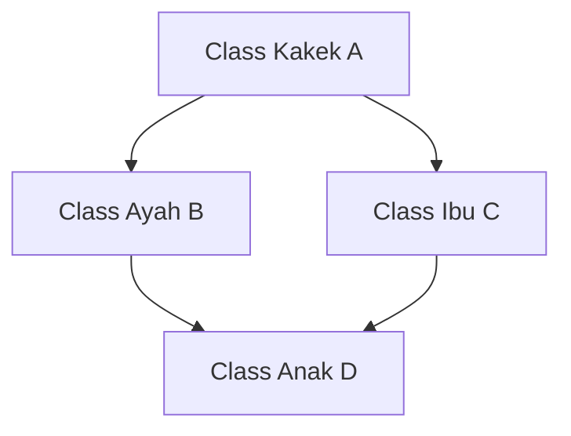

# 🧬 MODUL 4: PILAR 2 – INHERITANCE (PEWARISAN SIFAT & DRY)
> **Tingkat**: Core Level (4 Pilar Utama OOP)  
> **Tujuan**: Memahami konsep **Inheritance** (pewarisan sifat), hubungan *IS-A*, fungsi sakti `super()`, memperkaya method orang tua, pengecekan silsilah dengan `isinstance()` & `issubclass()`, Multiple Inheritance, MRO (*Method Resolution Order*), dan pola industri *Mixin Pattern*.

---

## 1. Cerita Pembuka: DNA Keluarga & Garis Keturunan Kendaraan

Bayangkan Anda bekerja di pabrik kendaraan bermotor:
* Anda diminta mendesain 3 jenis produk: **Mobil Sedan**, **Truk Kontainer**, dan **Sepeda Motor**.
* Ketiga benda tersebut memiliki ciri dasar yang sama:
  * Punya merk, warna, tahun pembuatan, dan kapasitas tangki bensin.
  * Bisa dinyalakan mesinnya, bisa direm, dan bisa dimatikan.
* **Apakah Anda akan mengetik ulang kode yang sama 3 kali dari nol?** Tentu tidak! Itu membuang-buang waktu dan melanggar prinsip sakti koding: **DRY (*Don't Repeat Yourself*)**.

```text
                     ┌──────────────────────────────┐
                     │    PARENT CLASS (INDUK)      │
                     │          KENDARAAN           │
                     │  (Merk, Warna, Kecepatan)    │
                     │   [nyalakan()]  [rem()]      │
                     └──────────────────────────────┘
                                     │
          ┌──────────────────────────┼──────────────────────────┐
          ▼                          ▼                          ▼
┌──────────────────┐       ┌──────────────────┐       ┌──────────────────┐
│   MOBIL SEDAN    │       │  TRUK KONTAINER  │       │   SEPEDA MOTOR   │
│  (Child Class)   │       │  (Child Class)   │       │  (Child Class)   │
│ + Fitur: AC &    │       │ + Fitur: Muatan  │       │ + Fitur: Standar │
│   Jumlah Pintu   │       │   Tonase Berat   │       │   Samping        │
└──────────────────┘       └──────────────────┘       └──────────────────┘
```

Dalam dunia pemrograman:
* **Parent Class (Kelas Induk / Superclass)**: Menyimpan semua sifat dan kemampuan umum.
* **Child Class (Kelas Anak / Subclass)**: Mewarisi semua sifat orang tuanya secara otomatis, dan bebas menambahkan fitur khusus miliknya sendiri.
* Hubungan ini dikenal sebagai hubungan **"IS-A" (Adalah Seorang / Adalah Sebuah)**:
  * *Mobil Sedan IS-A Kendaraan* (Mobil sedan adalah sebuah kendaraan).
  * *Programmer IS-A Karyawan* (Programmer adalah seorang karyawan).

---

## 2. Sintaks Dasar Pewarisan di Python

Untuk mewarisi sifat class lain di Python, cukup masukkan nama class induk di dalam tanda kurung:

```python
# 1. KELAS INDUK (PARENT)
class Kendaraan:
    def __init__(self, merk: str, warna: str):
        self.merk = merk
        self.warna = warna
        self.kecepatan = 0

    def klakson(self):
        print(f"[{self.merk}] Tiiin tiiin!")

# 2. KELAS ANAK (CHILD)
# Perhatikan tanda kurung: Mobil mewarisi Kendaraan!
class Mobil(Kendaraan):
    pass  # Otomatis mewarisi merk, warna, dan kemampuan klakson!
```

```python
avanza = Mobil("Toyota Avanza", "Hitam")
print(avanza.merk)   # Output: Toyota Avanza
avanza.klakson()     # Output: [Toyota Avanza] Tiiin tiiin!
```

---

## 3. Fungsi Sakti `super()`: Bukan Hanya untuk `__init__`!

Fungsi `super()` merujuk langsung ke kelas induk (*superclass*). Kita bisa menggunakannya dalam dua situasi:

### A. Di dalam `__init__` (Mengurus Data Umum)
```python
class Mobil(Kendaraan):
    def __init__(self, merk: str, warna: str, jumlah_pintu: int):
        # 1. Panggil constructor orang tua:
        super().__init__(merk, warna)
        # 2. Tambah atribut khusus milik anak:
        self.jumlah_pintu = jumlah_pintu
```

### B. Di dalam Method Biasa (Memperkaya Aksi Orang Tua)
Sering kali anak **tidak ingin membuang total** kemampuan orang tua, melainkan **menjalankan aksi orang tua DULU, baru menambah aksi baru**:

```python
class Ambulans(Kendaraan):
    def klakson(self):
        # 1. Bunyikan klakson bawaan orang tua:
        super().klakson()
        # 2. Tambahkan aksi khusus ambulans:
        print(f"[{self.merk}] Wiu wiu wiu! Sirine darurat dinyalakan!")
```

```python
amb = Ambulans("Toyota HiAce", "Putih")
amb.klakson()
# Output:
# [Toyota HiAce] Tiiin tiiin!
# [Toyota HiAce] Wiu wiu wiu! Sirine darurat dinyalakan!
```

---

## 4. Pengecekan Silsilah: `isinstance()` vs `issubclass()`

Python menyediakan dua fungsi bawaan untuk memeriksa silsilah keturunan:

1. **`isinstance(objek, Class)`**: Apakah objek ini keturunan dari class tersebut?
2. **`issubclass(ClassAnak, ClassInduk)`**: Apakah class A adalah anak dari class B?

```python
avanza = Mobil("Toyota", "Silver", 4)

print(isinstance(avanza, Mobil))      # True (avanza adalah Mobil)
print(isinstance(avanza, Kendaraan))  # True! (Karena Mobil adalah Kendaraan)
print(isinstance(avanza, str))        # False (Bukan teks)

print(issubclass(Mobil, Kendaraan))   # True (Mobil anak dari Kendaraan)
```

---

## 5. Fitur Khas Python: Multiple Inheritance & Pola "Mixin" 🔌

Python mengizinkan sebuah class mewarisi sifat dari **banyak induk sekaligus**. Di industri, pola ini paling sering diterapkan sebagai **Mixin Pattern** (kelas pelengkap kemampuan / plugin mandiri):

```python
# MIXIN 1: Kemampuan mencetak log
class LoggerMixin:
    def catat_log(self, pesan: str):
        print(f"[LOG {self.__class__.__name__}]: {pesan}")

# MIXIN 2: Kemampuan konversi ke format teks
class TeksFormatterMixin:
    def ke_huruf_besar(self, teks: str) -> str:
        return teks.upper()

# KELAS NYATA: Mewarisi class utama + Mixin tambahan
class Transaksi(LoggerMixin, TeksFormatterMixin):
    def __init__(self, id_transaksi: str, total: int):
        self.id_transaksi = id_transaksi
        self.total = total

    def bayar(self):
        self.catat_log(f"Transaksi {self.id_transaksi} sebesar Rp {self.total:,} berhasil dibayar.")
```

---

## 6. Masalah Berlian (*Diamond Problem*) & Solusi MRO Python 💎

Apa yang terjadi jika dua orang tua memiliki fungsi dengan nama yang sama persis? Orang tua mana yang akan dipilih anak?



Kondisi bercabang ini disebut **Diamond Problem**.  
Python menyelesaikannya dengan sangat tertib menggunakan algoritma **C3 Linearization**, yang menghasilkan urutan yang disebut **MRO (Method Resolution Order)**.

Anda bisa melihat urutan pencarian prioritas Python dengan perintah:
```python
print(AnakD.mro())
# Output: [AnakD, AyahB, IbuC, KakekA, object]
```
Python akan mencari dari kiri ke kanan:  
Cari di diri sendiri (`AnakD`) $\rightarrow$ cari di orang tua pertama (`AyahB`) $\rightarrow$ cari di orang tua kedua (`IbuC`) $\rightarrow$ terakhir cari di `object` bawaan Python.

---

## 7. ⚠️ Awas 2 Jebakan Klasik Pemula!

### ❌ Jebakan 1: Lupa Memanggil `super().__init__()`
Jika anak membuat `__init__` sendiri tetapi lupa memanggil `super().__init__()`:
```python
class AnakLupa(Kendaraan):
    def __init__(self, merk, warna, ac):
        self.ac = ac  # Lupa super().__init__(merk, warna)!

a = AnakLupa("Honda", "Merah", True)
print(a.merk)  # 💥 ERROR: AttributeError: 'AnakLupa' object has no attribute 'merk'
```
*Solusi*: Jika anak membuat `__init__`, selalu panggil `super().__init__(...)` di baris pertama!

### ❌ Jebakan 2: Rantai Warisan Terlalu Dalam (*Over-Inheritance*)
Pemula sering berlebihan membuat hierarki:  
`MakhlukHidup` $\rightarrow$ `Hewan` $\rightarrow$ `Mamalia` $\rightarrow$ `BerkakiEmpat` $\rightarrow$ `Karnivora` $\rightarrow$ `Kucing` $\rightarrow$ `KucingAnggora`.  
Jika ada perubahan di tingkat kakek buyut, semua anak-cucunya bisa rusak!  
*Solusi*: Jaga kedalaman warisan maksimal 2-3 level saja. Nanti di Modul 11 kita akan belajar jurus: *"Composition over Inheritance"*.

---

## 8. 🎯 Kuis Kilat Cek Pemahaman Mandiri

#### Soal 1:
> Manakah contoh hubungan pewarisan (*Inheritance / IS-A*) yang benar di bawah ini?  
> A. Mobil memiliki Mesin  
> B. Kucing adalah seekor Hewan  
> C. Komputer memiliki Keyboard  
> D. Perpustakaan menyimpan Buku  

<details>
<summary>👉 Klik untuk melihat Jawaban Soal 1</summary>

**Jawaban: B (Kucing adalah seekor Hewan)**  
*Penjelasan*: Hubungan B adalah *IS-A* (Kucing IS-A Hewan), sangat cocok untuk Inheritance. Sedangkan A, C, dan D adalah hubungan kepemilikan (*HAS-A* / Komposisi), bukan pewarisan.
</details>

---

#### Soal 2:
> Jika kita ingin menjalankan fungsi `simpan()` milik orang tua, lalu menambahkan aksi kirim email di anak, bagaimana cara menulisnya?  
> A. `super().simpan()` lalu baris berikutnya kode kirim email.  
> B. `parent.simpan()` lalu baris berikutnya kode kirim email.  
> C. `self.simpan()` lalu baris berikutnya kode kirim email.  

<details>
<summary>👉 Klik untuk melihat Jawaban Soal 2</summary>

**Jawaban: A (`super().simpan()`)**  
*Penjelasan*: `super()` memanggil method versi class orang tua secara eksplisit, lalu anak dapat menambahkan logika tambahannya sendiri di bawahnya.
</details>

---

## 9. 🛠️ Berkas Latihan di Modul Ini
Silakan buka dan jalankan file berikut di terminal:
1. `01_dasar_inheritance.py` $\rightarrow$ Praktik pewarisan `Kendaraan` ke `Mobil`, aksi `super().klakson()`, dan cek `isinstance()`.
2. `02_multiple_inheritance_mro.py` $\rightarrow$ Praktik Multiple Inheritance, Pola Mixin (`LoggerMixin`), dan cek urutan `mro()`.
3. `03_latihan_mandiri.py` $\rightarrow$ Tantangan membangun Sistem Hirarki Karyawan Kantor.
4. `03_solusi_latihan.py` $\rightarrow$ Kunci jawaban lengkap latihan.
