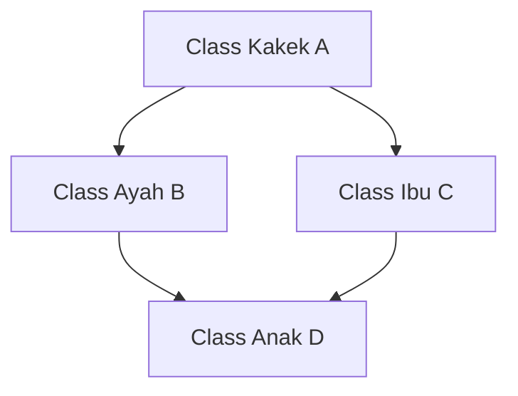

# 🧬 MODUL 4: PILAR 2 – INHERITANCE (PEWARISAN SIFAT & DRY)
> **Tingkat**: Core Level (4 Pilar Utama OOP)  
> **Tujuan**: Memahami konsep **Inheritance** (pewarisan sifat), hubungan *IS-A*, fungsi sakti `super().__init__()`, pengecekan silsilah dengan `isinstance()` & `issubclass()`, Multiple Inheritance, serta MRO (*Method Resolution Order*).

---

## 1. Cerita Pembuka: DNA Keluarga & Garis Keturunan Kendaraan

Bayangkan Anda bekerja di pabrik kendaraan bermotor:
* Anda diminta mendesain 3 jenis produk: **Mobil Sedan**, **Truk Kontainer**, dan **Sepeda Motor**.
* Ketiga benda tersebut memiliki ciri dasar yang sama:
  * Punya merk, warna, tahun pembuatan, dan kapasitas tangki bensin.
  * Bisa dinyalakan mesinnya, bisa direm, dan bisa dimatikan.
* **Apakah Anda akan mengetik ulang kode yang sama 3 kali dari nol?** Tentu tidak! Itu membuang-buang waktu dan melanggar prinsip sakti koding: **DRY (*Don't Repeat Yourself*)**.

```text
                     ┌──────────────────────────────┐
                     │    PARENT CLASS (INDUK)      │
                     │          KENDARAAN           │
                     │  (Merk, Warna, Kecepatan)    │
                     │   [nyalakan()]  [rem()]      │
                     └──────────────────────────────┘
                                     │
          ┌──────────────────────────┼──────────────────────────┐
          ▼                          ▼                          ▼
┌──────────────────┐       ┌──────────────────┐       ┌──────────────────┐
│   MOBIL SEDAN    │       │  TRUK KONTAINER  │       │   SEPEDA MOTOR   │
│  (Child Class)   │       │  (Child Class)   │       │  (Child Class)   │
│ + Fitur: AC &    │       │ + Fitur: Muatan  │       │ + Fitur: Standar │
│   Jumlah Pintu   │       │   Tonase Berat   │       │   Samping        │
└──────────────────┘       └──────────────────┘       └──────────────────┘
```

Dalam dunia pemrograman:
* **Parent Class (Kelas Induk / Superclass)**: Menyimpan semua sifat dan kemampuan umum.
* **Child Class (Kelas Anak / Subclass)**: Mewarisi semua sifat orang tuanya secara otomatis, dan bebas menambahkan fitur khusus miliknya sendiri.
* Hubungan ini dikenal sebagai hubungan **"IS-A" (Adalah Seorang / Adalah Sebuah)**:
  * *Mobil Sedan IS-A Kendaraan* (Mobil sedan adalah sebuah kendaraan).
  * *Programmer IS-A Karyawan* (Programmer adalah seorang karyawan).

---

## 2. Sintaks Dasar Pewarisan di Python

Untuk mewarisi sifat class lain di Python, cukup masukkan nama class induk di dalam tanda kurung:

```python
# 1. KELAS INDUK (PARENT)
class Kendaraan:
    def __init__(self, merk: str, warna: str):
        self.merk = merk
        self.warna = warna
        self.kecepatan = 0

    def klakson(self):
        print(f"[{self.merk}] Tiiin tiiiin!")

# 2. KELAS ANAK (CHILD)
# Perhatikan tanda kurung: Mobil mewarisi Kendaraan!
class Mobil(Kendaraan):
    pass  # Belum menulis apa-apa, tapi sudah otomatis punya merk, warna, dan klakson!
```

```python
avanza = Mobil("Toyota Avanza", "Hitam")
print(avanza.merk)   # Output: Toyota Avanza (Dapat warisan!)
avanza.klakson()     # Output: [Toyota Avanza] Tiiin tiiiin! (Dapat warisan!)
```

---

## 3. Fungsi Sakti `super()`: Memanggil Kemampuan Orang Tua

Bagaimana jika kelas anak ingin punya atribut tambahan (misal: mobil punya `jumlah_pintu`), tetapi **tidak mau menulis ulang** `self.merk` dan `self.warna`?

Gunakan fungsi sakti: **`super().__init__()`**!

```python
class Mobil(Kendaraan):
    def __init__(self, merk: str, warna: str, jumlah_pintu: int):
        # 1. Panggil constructor orang tua untuk mengurus merk & warna:
        super().__init__(merk, warna)
        
        # 2. Urus atribut baru milik pribadi kelas anak:
        self.jumlah_pintu = jumlah_pintu

    def buka_bagasi(self):
        print(f"Bagasi {self.merk} yang berpintu {self.jumlah_pintu} dibuka.")
```

> **Mengapa harus `super()`?**  
> `super()` merujuk langsung ke kelas induk (*superclass*). Dengan memanggil `super().__init__()`, kita menyerahkan tugas inisialisasi data umum kepada orang tua, sehingga kode anak tetap ringkas dan bersih.

---

## 4. Pengecekan Silsilah: `isinstance()` vs `issubclass()`

Python menyediakan dua fungsi bawaan untuk memeriksa silsilah keturunan:

1. **`isinstance(objek, Class)`**: Apakah objek ini keturunan dari class tersebut?
2. **`issubclass(ClassAnak, ClassInduk)`**: Apakah class A adalah anak dari class B?

```python
avanza = Mobil("Toyota", "Silver", 4)

print(isinstance(avanza, Mobil))      # True (Jelas, avanza adalah Mobil)
print(isinstance(avanza, Kendaraan))  # True! (Karena Mobil adalah Kendaraan)
print(isinstance(avanza, str))        # False (Bukan teks)

print(issubclass(Mobil, Kendaraan))   # True (Mobil anak dari Kendaraan)
```

---

## 5. Fitur Khas Python: Multiple Inheritance (Punya Dua Induk) 👨‍👩‍👧

Tidak seperti Java atau C# yang hanya mengizinkan satu induk kandung, Python mengizinkan sebuah class mewarisi sifat dari **banyak induk sekaligus**:

```python
class KemampuanTerbang:
    def terbang(self):
        print("Mengepakkan sayap dan terbang di angkasa!")

class KemampuanBerenang:
    def berenang(self):
        print("Mendayung kaki dan berenang di danau!")

# Bebek mewarisi dua kemampuan sekaligus!
class Bebek(KemampuanTerbang, KemampuanBerenang):
    def __init__(self, nama: str):
        self.nama = nama

donald = Bebek("Donald")
donald.terbang()   # Output: Mengepakkan sayap dan terbang di angkasa!
donald.berenang()  # Output: Mendayung kaki dan berenang di danau!
```

---

## 6. Masalah Berlian (*Diamond Problem*) & Solusi MRO Python 💎

Apa yang terjadi jika dua orang tua memiliki fungsi dengan nama yang sama persis? Orang tua mana yang akan dipilih anak?



Kondisi bercabang ini disebut **Diamond Problem**.  
Python menyelesaikannya dengan sangat tertib menggunakan algoritma **C3 Linearization**, yang menghasilkan urutan yang disebut **MRO (Method Resolution Order)**.

Anda bisa melihat urutan pencarian prioritas Python dengan perintah:
```python
print(Bebek.mro())
# Output: [Bebek, KemampuanTerbang, KemampuanBerenang, object]
```
Python akan mencari dari kiri ke kanan:  
Cari di diri sendiri (`Bebek`) $\rightarrow$ cari di orang tua pertama (`KemampuanTerbang`) $\rightarrow$ cari di orang tua kedua (`KemampuanBerenang`) $\rightarrow$ terakhir cari di `object` bawaan Python.

---

## 7. ⚠️ Awas 2 Jebakan Klasik Pemula!

### ❌ Jebakan 1: Lupa Memanggil `super().__init__()`
Jika anak membuat `__init__` sendiri tetapi lupa memanggil `super().__init__()`:
```python
class AnakLupa(Kendaraan):
    def __init__(self, merk, warna, ac):
        self.ac = ac  # Lupa super().__init__(merk, warna)!

a = AnakLupa("Honda", "Merah", True)
print(a.merk)  # 💥 ERROR: AttributeError: 'AnakLupa' object has no attribute 'merk'
```
*Solusi*: Jika anak membuat `__init__`, selalu panggil `super().__init__(...)` di baris pertama!

### ❌ Jebakan 2: Rantai Warisan Terlalu Dalam (*Over-Inheritance*)
Pemula sering berlebihan membuat hierarki:  
`MakhlukHidup` $\rightarrow$ `Hewan` $\rightarrow$ `Mamalia` $\rightarrow$ `BerkakiEmpat` $\rightarrow$ `Karnivora` $\rightarrow$ `Kucing` $\rightarrow$ `KucingAnggora`.  
Jika ada perubahan di tingkat kakek buyut, semua anak-cucunya bisa rusak!  
*Solusi*: Jaga kedalaman warisan maksimal 2-3 level saja. Nanti di Modul 11 kita akan belajar jurus: *"Composition over Inheritance"*.

---

## 8. 🎯 Kuis Kilat Cek Pemahaman Mandiri

#### Soal 1:
> Manakah contoh hubungan pewarisan (*Inheritance / IS-A*) yang benar di bawah ini?  
> A. Mobil memiliki Mesin  
> B. Kucing adalah seekor Hewan  
> C. Komputer memiliki Keyboard  
> D. Perpustakaan menyimpan Buku  

<details>
<summary>👉 Klik untuk melihat Jawaban Soal 1</summary>

**Jawaban: B (Kucing adalah seekor Hewan)**  
*Penjelasan*: Hubungan B adalah *IS-A* (Kucing IS-A Hewan), sangat cocok untuk Inheritance. Sedangkan A, C, dan D adalah hubungan kepemilikan (*HAS-A* / Komposisi), bukan pewarisan.
</details>

---

#### Soal 2:
> Apa kegunaan dari pemanggilan `super().__init__(...)` pada class anak?  
> A. Menghapus data class induk agar hemat memori.  
> B. Menjalankan fungsi constructor class induk agar atribut induk terpasang pada anak.  
> C. Mengubah nama class anak menjadi nama class induk.  

<details>
<summary>👉 Klik untuk melihat Jawaban Soal 2</summary>

**Jawaban: B**  
*Penjelasan*: `super().__init__()` mendelegasikan inisialisasi data umum kepada class orang tua sehingga anak tidak perlu mengetik ulang inisialisasi tersebut.
</details>

---

## 9. 🛠️ Berkas Latihan di Modul Ini
Silakan buka dan jalankan file berikut di terminal:
1. `01_dasar_inheritance.py` $\rightarrow$ Praktik pewarisan `Kendaraan` ke `Mobil` dan cek `isinstance()`.
2. `02_multiple_inheritance_mro.py` $\rightarrow$ Praktik Multiple Inheritance, Bebek terbang & berenang, serta cek urutan `mro()`.
3. `03_latihan_mandiri.py` $\rightarrow$ Tantangan membangun Sistem Hirarki Karyawan Kantor.
4. `03_solusi_latihan.py` $\rightarrow$ Kunci jawaban lengkap latihan.
