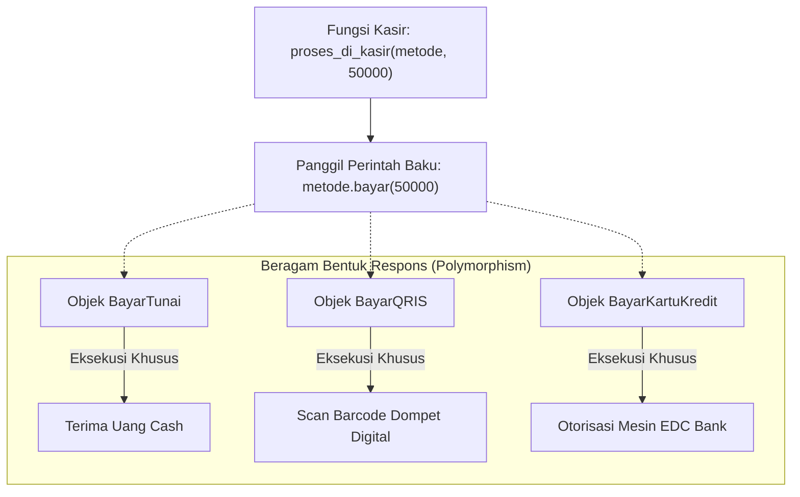

# 🎭 MODUL 5: PILAR 3 – POLYMORPHISM & FILOSOFI DUCK TYPING
> **Tingkat**: Core Level (4 Pilar Utama OOP)  
> **Tujuan**: Memahami konsep **Polymorphism** (satu perintah, beragam tindakan), membedah perbedaan *Overriding* vs *Overloading*, menguasai filosofi legendaris Python **Duck Typing**, serta membangun sistem fleksibel yang siap menerima objek apa pun tanpa merusak kode lama.

---

## 1. Cerita Pembuka: Tombol "Play" & Colokan USB Universal

Bayangkan Anda memiliki beberapa perangkat elektronik di rumah:
* Smartphone Android, Laptop Windows, dan Konsol Game PlayStation.
* Ketiga perangkat tersebut memiliki satu kesamaan: semuanya memiliki **Port USB**.
* Ketika Anda mencolokkan flashdisk ke Laptop, flashdisk langsung terbaca. Ketika Anda mencolokkan kabel charger ke HP, baterai terisi. Ketika Anda mencolokkan stik game ke PlayStation, stik siap dimainkan.

```text
                               ┌─────────────────────────────────┐
                               │     PERINTAH TUNGGAL RESMI      │
                               │        colok_kabel_usb()        │
                               └─────────────────────────────────┘
                                                │
                 ┌──────────────────────────────┼──────────────────────────────┐
                 ▼                              ▼                              ▼
      ┌────────────────────┐         ┌────────────────────┐         ┌────────────────────┐
      │     SMARTPHONE     │         │       LAPTOP       │         │    PLAYSTATION     │
      │  (Mengisi Baterai) │         │ (Membaca File USB) │         │  (Deteksi Stik PS) │
      └────────────────────┘         └────────────────────┘         └────────────────────┘
```

Contoh lain dalam kehidupan sehari-hari:
* Tombol **"Play" (▶️)** di layar:
  * Jika Anda memutar lagu di Spotify $\rightarrow$ Keluar suara musik.
  * Jika Anda memutar video di YouTube $\rightarrow$ Keluar gambar bergerak dan audio.
  * Jika Anda memutar rekaman suara di WhatsApp $\rightarrow$ Terdengar suara pesan teman.
* Perintahnya **SAMA PERSIS**: `play()`.
* Tetapi aksinya **BERAGAM BENTUK** tergantung objek apa yang sedang merespons!

> **Inilah esensi Polymorphism**:  
> Berasal dari bahasa Yunani: *Poly* (Banyak) + *Morph* (Bentuk).  
> **Satu antarmuka perintah yang sama, tetapi menghasilkan tindakan yang berbeda sesuai karakter masing-masing objek.**

---

## 2. Polymorphism Klasik Lewat Inheritance (Method Overriding)

Bentuk polymorphism paling umum adalah ketika beberapa kelas anak menimpa (*override*) method yang diwariskan oleh kelas induk:

```python
class Hewan:
    def __init__(self, nama: str):
        self.nama = nama

    def bersuara(self):
        print(f"{self.nama} mengeluarkan suara misterius...")

class Kucing(Hewan):
    def bersuara(self):
        print(f"[{self.nama}] Meooong~ purrr!")

class Anjing(Hewan):
    def bersuara(self):
        print(f"[{self.nama}] Guk guk guk!")

class Bebek(Hewan):
    def bersuara(self):
        print(f"[{self.nama}] Kweeeek kweeeek!")
```

### Keajaiban Loop Polimorfik:
Perhatikan betapa indahnya kita bisa memperlakukan semua objek secara seragam:

```python
koleksi_hewan = [
    Kucing("Mimi"),
    Anjing("Blacky"),
    Bebek("Donald")
]

# SATU PERINTAH UNTUK SEMUA OBJEK:
for h in koleksi_hewan:
    h.bersuara()

# Output:
# [Mimi] Meooong~ purrr!
# [Blacky] Guk guk guk!
# [Donald] Kweeeek kweeeek!
```
Kita tidak perlu menulis `if tipe == "kucing"` atau `if tipe == "anjing"`. Cukup panggil `h.bersuara()`, dan masing-masing hewan otomatis tahu cara mengekspresikan dirinya!

---

## 3. Filosofi Khas Python: "Duck Typing" 🦆

Ini adalah salah satu fitur paling unik dan membanggakan dari bahasa Python yang membedakannya dari Java, C++, atau C#.

Di bahasa kaku (seperti Java):  
Untuk bisa diperlakukan secara polimorfik, objek **HARUS** merupakan turunan resmi dari kelas induk yang sama (punya hubungan darah/warisan).

Di Python yang dinamis, ada peribahasa sakti:
> *"If it walks like a duck and quacks like a duck, then it's a duck!"*  
> (Jika dia berjalan seperti bebek dan bersuara seperti bebek, maka bagi kita dia adalah bebek!)

### Apa Maksudnya di Kodingan?
Objek **TIDAK PERLU** mewarisi class yang sama! Asalkan objek tersebut memiliki **nama method yang sama**, Python akan dengan senang hati mengeksekusinya:

```python
class ManusiaMeniruBebek:
    """Manusia yang sama sekali BUKAN turunan Hewan/Bebek!"""
    def bersuara(self):
        print("[Orang Iseng]: Kweeeek! (Menirukan suara bebek dengan mulut)")

# Python tidak peduli silsilah keturunannya!
orang = ManusiaMeniruBebek()
kucing = Kucing("Mimi")

for objek in [kucing, orang]:
    objek.bersuara()  # ✅ KEDUANYA BERHASIL DIEKSEKUSI DENGAN MULUS!
```

**Kelebihan Duck Typing**:  
Kode Anda menjadi luar biasa fleksibel. Di masa depan, siapa saja bisa menambahkan objek baru ke sistem Anda tanpa harus mengubah satu baris pun kode lama Anda!

---

## 4. Method Overriding vs Method Overloading

Banyak pemula yang bingung membedakan kedua istilah ini:

| Pembeda | Method Overriding | Method Overloading |
| :--- | :--- | :--- |
| **Definisi** | Menulis ulang method induk di kelas anak dengan nama yang sama. | Menulis beberapa fungsi dengan nama sama tetapi jumlah parameter berbeda di dalam satu class. |
| **Dukungan Python** | **Didukung Penuh 100%** | **TIDAK didukung secara native** (Fungsi yang ditulis kedua akan menimpa fungsi pertama). |
| **Solusi di Python** | Cukup tulis method dengan nama sama di anak. | Gunakan **Default Arguments** (`arg=None`) atau `*args`. |

### Contoh Mengakali Overloading di Python:
Alih-alih membuat dua fungsi terpisah, di Python kita cukup gunakan nilai bawaan:

```python
class Kalkulator:
    # Mengakali Overloading: Bisa menjumlahkan 2 angka atau 3 angka sekaligus!
    def tambah(self, a: int, b: int, c: int = 0) -> int:
        return a + b + c

k = Kalkulator()
print(k.tambah(5, 10))     # Output: 15 (2 angka)
print(k.tambah(5, 10, 20)) # Output: 35 (3 angka)
```

---

## 5. Studi Kasus Industri: Gateway Pembayaran (Payment Gateway) 💳

Bayangkan Anda sedang membuat aplikasi toko online seperti Tokopedia / Shopee.  
Sistem kasir Anda harus bisa menerima pembayaran lewat berbagai macam kanal:
1. **Tunai**
2. **QRIS (GoPay / OVO)**
3. **Kartu Kredit**

### Desain Polimorfik yang Elegan:
```python
class BayarTunai:
    def bayar(self, tagihan: int):
        print(f"[TUNAI] Pelanggan menyerahkan uang cash pas Rp {tagihan:,}.")

class BayarQRIS:
    def __init__(self, nama_dompet: str):
        self.nama_dompet = nama_dompet

    def bayar(self, tagihan: int):
        print(f"[QRIS] Scan barcode lewat {self.nama_dompet} berhasil! Terpotong Rp {tagihan:,}.")

class BayarKartuKredit:
    def __init__(self, nomor_kartu: str):
        self.nomor_kartu = nomor_kartu

    def bayar(self, tagihan: int):
        print(f"[KARTU KREDIT] Menagihkan Rp {tagihan:,} ke kartu ****{self.nomor_kartu[-4:]}.")
```

### Kasir Pintar (Tanpa Banyak `if...elif`!):
```python
def proses_di_kasir(metode_pembayaran, total_belanja: int):
    print("Memulai proses transaksi...")
    # Cukup satu baris ini saja! Siapa pun metode pembayarannya, panggil bayar():
    metode_pembayaran.bayar(total_belanja)
    print("Transaksi selesai. Terima kasih!\n")

# PENGUJIAN:
proses_di_kasir(BayarTunai(), 50_000)
proses_di_kasir(BayarQRIS("GoPay"), 75_000)
proses_di_kasir(BayarKartuKredit("4111222233334444"), 500_000)
```
Lihat betapa bersihnya fungsi `proses_di_kasir()`. Jika bulan depan toko Anda menambah metode **"Transfer Virtual Account"**, Anda tidak perlu mengotori fungsi kasir dengan `elif metode == "VA"`. Cukup buat class baru yang memiliki method `bayar()`, dan kasir langsung otomatis mengenalnya!

---

## 6. Diagram Alur Polymorphism (Mermaid)



---

## 7. ⚠️ Awas Jebakan Klasik Pemula!

### ❌ Jebakan: Memaksa `if isinstance()` di Semua Tempat
Banyak programmer pemula yang menulis fungsi kasir seperti ini:
```python
# ❌ KODE BURUK (ANTI-POLYMORPHISM):
def kasir_buruk(metode, jumlah):
    if isinstance(metode, BayarTunai):
        metode.bayar_tunai(jumlah)
    elif isinstance(metode, BayarQRIS):
        metode.bayar_qris(jumlah)
    elif isinstance(metode, BayarKartuKredit):
        metode.bayar_kartu(jumlah)
```
**Mengapa ini buruk?**  
Karena setiap kali ada metode pembayaran baru, Anda **terpaksa membuka kembali dan mengubah fungsi kasir**! Ini melanggar prinsip *Open/Closed Principle* (yang akan kita pelajari di Modul 12).  
*Solusi*: Samakan nama method-nya menjadi `bayar(jumlah)`, lalu panggil langsung secara polimorfik!

---

## 8. 🎯 Kuis Kilat Cek Pemahaman Mandiri

#### Soal 1:
> Apa makna filosofis dari semboyan Python *"Duck Typing"*?  
> A. Semua class di Python harus mewarisi class Bebek.  
> B. Python tidak peduli tipe atau silsilah suatu objek, asalkan objek tersebut memiliki method/kemampuan yang dipanggil.  
> C. Hewan bebek adalah hewan resmi maskot bahasa Python.  

<details>
<summary>👉 Klik untuk melihat Jawaban Soal 1</summary>

**Jawaban: B**  
*Penjelasan*: Duck Typing berarti jika sebuah objek bisa melakukan aksi yang diminta (misal: bersuara seperti bebek), Python menganggap objek itu valid tanpa memeriksa apakah ia keturunan Bebek atau bukan.
</details>

---

#### Soal 2:
> Mengapa kita tidak bisa membuat dua fungsi `def hitung(a)` dan `def hitung(a, b)` di dalam satu class Python seperti di bahasa Java?  
> A. Karena Python melarang nama fungsi sama, fungsi kedua akan menimpa fungsi pertama di dalam memori.  
> B. Karena parameter `b` bersifat terlarang di Python.  
> C. Karena memori komputer akan meledak.  

<details>
<summary>👉 Klik untuk melihat Jawaban Soal 2</summary>

**Jawaban: A**  
*Penjelasan*: Di Python, definisi fungsi kedua dengan nama yang sama akan menimpa (*overwrite*) fungsi pertama. Solusinya di Python adalah menggunakan nilai bawaan (default argument) seperti `def hitung(a, b=0)`.
</details>

---

## 9. 🛠️ Berkas Latihan di Modul Ini
Silakan buka dan jalankan file berikut di terminal:
1. `01_dasar_polymorphism.py` $\rightarrow$ Praktik loop polimorfik suara hewan dan armada transportasi.
2. `02_duck_typing.py` $\rightarrow$ Demonstrasi nyata filosofi Duck Typing tanpa ikatan inheritance.
3. `03_latihan_mandiri.py` $\rightarrow$ Tantangan membuat Payment Gateway Toko Online (Tunai, QRIS, Kartu Kredit).
4. `03_solusi_latihan.py` $\rightarrow$ Kunci jawaban lengkap latihan.
