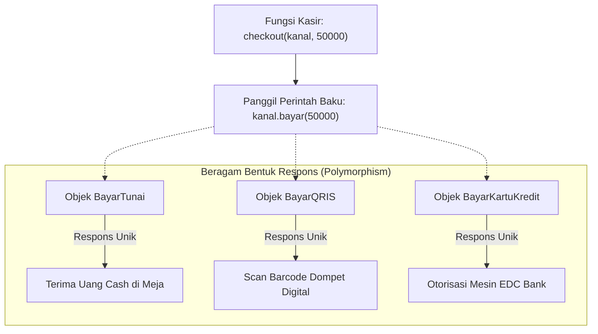

# 🎭 MODUL 5: PILAR 3 – POLYMORPHISM & FILOSOFI DUCK TYPING
> **Tingkat**: Core Level (4 Pilar Utama OOP)  
> **Tujuan**: Memahami konsep **Polymorphism** (satu perintah, beragam tindakan), polimorfisme operator bawaan, filosofi legendaris **Duck Typing**, dua mazhab eksekusi (*LBYL vs EAFP*), serta fitur modern `typing.Protocol`.

---

## 1. Cerita Pembuka: Tombol "Play" & Colokan USB Universal

Bayangkan Anda memiliki beberapa perangkat elektronik di rumah:
* Smartphone Android, Laptop Windows, dan Konsol Game PlayStation.
* Ketiga perangkat tersebut memiliki satu kesamaan: semuanya memiliki **Port USB**.
* Ketika Anda mencolokkan flashdisk ke Laptop, flashdisk langsung terbaca. Ketika Anda mencolokkan kabel charger ke HP, baterai terisi. Ketika Anda mencolokkan stik game ke PlayStation, stik siap dimainkan.

```text
                               ┌─────────────────────────────────┐
                               │     PERINTAH TUNGGAL RESMI      │
                               │        colok_kabel_usb()        │
                               └─────────────────────────────────┘
                                                │
                 ┌──────────────────────────────┼──────────────────────────────┐
                 ▼                              ▼                              ▼
      ┌────────────────────┐         ┌────────────────────┐         ┌────────────────────┐
      │     SMARTPHONE     │         │       LAPTOP       │         │    PLAYSTATION     │
      │  (Mengisi Baterai) │         │ (Membaca File USB) │         │  (Deteksi Stik PS) │
      └────────────────────┘         └────────────────────┘         └────────────────────┘
```

Contoh lain dalam kehidupan sehari-hari:
* Tombol **"Play" (▶️)** di layar:
  * Jika memutar lagu di Spotify $\rightarrow$ Keluar suara musik.
  * Jika memutar video di YouTube $\rightarrow$ Keluar gambar bergerak dan audio.
  * Jika memutar pesan suara di WhatsApp $\rightarrow$ Terdengar suara obrolan teman.
* Perintahnya **SAMA PERSIS**: `play()`.
* Tetapi aksinya **BERAGAM BENTUK** tergantung objek apa yang sedang merespons!

> **Inilah esensi Polymorphism**:  
> Berasal dari bahasa Yunani: *Poly* (Banyak) + *Morph* (Bentuk).  
> **Satu antarmuka perintah yang sama, tetapi menghasilkan tindakan yang berbeda sesuai karakter masing-masing objek.**

---

## 2. Kejutan: Anda Sebenarnya Sudah Menggunakan Polimorfisme Sejak Awal! 💡

Sebelum masuk ke class rumit, sadarkah Anda bahwa simbol tambah (`+`) di Python adalah bentuk polimorfisme paling nyata?

```python
# 1. Pada Angka (Matematika):
print(10 + 20)           # Output: 30

# 2. Pada Teks (Penggabungan String):
print("Kopi " + "Susu")   # Output: Kopi Susu

# 3. Pada List (Penggabungan Koleksi):
print([1, 2] + [3, 4])   # Output: [1, 2, 3, 4]
```
Satu simbol yang sama (`+`), tetapi perilakunya **berubah secara cerdas** tergantung jenis objek yang berada di sisi kiri dan kanannya!

---

## 3. Polymorphism Klasik Lewat Inheritance (Method Overriding)

Bentuk polymorphism paling umum adalah ketika beberapa kelas anak menimpa (*override*) method yang diwariskan oleh kelas induk:

```python
class Hewan:
    def __init__(self, nama: str):
        self.nama = nama

    def bersuara(self):
        print(f"{self.nama} mengeluarkan suara misterius...")

class Kucing(Hewan):
    def bersuara(self):
        print(f"[{self.nama}] Meooong~ purrr!")

class Anjing(Hewan):
    def bersuara(self):
        print(f"[{self.nama}] Guk guk guk!")

class Bebek(Hewan):
    def bersuara(self):
        print(f"[{self.nama}] Kweeeek kweeeek!")
```

### Keajaiban Loop Polimorfik:
Perhatikan betapa indahnya kita bisa memperlakukan semua objek secara seragam:

```python
koleksi_hewan = [Kucing("Mimi"), Anjing("Blacky"), Bebek("Donald")]

# SATU PERINTAH UNTUK SEMUA OBJEK:
for h in koleksi_hewan:
    h.bersuara()
```
Kita tidak perlu menulis `if tipe == "kucing"` atau `if tipe == "anjing"`. Cukup panggil `h.bersuara()`, dan masing-masing hewan otomatis tahu cara mengekspresikan dirinya!

---

## 4. Filosofi Khas Python: "Duck Typing" 🦆

Di bahasa kaku (seperti Java): Objek **HARUS** merupakan turunan resmi dari kelas induk yang sama untuk bisa polimorfik.  
Di Python yang dinamis, ada peribahasa legendaris:
> *"If it walks like a duck and quacks like a duck, then it's a duck!"*  
> (Jika dia berjalan seperti bebek dan bersuara seperti bebek, maka bagi kita dia adalah bebek!)

Objek **TIDAK PERLU** punya hubungan warisan/darah sama sekali! Asalkan objek tersebut memiliki **nama method yang diminta**, Python akan mengeksekusinya.

### Dua Mazhab Eksekusi Duck Typing di Python:
Bagaimana cara kita memanggil objek Duck Typing dengan aman?

#### A. Gaya LBYL (*Look Before You Leap* - Cek Dulu Sebelum Lompat)
```python
if hasattr(objek, "bersuara") and callable(objek.bersuara):
    objek.bersuara()
```

#### B. Gaya EAFP (*Easier to Ask for Forgiveness than Permission* - Gaya Favorit Python!)
Komunitas Python lebih menyukai prinsip: *"Jalankan saja dulu, jika error baru tangkap minta maaf!"*
```python
try:
    objek.bersuara()
except AttributeError:
    print("Objek ini tidak punya kemampuan bersuara!")
```

---

## 5. Python Modern: `typing.Protocol` (Duck Typing yang Didukung IDE) 🚀

Di Python 3.8+, jika Anda ingin menggunakan Duck Typing tetapi tetap ingin editor kode (VS Code / PyCharm) memberi bantuan *autocomplete* dan deteksi typo, gunakan **`typing.Protocol`**:

```python
from typing import Protocol

# Membuat kontrak bentuk (Interface Bebek)
class BisaBersuara(Protocol):
    def bersuara(self) -> None:
        ...

# Fungsi ini menerima objek apa pun ASALKAN memiliki fungsi bersuara()
def bunyikan(hewan: BisaBersuara):
    hewan.bersuara()
```
Kelas Anda **tidak perlu mewarisi `BisaBersuara`**, tetapi IDE akan langsung mengenali strukturnya. Inilah yang disebut *Structural Subtyping*.

---

## 6. Method Overriding vs Method Overloading

| Pembeda | Method Overriding | Method Overloading |
| :--- | :--- | :--- |
| **Definisi** | Menulis ulang method induk di kelas anak dengan nama yang sama. | Menulis beberapa fungsi bernama sama tapi parameter berbeda di 1 class. |
| **Dukungan Python** | **Didukung Penuh 100%** | **TIDAK didukung secara native** (Fungsi kedua menimpa fungsi pertama). |
| **Solusi di Python** | Cukup tulis method dengan nama sama di anak. | Gunakan **Default Arguments** (`b=0`) atau `*args`. |

```python
class Kalkulator:
    # Mengakali Overloading di Python dengan Default Argument:
    def tambah(self, a: int, b: int, c: int = 0) -> int:
        return a + b + c
```

---

## 7. Studi Kasus Industri: Gateway Pembayaran (Payment Gateway) 💳

```python
class BayarTunai:
    def bayar(self, tagihan: int):
        print(f"[TUNAI] Menerima uang cash Rp {tagihan:,}.")

class BayarQRIS:
    def __init__(self, ewallet: str):
        self.ewallet = ewallet

    def bayar(self, tagihan: int):
        print(f"[QRIS] Scan barcode lewat {self.ewallet} terbayar Rp {tagihan:,}.")

# FUNGSI KASIR POLIMORFIK:
def checkout(kanal_pembayaran, total: int):
    # Cukup satu baris ini saja! Siapa pun kanal pembayarannya, panggil bayar():
    kanal_pembayaran.bayar(total)
```

---

## 8. Diagram Alur Kerja Polymorphism (Mermaid)



---

## 9. 🎯 Kuis Kilat Cek Pemahaman Mandiri

#### Soal 1:
> Mengapa kode berikut disebut polimorfik?
> ```python
> a = 10 + 20
> b = "Halo " + "Dunia"
> ```

<details>
<summary>👉 Klik untuk melihat Jawaban Soal 1</summary>

**Jawaban: Karena operator `+` memiliki banyak bentuk aksi yang cerdas.**  
*Penjelasan*: Pada angka, `+` melakukan penjumlahan matematika numerik. Pada teks, `+` melakukan penggabungan string (concatenation). Satu simbol perintah yang sama merespons berbeda tergantung tipe objeknya.
</details>

---

#### Soal 2:
> Dalam filosofi Duck Typing di Python, apa perbedaan antara mazhab LBYL dan EAFP?  
> A. LBYL memeriksa kesiapan sebelum menjalankan (`hasattr`), sedangkan EAFP langsung mengeksekusi di dalam blok `try...except`.  
> B. LBYL untuk angka, EAFP untuk huruf.  
> C. LBYL sudah dihapus dari Python.  

<details>
<summary>👉 Klik untuk melihat Jawaban Soal 2</summary>

**Jawaban: A**  
*Penjelasan*: LBYL (*Look Before You Leap*) memeriksa dulu keberadaan method sebelum dipanggil. EAFP (*Easier to Ask for Forgiveness than Permission*) langsung memanggil method dan menangkap `AttributeError` jika ternyata method tersebut tidak ada. Komunitas Python sangat menyukai gaya EAFP.
</details>

---

## 10. 🛠️ Berkas Latihan di Modul Ini
Silakan buka dan jalankan file berikut di terminal:
1. `01_dasar_polymorphism.py` $\rightarrow$ Praktik loop polimorfik armada transportasi.
2. `02_duck_typing.py` $\rightarrow$ Demonstrasi nyata filosofi Duck Typing, perbandingan LBYL vs EAFP, dan Media Player.
3. `03_latihan_mandiri.py` $\rightarrow$ Tantangan membuat Payment Gateway Toko Online (Tunai, QRIS, Kartu Kredit).
4. `03_solusi_latihan.py` $\rightarrow$ Kunci jawaban lengkap latihan.
