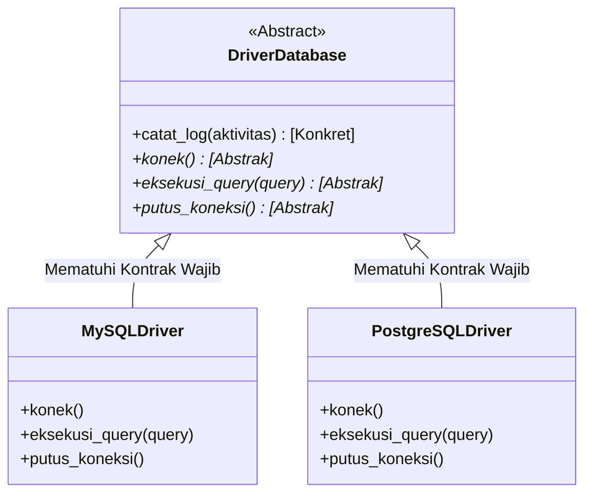

# 🔌 MODUL 6: PILAR 4 – ABSTRACTION (MENYEMBUNYIKAN KERUMITAN & KONTRAK WAJIB)
> **Tingkat**: Core Level (Pilar Penutup 4 Pilar OOP)  
> **Tujuan**: Memahami esensi **Abstraction**, membedakan secara tegas *Encapsulation vs Abstraction*, menguasai modul bawaan `abc` (`ABC` & `@abstractmethod`), memadukan method konkret & method abstrak, memanfaatkan *Abstract Property*, serta memahami peran *Interface* di Python.

---

## 1. Cerita Pembuka: Colokan Listrik Dinding & Remote TV

Bayangkan Anda baru saja membeli sebuah kipas angin baru di toko:
* Anda membawa kipas tersebut pulang, lalu melihat ke dinding rumah ada **Stopkontak Listrik (Colokan)**.
* Anda tidak perlu membongkar tembok untuk mencari tahu:
  * Dari mana asal kabel tembaganya?
  * Apakah listriknya dibangkitkan oleh PLTU Batu Bara, PLTA Air, atau Pembangkit Tenaga Surya?
  * Berapa putaran turbin di gardu induk PLN?
* Anda **cukup tahu satu hal**: Stopkontak memiliki standar 2 lubang bulat (Standar SNI). Selama colokan kipas Anda pas dengan lubang itu, listrik akan mengalir dan kipas berputar!

```text
┌────────────────────────────────────────────────────────┐
│          DUNIA KERUMITAN DI BALIK TEMBOK               │
│  [Turbin Pembangkit] [Gardu Tegangan Tinggi] [Trafo]   │
└────────────────────────────────────────────────────────┘
                           ▲
             (Disembunyikan secara sempurna)
                           │
             ┌─────────────┴─────────────┐
             │   STOPKONTAK (ABSTRAKSI)  │
             │   Hanya ada 2 Lubang SNI  │
             └─────────────┬─────────────┘
                           │
             (Siapa pun alatnya, cukup colok ke sini)
                           ▼
          [Kipas Angin] [Kulkas] [Charger HP]
```

Dalam dunia pemrograman:
* **Abstraction (Abstraksi)** adalah teknik untuk **menyembunyikan seluruh kerumitan teknis di balik layar** dan hanya menyajikan antarmuka sederhana yang esensial kepada pengguna.
* Abstraksi juga berfungsi sebagai **Surat Kontrak Kerja Baku**: mewajibkan semua kelas turunan memiliki tombol-tombol standar yang telah disepakati.

---

## 2. Beda Tegas: Encapsulation vs Abstraction ⚖️

Banyak pemula (bahkan programmer menengah) sering tertukar antara Encapsulation dan Abstraction:

| Aspek | Encapsulation (Pilar 1) | Abstraction (Pilar 4) |
| :--- | :--- | :--- |
| **Fokus Utama** | **Keamanan Data** (Proteksi) | **Penyederhanaan & Kontrak** (Desain) |
| **Pertanyaan Kunci** | *"Bagaimana cara menyembunyikan data agar tidak diubah sembarangan?"* | *"Bagaimana cara menyembunyikan kerumitan cara kerja dari pengguna?"* |
| **Analogi Nyata** | **Gembok Brankas Bank / Kapsul Obat** (Data di dalam aman terlindungi). | **Tombol Setir Mobil / Saklar Lampu** (Tahu fungsinya tanpa perlu tahu kabel dalamnya). |
| **Peralatan di Python**| `_protected`, `__private`, `@property` | `from abc import ABC, abstractmethod` |

---

## 3. Mengenal Abstract Base Class (ABC) di Python

Di Python, kita membuat kelas abstrak menggunakan modul bawaan: **`abc`** (*Abstract Base Classes*).

```python
from abc import ABC, abstractmethod

# 1. KELAS ABSTRAK (SURAT KONTRAK KERJA)
class Pembayaran(ABC):
    @abstractmethod
    def proses_bayar(self, nominal: int):
        """Method ini WAJIB diisi oleh siapa pun kelas anaknya!"""
        pass
```

### Dua Aturan Besi Kelas Abstrak:
1. **DILARANG MELAHIRKAN OBJEK DARI KELAS ABSTRAK!**
   ```python
   p = Pembayaran()
   # 💥 ERROR: TypeError: Can't instantiate abstract class Pembayaran with abstract method proses_bayar
   ```
   *Mengapa dilarang?* Karena kelas abstrak adalah konsep/ide mentah, bukan benda nyata. Anda tidak bisa membeli "Kendaraan", Anda hanya bisa membeli mobil fisik atau motor fisik!
2. **KELAS ANAK WAJIB MENGISI METHOD ABSTRAK!**
   Jika anak lupa menulis method `proses_bayar`, Python akan langsung menolak kelahiran anak tersebut saat kode dijalankan.

---

## 4. Rahasia Penting: Kelas Abstrak Boleh Memiliki Method Konkret (Sudah Ada Isinya!) 🛠️

Salah satu kesalahpahaman pemula adalah mengira semua method di kelas abstrak harus kosong (`pass`).  
**Faktanya**: Kelas abstrak boleh menyediakan fungsi siap pakai yang berlaku umum untuk semua anak!

```python
from abc import ABC, abstractmethod

class DriverDatabase(ABC):
    # 1. METHOD KONKRET (Sudah ada isinya, anak tidak wajib menimpa):
    def catat_log(self, aktivitas: str):
        print(f"[LOG AUDIT SISTEM]: {aktivitas}")

    # 2. METHOD ABSTRAK (Kontrak wajib diisi anak):
    @abstractmethod
    def konek(self):
        pass

    @abstractmethod
    def eksekusi_query(self, query: str):
        pass
```
Anak otomatis mendapatkan kemampuan `catat_log()` secara gratis, tetapi tetap dipaksa mengisi `konek()` dan `eksekusi_query()`. Inilah kekuatan gabungan Abstraksi dan Pewarisan!

---

## 5. Kekuatan Tambahan: Abstract Property 🏷️

Selain method aksi, kita juga bisa memaksa kelas anak **wajib memiliki properti tertentu**:

```python
from abc import ABC, abstractmethod

class KendaraanUmum(ABC):
    @property
    @abstractmethod
    def tarif_per_km(self) -> int:
        """Setiap kendaraan umum wajib menentukan tarif dasarnya!"""
        pass

class Angkot(KendaraanUmum):
    @property
    def tarif_per_km(self) -> int:
        return 3_000

class TaksiEksekutif(KendaraanUmum):
    @property
    def tarif_per_km(self) -> int:
        return 12_000
```

---

## 6. Mengapa Python Tidak Punya Kata Kunci `interface`?

Di bahasa seperti Java, TypeScript, atau C#, ada kata kunci khusus bernama `interface`.  
Di Python:
* Python sengaja tidak menambahkan kata kunci `interface` karena **Abstract Base Class (`ABC`) sudah bisa menjalankan peran `interface` dengan sempurna**!
* Jika sebuah class mewarisi `ABC` dan **seluruh fungsinya adalah `@abstractmethod`** (hanya berisi deklarasi kontrak tanpa isi), maka kelas tersebut secara de facto adalah sebuah **Interface**.

---

## 7. Diagram Alur Kontrak Abstraksi (Mermaid)



---

## 8. ⚠️ Awas 2 Jebakan Klasik Pemula!

### ❌ Jebakan 1: Lupa Mewarisi `ABC`
```python
class SalahKontrak:
    @abstractmethod  # Percuma pasang @abstractmethod jika tidak mewarisi ABC!
    def simpan(self):
        pass
```
*Akibat*: Python mengabaikan `@abstractmethod` dan kelas tetap bisa dilahirkan tanpa ada kewajiban apa pun.  
*Solusi*: Selalu tulis `class NamaClass(ABC):`.

### ❌ Jebakan 2: Mencoba Menginstansiasi Kelas Abstrak
```python
driver = DriverDatabase()  # 💥 TypeError!
```
*Solusi*: Kelas abstrak hanya untuk dijadikan cetak biru induk, instansiasilah kelas anaknya (`MySQLDriver()`).

---

## 9. 🎯 Kuis Kilat Cek Pemahaman Mandiri

#### Soal 1:
> Apakah sebuah Abstract Base Class di Python boleh memiliki method yang sudah ada baris kodingannya (tidak cuma `pass`)?  
> A. Boleh sekali! Itu disebut method konkret yang bisa langsung diwarisi anak.  
> B. Tidak boleh, semua fungsi harus berupa `@abstractmethod`.  
> C. Hanya boleh jika fungsi tersebut bernama `main()`.  

<details>
<summary>👉 Klik untuk melihat Jawaban Soal 1</summary>

**Jawaban: A**  
*Penjelasan*: Kelas abstrak sangat boleh memiliki method konkret yang sudah berfungsi penuh. Fungsinya adalah membagikan kode bersama kepada semua kelas anak, sambil tetap mewajibkan beberapa method khusus diisi oleh anak lewat `@abstractmethod`.
</details>

---

#### Soal 2:
> Manakah analogi yang paling tepat untuk membedakan Encapsulation dan Abstraction?  
> A. Encapsulation adalah rem mobil, Abstraction adalah bensin.  
> B. Encapsulation adalah kap mesin mobil yang terkunci (keamanan data), sedangkan Abstraction adalah pedal gas dan setir kemudi (menyembunyikan kerumitan mesin).  
> C. Keduanya adalah hal yang sama persis tanpa perbedaan.  

<details>
<summary>👉 Klik untuk melihat Jawaban Soal 2</summary>

**Jawaban: B**  
*Penjelasan*: Encapsulation membungkus dan mengunci data di dalam agar aman dari manipulasi liar. Abstraction menyajikan antarmuka sederhana (pedal gas) sehingga pengemudi tidak perlu memikirkan rumitnya kerja piston dan pengapian mesin.
</details>

---

## 10. 🛠️ Berkas Latihan di Modul Ini
Silakan buka dan jalankan file berikut di terminal:
1. `01_dasar_abstraction.py` $\rightarrow$ Praktik pembuatan `DriverDatabase`, method konkret vs method abstrak, kepatuhan kontrak, dan simulasi `TypeError`.
2. `02_abstract_property.py` $\rightarrow$ Praktik Abstract Property (`@property` + `@abstractmethod`) pada armada transportasi publik.
3. `03_latihan_mandiri.py` $\rightarrow$ Tantangan membuat Sistem Notifikasi Omnichannel (Email, SMS, WhatsApp).
4. `03_solusi_latihan.py` $\rightarrow$ Kunci jawaban lengkap latihan.
