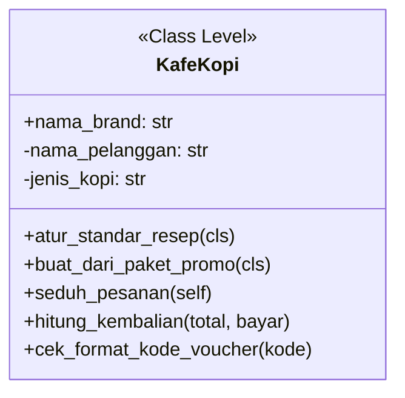
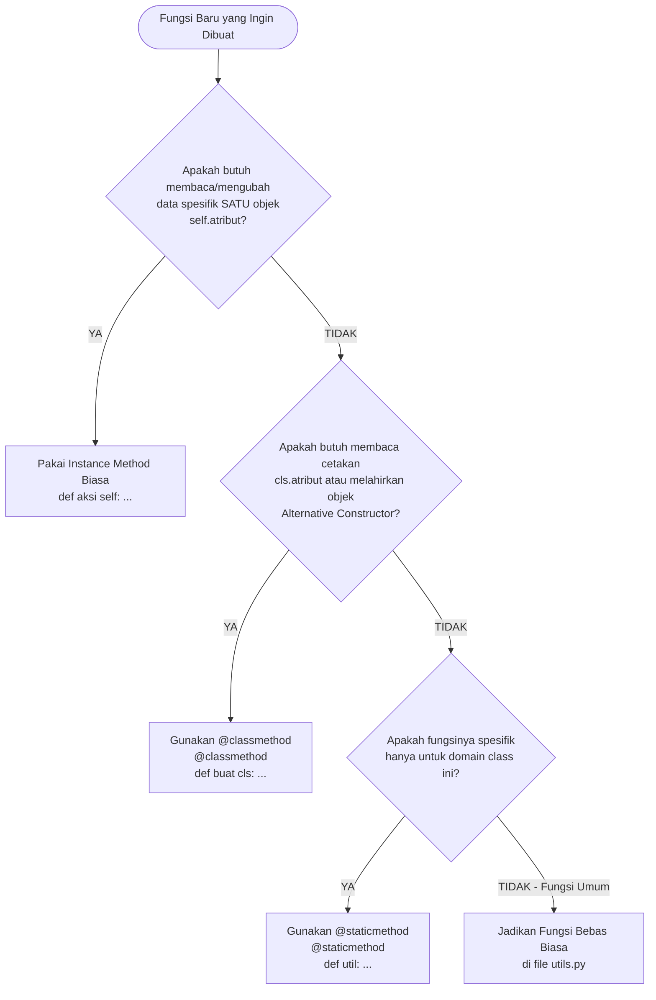

# 📘 Modul 8: Metode Spesial (`@classmethod` vs `@staticmethod`)

Selamat datang di Modul 8! Pada modul sebelumnya, kita telah mempelajari *Dunder Methods* yang memberikan "kekuatan magis" pada objek Python. 

Sekarang, kita akan membongkar rahasia di balik dekorator yang paling sering Anda temukan di kode Python profesional: **`@classmethod`** dan **`@staticmethod`**. 

Banyak pemrogram pemula bingung: *Kapan harus pakai method biasa? Kapan pakai `@classmethod`? Dan mengapa ada fungsi yang dimasukkan ke dalam class padahal tidak menyentuh `self` sama sekali?* Modul ini akan menjawab semuanya dengan analogi ramah awam dan studi kasus nyata.

---

## 🎯 Target Pembelajaran
Setelah menyelesaikan modul ini, Anda akan mampu:
1. Memahami perbedaan mendasar antara **Instance Method**, **Class Method**, dan **Static Method**.
2. Mengerti arti parameter **`self`** vs **`cls`**.
3. Menguasai pola desain **Alternative Constructor** (`@classmethod`) yang banyak dipakai di library besar seperti Pandas, Django, dan SQLAlchemy.
4. Mengetahui kapan fungsi pembantu (*utility function*) layak dijadikan `@staticmethod`.
5. Menghindari jebakan salah memilih decorator yang merusak pewarisan (*inheritance*).

---

## ☕ 1. Analogi Dunia Nyata: Kafe Kopi Modern

Bayangkan sebuah waralaba kedai kopi bernama **"Kopi Antigravity"**:



1. **Instance Method (`self`) - "Barista yang Melayani Pesanan Tertentu":**
   * Barista perlu tahu siapa pelanggannya (`self.nama_pelanggan`) dan apa rasa kopi yang dipesan (`self.jenis_kopi`).
   * Setiap cangkir kopi yang diseduh berbeda untuk tiap pembeli. Ini membutuhkan informasi spesifik dari **objek perorangan** (`self`).
2. **Class Method (`cls`) - "Manajer Cabang / Tim Litbang Waralaba":**
   * Manajer memiliki akses ke resep standar pusat waralaba (`cls`). 
   * Manajer bisa membuat paket menu baru secara massal, misalnya melahirkan paket pesanan siap saji dari kode promo string (*Alternative Constructor*).
   * Yang diakses bukan gelas kopi tertentu, melainkan **cetakan/kebijakan seluruh kafe** (`cls`).
3. **Static Method - "Kalkulator Saku di Meja Kasir":**
   * Kalkulator ini hanya dipakai untuk menghitung uang kembalian: `hitung_kembalian(total, uang_diterima)`.
   * Kalkulator tidak peduli siapa nama pelanggan (`self`), dan tidak peduli apa merk kafenya (`cls`). Dia murni alat bantu hitung matematika.
   * Kenapa ditaruh di dalam class `KafeKopi`? Agar rapi dan logis karena kalkulator tersebut digunakan dalam operasional kafe.

---

## 📊 2. Perbandingan 3 Jenis Method di Python

Mari kita bedah perbedaan ketiganya dalam tabel ringkas:

| Aspek | Instance Method | Class Method (`@classmethod`) | Static Method (`@staticmethod`) |
| :--- | :--- | :--- | :--- |
| **Dekorator** | *(Tidak ada / default)* | `@classmethod` | `@staticmethod` |
| **Parameter Wajib Pertama** | `self` (merujuk ke instance objek) | `cls` (merujuk ke blueprint class) | *Tidak ada* (seperti fungsi bebas biasa) |
| **Bisa Mengakses Instance Attr?** | ✅ Ya (bisa baca/tulis `self.x`) | ❌ Tidak bisa | ❌ Tidak bisa |
| **Bisa Mengakses Class Attr?** | ✅ Ya (lewat `self.__class__`) | ✅ Ya (langsung lewat `cls.x`) | ❌ Hanya jika panggil nama class langsung |
| **Paling Sering Digunakan Untuk** | Aksi rutin objek sehari-hari | **Alternative Constructor** & konfigurasi class | Fungsi utilitas/bantu murni |

---

## 🔍 3. Membedah Kode: Sintaks Dasar

```python
class Karyawan:
    perusahaan = "PT Maju Mundur Sejahtera"  # Class attribute

    def __init__(self, nama: str, gaji: int):
        self.nama = nama                     # Instance attribute
        self.gaji = gaji

    # 1. Instance Method: Butuh 'self'
    def info_profil(self) -> str:
        return f"{self.nama} bekerja di {self.perusahaan} dengan gaji Rp {self.gaji:,}"

    # 2. Class Method: Butuh 'cls'
    @classmethod
    def ubah_nama_perusahaan(cls, nama_baru: str):
        cls.perusahaan = nama_baru

    # 3. Static Method: Tanpa 'self' dan tanpa 'cls'
    @staticmethod
    def validasi_format_email(email: str) -> bool:
        return "@" in email and "." in email
```

Cara pemanggilannya:
```python
# Instance method dipanggil dari objek
karyawan1 = Karyawan("Budi", 7_000_000)
print(karyawan1.info_profil())

# Class method dipanggil dari Class langsung (atau dari objek)
Karyawan.ubah_nama_perusahaan("PT Vibe Coding Indonesia")

# Static method dipanggil dari Class langsung
apakah_valid = Karyawan.validasi_format_email("budi@gmail.com") # True
```

---

## 💡 4. Pola Emas: Alternative Constructor dengan `@classmethod`

Di Python, sebuah class **hanya boleh memiliki satu method `__init__`**. 

Lalu, bagaimana jika data masukan aplikasi kita datang dari berbagai sumber dengan bentuk yang berbeda-beda?
* Pengguna mendaftar lewat formulir web: dapat `nama`, `email`, `umur` secara terpisah.
* Pengguna diimpor dari file CSV: formatnya berupa teks `"Budi,budi@email.com,1995"`.
* Pengguna didapat dari REST API: formatnya berupa dictionary `{"name": "Budi", "mail": "budi@email.com", "birth": 1995}`.

Di sinilah `@classmethod` bersinar terang sebagai **Alternative Constructor**!

```mermaid
flowchart TD
    A[Data Mentah Masuk] --> B{Bentuk Data?}
    B -->|Argumen Terpisah| C[User'nama', 'email', 25\n__init__ Biasa]
    B -->|Teks CSV 'Budi,budi@...| D[User.dari_string'Budi,...'\n@classmethod]
    B -->|Dictionary JSON| E[User.dari_dict'nama': ...\n@classmethod]
    
    C --> F[Objek User Siap Digunakan di RAM]
    D -->|Otomatis return cls...| F
    E -->|Otomatis return cls...| F
```

### Contoh Kode:
```python
class User:
    def __init__(self, nama: str, email: str, tahun_lahir: int):
        self.nama = nama
        self.email = email
        self.tahun_lahir = tahun_lahir

    # Alternative Constructor 1: Dari string CSV
    @classmethod
    def dari_string(cls, teks_csv: str):
        # Memecah string "Andi,andi@mail.com,1998"
        nama, email, tahun = teks_csv.split(",")
        # Melahirkan objek baru menggunakan cetakan 'cls'
        return cls(nama.strip(), email.strip(), int(tahun.strip()))

    # Alternative Constructor 2: Dari Dictionary
    @classmethod
    def dari_dict(cls, data: dict):
        return cls(
            nama=data["nama"],
            email=data["email"],
            tahun_lahir=data["tahun_lahir"]
        )
```

### Mengapa Menggunakan `cls(...)` dan Bukan `User(...)`?
Ini adalah salah satu pertanyaan wawancara Python yang paling sering ditanyakan!

Jika Anda menulis `return User(...)` di dalam method tersebut, ketika ada subkelas yang mewarisinya:
```python
class Admin(User):
    pass

admin = Admin.dari_string("SuperAdmin,admin@mail.com,1990")
```
Jika method menggunakan `return cls(...)`, objek yang tercipta adalah instansi dari **`Admin`**.  
Tetapi jika Anda menulis `return User(...)`, objek yang tercipta akan dipaksa menjadi **`User`** biasa!

---

## 🛠️ 5. Kapan Harus Menggunakan `@staticmethod`?

Gunakan `@staticmethod` jika:
1. Fungsi tersebut secara konsep **berkaitan erat dengan tugas class**, namun...
2. Fungsi tersebut **tidak perlu membaca atribut objek** (`self.xxx`) maupun **atribut kelas** (`cls.xxx`).
3. Anda ingin mengelompokkan fungsi pembantu tersebut agar tidak berserakan di global namespace modul.

Contoh yang tepat:
* Menghitung pajak transaksi: `Transaksi.hitung_pajak(subtotal, tarif)`
* Memeriksa apakah suatu tanggal adalah hari libur: `JadwalKerja.apakah_hari_libur(tanggal)`
* Mengubah satuan: `KonverterSuhu.celsius_ke_fahrenheit(c)`

---

## ⚠️ 6. Awas Jebakan Pemula! (Common Pitfalls)

Berikut adalah kesalahan-kesalahan yang paling sering dialami pemula:

### ❌ Jebakan 1: Memaksa Semua Fungsi Pembantu Masuk ke Class
Tidak semua fungsi harus masuk ke dalam class! Jika sebuah fungsi sangat umum (misal `format_rupiah` yang dipakai di 10 class berbeda), lebih baik dijadikan fungsi biasa di dalam file `utils.py` daripada dipaksakan menjadi `@staticmethod` di salah satu class.

### ❌ Jebakan 2: Lupa Dekorator `@classmethod`
```python
# SALAH:
class Mobil:
    def info_pabrik(cls):  # Python mengira ini method biasa dengan parameter 'self' bernama 'cls'!
        print(cls)

# BENAR:
class Mobil:
    @classmethod
    def info_pabrik(cls):
        print(cls)
```

### ❌ Jebakan 3: Memanggil `self` di dalam `@classmethod` atau `@staticmethod`
Karena parameter `self` tidak ada di dalam `@classmethod` (hanya ada `cls`) dan sama sekali tidak ada di `@staticmethod`, mencoba mengetik `self.nama` akan langsung memicu error:
```python
# SALAH:
@classmethod
def cetak_nama(cls):
    print(self.nama)  # 💥 NameError: name 'self' is not defined!
```

### ❌ Jebakan 4: Hardcoding Nama Class Saat Membuat Alternative Constructor
Jangan menulis nama kelas secara kaku jika ingin mendukung pewarisan (*subclassing*):
```python
# KURANG TEPAT (Merusak Inheritance):
@classmethod
def dari_string(cls, teks):
    return User(...)  # Jika dipanggil Admin.dari_string(), yang lahir tetap User biasa!

# BENAR & PYTHONIC:
@classmethod
def dari_string(cls, teks):
    return cls(...)   # Jika dipanggil Admin.dari_string(), otomatis lahir objek Admin!
```

### ❌ Jebakan 5: Kebingungan Cara Memanggil Static / Class Method
Apakah static method dipanggil lewat objek (`user1.format_rupiah()`) atau lewat Class (`User.format_rupiah()`)?
* Secara teknis di Python, **keduanya bisa berjalan**.
* Namun aturan *Clean Code* menganjurkan memanggilnya melalui nama **Class langsung** (`User.format_rupiah()`) agar programmer lain yang membaca kode langsung tahu bahwa method tersebut independen dari status objek individual.

---

## 🌳 7. Panduan Cepat: Pohon Keputusan Pemilihan Method

Gunakan diagram alur ini saat Anda bingung memilih jenis method:



---

## 🧠 8. Kuis Uji Pemahaman

Uji pemahaman Anda sebelum melangkah ke praktik kode:

1. **Apa perbedaan parameter pertama pada Instance Method dan Class Method?**
<details>
<summary>👁️ Lihat Jawaban</summary>
Instance method menerima <code>self</code> (merujuk ke instansi/objek spesifik), sedangkan Class method menerima <code>cls</code> (merujuk ke cetakan/blueprint class itu sendiri).
</details>

2. **Dapatkah sebuah `@staticmethod` memodifikasi atribut instance milik objek?**
<details>
<summary>👁️ Lihat Jawaban</summary>
<strong>Tidak bisa.</strong> Static method tidak menerima parameter <code>self</code>, sehingga tidak memiliki akses langsung ke atribut instansi objek.
</details>

3. **Mengapa pola <i>Alternative Constructor</i> lebih baik mengembalikan <code>cls(...)</code> daripada <code>NamaClass(...)</code>?**
<details>
<summary>👁️ Lihat Jawaban</summary>
Agar mendukung <strong>pewarisan (inheritance)</strong>. Jika suatu saat class tersebut diturunkan ke subkelas (misal <code>Admin</code> turunan dari <code>User</code>), pemanggilan <code>Admin.dari_string(...)</code> akan secara otomatis melahirkan objek bertipe <code>Admin</code>, bukan <code>User</code> biasa.
</details>

4. **Kapan sebuah fungsi pembantu lebih baik diletakkan di file terpisah (seperti `utils.py`) daripada dijadikan `@staticmethod` di dalam class?**
<details>
<summary>👁️ Lihat Jawaban</summary>
Ketika fungsi pembantu tersebut bersifat <strong>sangat umum (general-purpose)</strong> dan dibutuhkan oleh banyak modul atau class berbeda di seluruh aplikasi (misal: format mata uang global, pembersih tag HTML umum, atau enkripsi token), sehingga tidak ada alasan logis untuk membatasi keberadaannya di dalam satu class tertentu saja.
</details>

---

## 📂 Berkas Praktik pada Modul Ini
Silakan pelajari dan jalankan berkas-berkas berikut secara bertahap:
1. [`01_tiga_jenis_method.py`](file:///c:/Users/anton/vibecoding/OOP/03_intermediate_level/modul_08_special_methods/01_tiga_jenis_method.py): Perbandingan langsung sintaks & perilaku Instance vs Class vs Static Method.
2. [`02_alternative_constructor.py`](file:///c:/Users/anton/vibecoding/OOP/03_intermediate_level/modul_08_special_methods/02_alternative_constructor.py): Studi kasus nyata melahirkan objek dari String CSV dan Dictionary JSON.
3. [`03_latihan_mandiri.py`](file:///c:/Users/anton/vibecoding/OOP/03_intermediate_level/modul_08_special_methods/03_latihan_mandiri.py): Lembar kerja tantangan sistem transaksi keuangan.
4. [`04_solusi_latihan.py`](file:///c:/Users/anton/vibecoding/OOP/03_intermediate_level/modul_08_special_methods/04_solusi_latihan.py): Kunci jawaban resmi dengan penjelasan mendalam.
