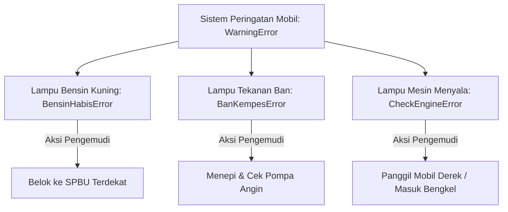
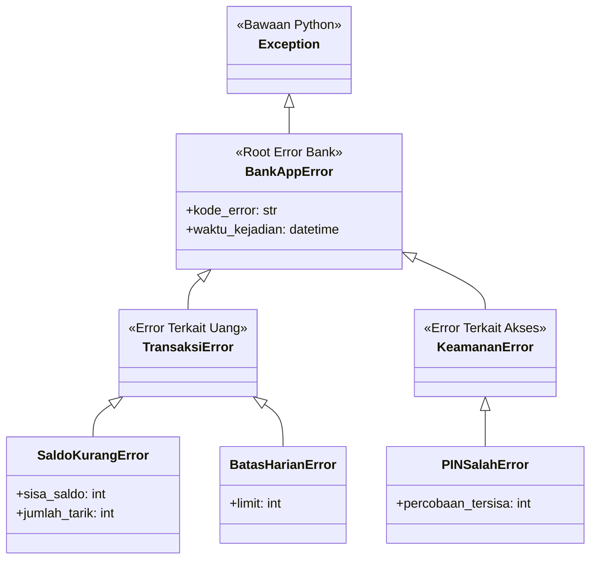

# 🛡️ Modul 9: Custom Exception & Error Handling Berbasis Objek

Selamat datang di Modul 9! Di dunia pemrograman nyata, hal-hal buruk pasti bisa terjadi: koneksi internet terputus, saldo rekening tidak cukup saat checkout, password salah tiga kali, atau database kehabisan ruang simpan.

Banyak pemrogram pemula menangani masalah ini dengan cara yang serampangan:
```python
# ❌ CARA PEMULA YANG RAWAN MASALAH:
if saldo < jumlah_tarik:
    raise Exception("Saldo kamu kurang bos!")
```
Mengapa melempar `Exception("pesan string")` umum dianggap buruk di industri perangkat lunak? Bagaimana cara membuat **pesan error khusus berbasis class** yang cerdas, memiliki hierarki, dan menyimpan metadata? Modul ini akan mengupas tuntas rahasia manajemen error profesional menggunakan konsep OOP!

---

## 🎯 Target Pembelajaran
Setelah menyelesaikan modul ini, Anda akan mampu:
1. Memahami mengapa sistem perangkat lunak membutuhkan **Custom Exception**.
2. Mewarisi class bawaan **`Exception`** untuk membuat error spesifik buatan sendiri.
3. Membangun **Hierarki Error** (Tree of Exceptions) yang elegan dan terstruktur.
4. Menyimpan **Metadata** (seperti sisa saldo, kode status, waktu kejadian) di dalam objek error.
5. Menghindari jebakan fatal *Blanket Except* (`except Exception: pass`) yang sering menyembunyikan bug kritis.

---

## 🚗 1. Analogi Dunia Nyata: Lampu Indikator Dashboard Mobil

Bayangkan Anda sedang mengendarai mobil modern di jalan tol:



* **Jika Mobil Hanya Punya 1 Lampu Umum Berlabel "RUSAK!":**  
  Ketika lampu menyala, Anda panik! Apakah bensinnya yang habis? Atau remnya yang blong? Anda tidak tahu tindakan apa yang harus diambil. Ini sama persis dengan melempar `raise Exception("rusak")`.
* **Dengan Custom Exception Berbasis OOP:**  
  Setiap kerusakan memiliki jenis class sendiri. Jika yang muncul adalah `BensinHabisError`, pengemudi (aplikasi) tahu harus mencari SPBU tanpa panik mematikan mesin darurat di tengah jalan.

---

## 🔍 2. Mengapa String Error Saja Tidak Cukup?

Perhatikan masalah saat aplikasi lain mencoba menangani error yang dilempar sebagai string:

```python
# Melempar error umum:
raise Exception("SALDO_KURANG: Saldo Anda hanya Rp 50.000")

# Aplikasi UI / Frontend yang menangkap error harus memeriksa teks secara manual:
try:
    proses_transfer()
except Exception as e:
    if "SALDO_KURANG" in str(e): # ⚠️ Sangat rapuh! Jika teks diubah sedikit, kode ini rusak!
        tampilkan_halaman_topup()
```

Jika programmer backend mengubah kalimat menjadi `"Saldo tidak mencukupi"`, maka kode frontend di atas akan gagal mendeteksi kondisi tersebut!

### Solusi Elegan: Tangkap Berdasarkan Tipe Objek Class
```python
try:
    proses_transfer()
except SaldoTidakCukupError as e:  # ✅ Kebal terhadap perubahan kalimat teks!
    tampilkan_halaman_topup(e.sisa_saldo, e.nominal_tarik)
except RekeningDibekukanError as e:
    tampilkan_kontak_customer_service()
```

---

## 🏗️ 3. Anatomi Membuat Custom Exception Pertama

Membuat custom exception di Python sangatlah sederhana: **cukup buat class yang mewarisi `Exception`**!

```python
class UsiaBelumCukupError(Exception):
    """Dilempar ketika pendaftar belum memenuhi batas usia minimal."""
    pass
```

Hanya dengan 2 baris kode di atas, Anda sudah memiliki error kustom resmi!  
Mari kita buat lebih cerdas dengan menambahkan data (metadata):

```python
class UsiaBelumCukupError(Exception):
    def __init__(self, usia_saat_ini: int, usia_minimal: int = 17):
        self.usia_saat_ini = usia_saat_ini
        self.usia_minimal = usia_minimal
        pesan = f"Pendaftaran ditolak: Usia pendaftar {usia_saat_ini} tahun (Minimal {usia_minimal} tahun)."
        super().__init__(pesan)  # Kirim pesan resmi ke induk Exception
```

Saat digunakan:
```python
def daftar_sim(nama: str, usia: int):
    if usia < 17:
        raise UsiaBelumCukupError(usia_saat_ini=usia, usia_minimal=17)
    print(f"Pendaftaran SIM untuk {nama} berhasil!")

try:
    daftar_sim("Bocil Kematian", 14)
except UsiaBelumCukupError as err:
    print(f"[DITOLAK] {err}")
    print(f"Info Tambahan: Kurang {err.usia_minimal - err.usia_saat_ini} tahun lagi!")
```

---

## 🌳 4. Membangun Hierarki Error (Pohon Error Aplikasi)

Di aplikasi berskala menengah hingga besar, kita tidak membuat exception secara acak. Kita membuat **Satu Base Exception** untuk aplikasi kita, lalu menurunkannya menjadi sub-exception spesifik:



### Keuntungan Luar Biasa dari Hierarki Ini:
Anda bisa memilih seberapa spesifik Anda ingin menangani error:

```python
# 1. Menangani secara ultra-spesifik:
try:
    lakukan_transaksi()
except SaldoKurangError:
    arahkan_ke_halaman_topup()

# 2. ATAU menangani seluruh transaksi error sekaligus:
try:
    lakukan_transaksi()
except TransaksiError as e:
    catat_ke_log_keuangan(e)

# 3. ATAU menangkap semua error milik aplikasi bank kita:
try:
    lakukan_transaksi()
except BankAppError as e:
    tampilkan_popup_gangguan_layanan(e)
```

---

## ⚠️ 5. Awas Jebakan Pemula! (Common Pitfalls)

### ❌ Jebakan 1: *Blanket Except* (`except Exception:` atau `except: pass`)
Ini adalah dosa terbesar pemula dalam penanganan error:
```python
# SANGAT BERBAHAYA:
try:
    hasil = proses_data_penting()
except Exception:
    pass  # Menelan SEMUA error tanpa jejak!
```
**Mengapa berbahaya?**  
Jika ada salah ketik variabel (`NameError`), pembagian dengan nol (`ZeroDivisionError`), atau bug logika, program Anda akan diam seribu bahasa (*silent failure*) dan Anda akan pusing mencari di mana letak kerusakannya selama berhari-hari!  
*Solusi:* Tangkaplah exception yang Anda antisipasi saja, atau minimal cetak/catat pesan lognya.

### ❌ Jebakan 2: Mewarisi `BaseException` Bukannya `Exception`
Di Python, akar paling atas adalah `BaseException`, yang membawahi `KeyboardInterrupt` (saat user menekan `Ctrl+C` di terminal) dan `SystemExit`.
* Jangan warisi `BaseException`!
* **Selalu warisi class `Exception`**. Jika Anda mewarisi `BaseException`, aplikasi Anda tidak bisa dihentikan dengan `Ctrl+C` saat error terjadi.

### ❌ Jebakan 3: Lupa Memanggil `super().__init__(pesan)`
Jika Anda membuat `__init__` kustom di dalam class exception, jangan lupa meneruskan string pesan ke `super().__init__(pesan)` agar fungsi bawaan seperti `str(e)` dan `print(e)` tetap bisa menampilkan teks error dengan benar.

---

## 🧠 6. Kuis Uji Pemahaman

1. **Mengapa menangkap error dengan `except SaldoKurangError:` jauh lebih baik daripada memeriksa teks `if "saldo" in str(e):`?**
<details>
<summary>👁️ Lihat Jawaban</summary>
Karena pemeriksaan berbasis class bersifat <strong>kebal terhadap perubahan teks</strong> (refactoring teks pesan/lokalisasi multi-bahasa tidak akan merusak logika aplikasi) dan memungkinkan kita mengakses atribut/metadata terstruktur secara langsung.
</details>

2. **Jika class `SaldoKurangError` adalah anak turunan dari `BankError`, apa yang terjadi jika blok kode menulis `except BankError as e:`?**
<details>
<summary>👁️ Lihat Jawaban</summary>
Blok tersebut <strong>akan tetap berhasil menangkap `SaldoKurangError`</strong> karena sifat pewarisan (Polymorphism: Objek anak adalah instansi dari induknya).
</details>

3. **Mengapa kita tidak boleh membiasakan menulis `except: pass` (Blanket Except)?**
<details>
<summary>👁️ Lihat Jawaban</summary>
Karena dapat menelan seluruh jenis error secara diam-diam termasuk bug sintaks, salah nama variabel, atau kegagalan fatal sistem, sehingga membuat proses pelacakan bug (debugging) menjadi sangat sulit.
</details>

---

## 📂 Berkas Praktik pada Modul Ini
Silakan pelajari dan jalankan berkas-berkas berikut secara bertahap:
1. [`01_dasar_custom_exception.py`](file:///c:/Users/anton/vibecoding/OOP/03_intermediate_level/modul_09_custom_exceptions/01_dasar_custom_exception.py): Membuat exception kustom pertama dan menyimpan metadata.
2. [`02_hierarki_dan_metadata_error.py`](file:///c:/Users/anton/vibecoding/OOP/03_intermediate_level/modul_09_custom_exceptions/02_hierarki_dan_metadata_error.py): Membangun pohon hierarki error perbankan dan seleksi penanganan error.
3. [`03_latihan_mandiri.py`](file:///c:/Users/anton/vibecoding/OOP/03_intermediate_level/modul_09_custom_exceptions/03_latihan_mandiri.py): Lembar kerja tantangan sistem penarikan saldo ATM & e-Wallet.
4. [`04_solusi_latihan.py`](file:///c:/Users/anton/vibecoding/OOP/03_intermediate_level/modul_09_custom_exceptions/04_solusi_latihan.py): Kunci jawaban resmi lengkap dengan penanganan error berlapis.
