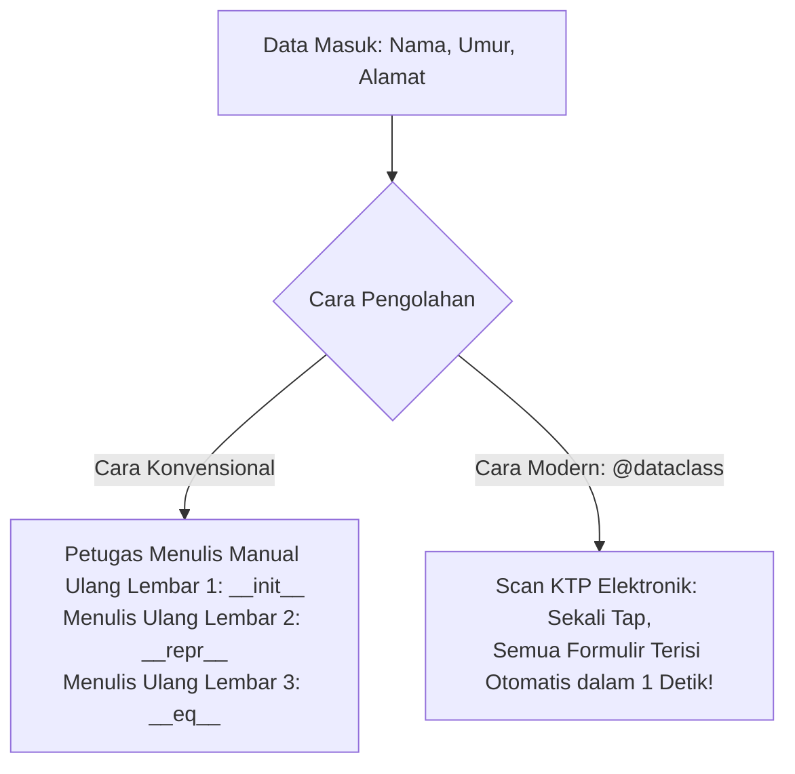

# ⚡ Modul 10: Modern Python Shortcut (`@dataclass`) & Type Hinting

Selamat datang di Modul 10! Ini adalah modul pamungkas dari **Fase 3: Intermediate Level**. 

Pernahkah Anda merasa lelah mengetik kode seperti ini berulang-ulang setiap kali membuat class data?
```python
# 😩 KODE MEMBOSANKAN YANG BERULANG (BOILERPLATE):
class Produk:
    def __init__(self, nama: str, harga: int, stok: int):
        self.nama = nama
        self.harga = harga
        self.stok = stok

    def __repr__(self):
        return f"Produk(nama='{self.nama}', harga={self.harga}, stok={self.stok})"

    def __eq__(self, other):
        return (self.nama, self.harga, self.stok) == (other.nama, other.harga, other.stok)
```
Hanya untuk menyimpan 3 buah data (`nama`, `harga`, `stok`), Anda harus menulis belasan baris kode yang membosankan (*boilerplate code*)! 

Sejak Python 3.7, para perancang Python menghadirkan "jalan pintas modern" bernama **`@dataclass`**. Dengan `@dataclass`, seluruh kode panjang di atas dapat diringkas menjadi **hanya 4 baris**!

---

## 🎯 Target Pembelajaran
Setelah menyelesaikan modul ini, Anda akan mampu:
1. Memahami konsep dan filosofi dekorator **`@dataclass`**.
2. Menggunakan **Type Hinting** modern Python secara tepat.
3. Menikmati keajaiban otomatis: `__init__`, `__repr__`, dan `__eq__` tanpa perlu mengetik manual.
4. Menangani nilai bawaan mutable dengan **`field(default_factory=list)`**.
5. Melakukan validasi dan perhitungan pasca-inisialisasi menggunakan **`__post_init__()`**.
6. Membuat objek *Read-Only* (kebal perubahan) dengan **`frozen=True`**.
7. Mengaktifkan pengurutan otomatis objek menggunakan **`order=True`**.

---

## 📋 1. Analogi Dunia Nyata: Formulir Isian Otomatis

Bayangkan Anda datang ke kantor pelayanan publik:



* **Class Konvensional:** Petugas administrasi zaman dulu yang harus menulis ulang data yang sama di 3 lembar formulir berbeda secara manual. Sangat lambat dan rentan salah ketik (*human error*).
* **`@dataclass`:** Sistem KTP Elektronik modern. Anda cukup menyebutkan kolom datanya dan tipe datanya, komputer secara otomatis mencetak `__init__`, format cetak rapi `__repr__`, dan alat pembanding `__eq__` di balik layar!

---

## ⚖️ 2. Perbandingan Langsung: Sebelum vs Sesudah `@dataclass`

Lihatlah bagaimana kode Anda bertransformasi menjadi sangat bersih dan elegan:

### Sebelum (Cara Kuno - 16 Baris):
```python
class Siswa:
    def __init__(self, nama: str, kelas: str, nilai: float):
        self.nama = nama
        self.kelas = kelas
        self.nilai = nilai

    def __repr__(self) -> str:
        return f"Siswa(nama='{self.nama}', kelas='{self.kelas}', nilai={self.nilai})"

    def __eq__(self, other) -> bool:
        if isinstance(other, Siswa):
            return (self.nama, self.kelas, self.nilai) == (other.nama, other.kelas, other.nilai)
        return False
```

### Sesudah (Modern Pythonic - 5 Baris Saja!):
```python
from dataclasses import dataclass

@dataclass
class Siswa:
    nama: str
    kelas: str
    nilai: float
```

Kedua kode di atas menghasilkan **perilaku yang persis 100% sama!**  
* `s1 = Siswa("Budi", "12A", 95.5)` $\rightarrow$ Constructor otomatis tercipta.
* `print(s1)` $\rightarrow$ Otomatis mencetak `Siswa(nama='Budi', kelas='12A', nilai=95.5)`.
* `s1 == s2` $\rightarrow$ Otomatis membandingkan isi nilai, bukan alamat memori!

---

## 🏷️ 3. Type Hinting Modern di Python

Saat menggunakan `@dataclass`, **Type Hinting (penanda tipe data) bersifat WAJIB**. Python menggunakan tipe data ini untuk mengenali field apa saja yang harus dijadikan atribut:

```python
from dataclasses import dataclass
from typing import Optional

@dataclass
class ProfilPengguna:
    id_user: int               # Integer
    username: str              # String
    skor_rata: float = 0.0     # Float dengan nilai default
    is_aktif: bool = True      # Boolean dengan nilai default
    bio: Optional[str] = None  # Bisa berupa string atau None
```

> 💡 **Catatan Penting**: Type hint di Python bersifat sebagai *dokumentasi dan panduan IDE* (tidak melempar error saat runtime jika tipenya tidak cocok). Namun, type hint membuat kode Anda sangat mudah dibaca oleh tim dan mencegah bug saat pengembangan.

---

## ⚙️ 4. Fitur-Fitur Superpower `@dataclass`

### A. Nilai Bawaan Mutable dengan `field(default_factory=...)`
Jika Anda ingin atribut memiliki nilai bawaan berupa list, dict, atau set kosong:
```python
# ❌ AKAN ERROR FATAL DI PYTHON:
@dataclass
class Tim:
    nama: str
    anggota: list = []  # ValueError: mutable default <class 'list'> is not allowed!
```
*Mengapa dilarang?*  
Karena jika diizinkan, seluruh objek `Tim` akan berbagi list yang sama (kebocoran data)!

*Solusi Resmi:* Gunakan `field(default_factory=list)`:
```python
from dataclasses import dataclass, field

@dataclass
class Tim:
    nama: str
    anggota: list[str] = field(default_factory=list) # ✅ Setiap tim dapat list baru yang independen!
```

---

### B. Validasi & Kalkulasi Pasca-Inisialisasi: `__post_init__()`
Bagaimana jika kita butuh menghitung atribut turunan atau memvalidasi data setelah objek lahir? Gunakan `__post_init__()`!

```python
@dataclass
class BarangBelanja:
    nama: str
    harga_satuan: int
    jumlah: int
    total_harga: int = field(init=False)  # init=False artinya tidak diminta di constructor

    def __post_init__(self):
        # 1. Validasi
        if self.harga_satuan < 0:
            raise ValueError("Harga satuan tidak boleh negatif!")
        if self.jumlah <= 0:
            raise ValueError("Jumlah barang minimal 1!")
        
        # 2. Kalkulasi Otomatis
        self.total_harga = self.harga_satuan * self.jumlah
```

---

### C. Objek Anti-Ubah (Read-Only) dengan `frozen=True`
Jika Anda ingin data tidak bisa diubah-ubah setelah dibuat (Immutable Data Object):

```python
@dataclass(frozen=True)
class TitikKoordinat:
    x: float
    y: float

titik = TitikKoordinat(10.5, 20.0)
titik.x = 99.9  # 💥 FrozenInstanceError: cannot assign to field 'x'!
```
Sangat berguna untuk konfigurasi sistem, API key, atau data geografis yang tidak boleh diutak-atik.

---

### D. Pengurutan Otomatis dengan `order=True`
Tambahkan parameter `order=True` jika Anda ingin objek bisa dibandingkan besar-kecilnya (`<`, `<=`, `>`, `>=`) dan diurutkan dengan `list.sort()`:

```python
@dataclass(order=True)
class PeringkatGamer:
    skor: int
    username: str

g1 = PeringkatGamer(skor=1500, username="pro_player")
g2 = PeringkatGamer(skor=800, username="newbie")

print(g1 > g2)  # True! Diurutkan berdasarkan field pertama (skor)
```

---

### E. Konversi Instan ke Dictionary dengan `asdict()`
Ingin mengirim data dataclass ke API atau menyimpan ke JSON? Sangat mudah:

```python
from dataclasses import dataclass, asdict

@dataclass
class Hero:
    nama: str
    hp: int

hero1 = Hero("Gatotkaca", 2500)
kamus_data = asdict(hero1)
print(kamus_data)  # {'nama': 'Gatotkaca', 'hp': 2500} -> Siap untuk json.dumps()!
```

---

## ⚠️ 5. Awas Jebakan Pemula! (Common Pitfalls)

### ❌ Jebakan 1: Field Tanpa Default Ditulis Setelah Field Ber-default
Aturan Python berlaku: parameter wajib harus berada di depan parameter opsional!
```python
# SALAH:
@dataclass
class Mobil:
    merk: str = "Toyota" # Ada default
    tipe: str            # 💥 SyntaxError: non-default argument 'tipe' follows default argument!

# BENAR:
@dataclass
class Mobil:
    tipe: str            # Wajib dulu
    merk: str = "Toyota" # Opsional di belakang
```

### ❌ Jebakan 2: Menggunakan List/Dict Kosong Langsung Sebagai Default
Selalu gunakan `field(default_factory=list)` atau `field(default_factory=dict)` untuk mencegah `ValueError: mutable default ... is not allowed`.

### ❌ Jebakan 3: Mengira Dataclass Otomatis Menolak Tipe yang Salah
Python tidak memeriksa tipe data saat program berjalan (*no runtime type enforcement*).
```python
@dataclass
class Anggota:
    umur: int

# Python TIDAK AKAN melempar error di baris ini:
a = Anggota(umur="dua puluh")  # Nilainya tetap diterima sebagai string!
```
Jika Anda butuh validasi tipe data yang ketat, lakukan pengecekan di dalam method `__post_init__()` menggunakan `isinstance()`.

---

## 🧠 6. Kuis Uji Pemahaman

1. **Dunder method apa saja yang secara otomatis dibuat oleh dekorator `@dataclass` standar?**
<details>
<summary>👁️ Lihat Jawaban</summary>
Secara default, <code>@dataclass</code> otomatis membuatkan <code>__init__()</code> (constructor), <code>__repr__()</code> (representasi string informatif), dan <code>__eq__()</code> (perbandingan isi atribut).
</details>

2. **Mengapa Python melarang kita menulis `tags: list = []` secara langsung di dalam `@dataclass`?**
<details>
<summary>👁️ Lihat Jawaban</summary>
Karena <code>list</code> adalah tipe data <i>mutable</i>. Jika diizinkan sebagai nilai default, seluruh objek yang dibuat tanpa argumen akan berbagi referensi ke satu list memori yang sama di RAM, menyebabkan kebocoran data antar objek. Solusinya adalah menggunakan <code>field(default_factory=list)</code>.
</details>

3. **Apa kegunaan dari method spesial `__post_init__(self)`?**
<details>
<summary>👁️ Lihat Jawaban</summary>
Untuk mengeksekusi logika tambahan (seperti validasi aturan bisnis atau kalkulasi otomatis atribut turunan) <strong>segera setelah</strong> method bawaan <code>__init__()</code> selesai dijalankan.
</details>

4. **Bagaimana cara membuat sebuah dataclass menjadi kebal terhadap perubahan data (Read-Only / Immutable)?**
<details>
<summary>👁️ Lihat Jawaban</summary>
Dengan menambahkan parameter <code>frozen=True</code> pada dekorator, yaitu: <code>@dataclass(frozen=True)</code>.
</details>

---

## 📂 Berkas Praktik pada Modul Ini
Silakan pelajari dan jalankan berkas-berkas berikut secara bertahap:
1. [`01_dasar_dataclass.py`](file:///c:/Users/anton/vibecoding/OOP/03_intermediate_level/modul_10_dataclasses/01_dasar_dataclass.py): Demonstrasi "Sebelum vs Sesudah", otomatisasi `__repr__`, `__eq__`, dan konversi `asdict()`.
2. [`02_fitur_lanjutan_dataclass.py`](file:///c:/Users/anton/vibecoding/OOP/03_intermediate_level/modul_10_dataclasses/02_fitur_lanjutan_dataclass.py): Praktik `default_factory`, `__post_init__`, objek `frozen=True`, dan pengurutan `order=True`.
3. [`03_latihan_mandiri.py`](file:///c:/Users/anton/vibecoding/OOP/03_intermediate_level/modul_10_dataclasses/03_latihan_mandiri.py): Lembar kerja tantangan Model Data E-Commerce (`Produk`, `ItemPesanan`, `KeranjangBelanja`).
4. [`04_solusi_latihan.py`](file:///c:/Users/anton/vibecoding/OOP/03_intermediate_level/modul_10_dataclasses/04_solusi_latihan.py): Kunci jawaban resmi lengkap dengan kalkulasi subtotal dan struk belanja profesional.
