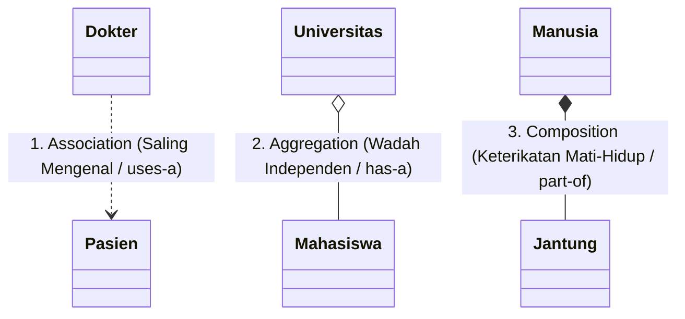

# 🏛️ Modul 11: Hubungan Antar Objek (Association, Aggregation, & Komposisi)

Selamat datang di **Fase 4: Hero Level**! 🚀  
Pada modul-modul sebelumnya, Anda telah menguasai cara membuat objek, 4 pilar OOP, dan fitur-fitur mutakhir Python. Sekarang, saatnya melangkah dari seorang *coder* menjadi seorang **arsitek perangkat lunak**.

Dalam aplikasi dunia nyata, objek tidak pernah hidup sendirian di ruang hampa. Objek harus saling bekerja sama, saling memiliki, dan saling berkomunikasi. 

Banyak pemula terjebak membuat struktur yang salah: mereka mewarisi semua hal dengan *Inheritance*, hingga kodenya kusut bagai benang wol. Di modul ini, Anda akan mempelajari **3 Jenis Hubungan Antar Objek** dan rahasia filosofi senior developer: **"Favor Composition over Inheritance"**.

---

## 🎯 Target Pembelajaran
Setelah menyelesaikan modul ini, Anda akan mampu:
1. Membedakan hubungan **IS-A** (Pewarisan) vs **HAS-A** (Kepemilikan).
2. Memahami 3 jenis relasi objek: **Association** (*uses-a*), **Aggregation** (*has-a longgar*), dan **Composition** (*part-of kuat*).
3. Menguasai prinsip desain legendaris: **Favor Composition over Inheritance**.
4. Menghindari bencana *Class Explosion* (ledakan jumlah class turunan).
5. Membangun sistem modular yang komponen-komponennya mudah ditukar pasang saat runtime (*plug-and-play*).

---

## ☕ 1. Analogi Dunia Nyata: Tiga Tingkat Ikatan

Bayangkan hubungan antar manusia dan benda di dunia nyata:



1. **Association (Asosiasi) - "Teman Ngopi / Dokter & Pasien":**
   * Dokter memeriksa Pasien. Pasien berkonsultasi ke Dokter.
   * Hubungan ini setara dan longgar (*uses-a*).
   * Keduanya berdiri sendiri: jika dokter pensiun, pasien tetap hidup dan bisa pergi ke dokter lain.
2. **Aggregation (Agregasi) - "Penumpang & Bus Kota":**
   * Bus kota membawa Penumpang (*has-a*).
   * Penumpang diciptakan di luar bus dan naik ke dalam bus.
   * Jika bus kota mogok atau dibongkar ke tempat besi tua, para penumpang **tidak ikut hancur**. Mereka turun dan tetap hidup mandiri di luar bus.
3. **Composition (Komposisi) - "Manusia & Jantung / Mobil & Rangka":**
   * Manusia memiliki Jantung (*part-of*).
   * Jantung diciptakan bersamaan dengan manusia dan berada di dalam tubuh manusia.
   * Keterikatan ini bersifat **mati-hidup**: jika manusia meninggal dunia, jantungnya tidak bisa lagi berfungsi secara mandiri. Jantung musnah bersama manusia pemiliknya.

---

## 📊 2. Tabel Komparasi 3 Jenis Hubungan

| Aspek | Association (Asosiasi) | Aggregation (Agregasi) | Composition (Komposisi) |
| :--- | :--- | :--- | :--- |
| **Sifat Hubungan** | Setara (*Peer-to-Peer*) | Wadah & Isi (*Whole-Part*) | Pemilik & Bagian Mutlak (*Life-or-Death*) |
| **Hubungan Logika** | *Uses-a* (Menggunakan) | *Has-a* (Memiliki secara longgar) | *Part-of* (Bagian tubuh hakiki) |
| **Penciptaan Objek Anak** | Di luar kelas | Di luar kelas (dioper via argumen) | **Di dalam kelas induk** |
| **Jika Induk Musnah?** | Anak tidak terpengaruh | **Anak tetap hidup mandiri** | **Anak ikut musnah bersama induk** |
| **Simbol UML** | Garis putus-putus (`-->`) | Garis panah intan kosong (`o--`) | Garis panah intan solid (`*--`) |

---

## ⚔️ 3. Pertarungan Abadi: *Inheritance* vs *Composition*

Prinsip nomor satu dalam buku legendaris *Design Patterns: Elements of Reusable Object-Oriented Software* (Gang of Four) berbunyi:
> *"Favor object composition over class inheritance."*  
> (Utamakan Komposisi Objek daripada Pewarisan Class).

### Mengapa Begitu? Masalah *Gorilla / Banana Problem*
Joe Armstrong (pencipta bahasa Erlang) pernah berkata:
> *"Masalah dengan bahasa OOP klasik adalah Anda menginginkan sebuah Pisang, tetapi yang Anda dapatkan adalah seekor Gorila yang sedang memegang pisang tersebut, beserta seluruh hutan rimba tempat gorila itu tinggal!"*

Saat Anda mewarisi class (`class Anak(Induk)`), anak dipaksa mewarisi **seluruh sifat dan method induk**, baik yang dibutuhkan maupun yang tidak dibutuhkan! Struktur kode menjadi sangat kaku (*tightly coupled*).

### Studi Kasus Nyata: Karakter Game RPG
Bayangkan Anda ingin membuat karakter prajurit game dengan berbagai variasi senjata dan elemen:
* Jika menggunakan **Inheritance**:
  - `PrajuritPedangApi`
  - `PrajuritPedangEs`
  - `PrajuritPanahApi`
  - `PrajuritPanahEs`  
  $\rightarrow$ **Class Explosion!** Jika ada 5 senjata dan 4 elemen, Anda harus membuat $5 \times 4 = 20$ class baru! Dan bagaimana jika di tengah permainan karakter ingin mengganti pedang menjadi panah? Di inheritance, **objek tidak bisa berganti induk di tengah jalan!**

* Jika menggunakan **Komposisi**:
  ```python
  class Karakter:
      def __init__(self, nama: str, senjata, elemen):
          self.nama = nama
          self.senjata = senjata  # Komposisi / Agregasi
          self.elemen = elemen
  ```
  Anda hanya butuh **1 Class Karakter**! Senjata dan elemen bisa diganti kapan saja saat game berjalan (*Plug and Play*):
  ```python
  hero = Karakter("Arthur", senjata=Pedang(), elemen=Api())
  hero.serang() # Menyerang dengan Pedang Api

  # Ganti senjata saat runtime:
  hero.senjata = BusurPanah()
  hero.serang() # Sekarang menyerang dengan Busur Panah Api!
  ```

---

## 🛠️ 4. Implementasi Kode: Tiga Hubungan dalam Python

### 1. Asosiasi (Association - *Uses-a*)
```python
class Dokter:
    def __init__(self, nama: str):
        self.nama = nama

    def periksa_pasien(self, pasien):
        # Dokter hanya 'menggunakan' objek pasien dalam method
        print(f"Dr. {self.nama} sedang mendiagnosis pasien {pasien.nama}.")

class Pasien:
    def __init__(self, nama: str):
        self.nama = nama
```

### 2. Agregasi (Aggregation - *Has-a Longgar*)
```python
class Mahasiswa:
    def __init__(self, nama: str):
        self.nama = nama

class Jurusan:
    def __init__(self, nama_jurusan: str):
        self.nama_jurusan = nama_jurusan
        self.daftar_mahasiswa = []  # Wadah penampung

    def tambah_mahasiswa(self, mhs: Mahasiswa):
        # Mahasiswa diciptakan di LUAR dan dimasukkan ke dalam jurusan
        self.daftar_mahasiswa.append(mhs)

# Mahasiswa hidup mandiri di RAM:
budi = Mahasiswa("Budi")
teknik_informatika = Jurusan("Teknik Informatika")
teknik_informatika.tambah_mahasiswa(budi)

del teknik_informatika  # Jurusan dihapus
print(budi.nama)        # Budi TETAP HIDUP dan aman di memori!
```

### 3. Komposisi (Composition - *Part-of Kuat*)
```python
class Mesin:
    def __init__(self, cc: int):
        self.cc = cc

    def nyalakan(self):
        print(f"Mesin {self.cc}cc menderu: Vroommm!")

class Mobil:
    def __init__(self, merk: str, cc_mesin: int):
        self.merk = merk
        # Mesin DICIPTAKAN DI DALAM mobil (Tergantung penuh pada Mobil)
        self.mesin = Mesin(cc_mesin)

    def jalan(self):
        print(f"Mobil {self.merk} siap melaju:")
        self.mesin.nyalakan()

avanza = Mobil("Toyota Avanza", 1500)
avanza.jalan()
# Jika objek avanza musnah, mesin di dalamnya ikut musnah!
```

---

## ⚠️ 5. Awas Jebakan Pemula! (Common Pitfalls)

### ❌ Jebakan 1: Pewarisan Konyol (*Absurd Inheritance*)
Banyak pemula menulis:
```python
# SALAH BESAR:
class Mobil(Mesin):  # Apakah Mobil "adalah" Mesin? BUKAN!
    pass
```
Terapkan tes kalimat sederhana:
* *"Apakah Mobil adalah Mesin?"* $\rightarrow$ **SALAH** (Mobil *memiliki* mesin $\rightarrow$ gunakan **Komposisi**).
* *"Apakah Kucing adalah Hewan?"* $\rightarrow$ **BENAR** (Kucing *adalah* hewan $\rightarrow$ gunakan **Inheritance**).

### ❌ Jebakan 2: Hardcoding Objek di Dalam Class Tanpa Fleksibilitas
Dalam arsitektur software modern, jika Anda ingin komponen mudah diuji (*unit testing*), gunakan teknik **Dependency Injection**: terima objek pendukung lewat constructor daripada memaksa membuatnya di dalam secara kaku.

---

## 🧠 6. Kuis Uji Pemahaman

1. **Apa perbedaan mendasar antara Agregasi dan Komposisi dalam hal siklus hidup objek (*lifecycle*)?**
<details>
<summary>👁️ Lihat Jawaban</summary>
Pada <strong>Agregasi</strong>, objek anak tetap hidup mandiri jika objek induk dihapus/dihancurkan. Sedangkan pada <strong>Komposisi</strong>, siklus hidup anak terikat mati-hidup dengan induk; jika induk dihapus, anak ikut musnah.
</details>

2. **Hubungan apa yang paling tepat antara `Komputer` dan `Flashdisk` yang dicolokkan ke port USB?**
<details>
<summary>👁️ Lihat Jawaban</summary>
<strong>Agregasi (atau Asosiasi)</strong>, karena Flashdisk diciptakan di luar komputer dan jika komputernya dimatikan/dihancurkan, Flashdisk tetap utuh dan bisa dicolokkan ke komputer lain.
</details>

3. **Mengapa prinsip <i>"Favor Composition over Inheritance"</i> sangat dianjurkan untuk mencegah <i>Class Explosion</i>?**
<details>
<summary>👁️ Lihat Jawaban</summary>
Karena inheritance bersifat kaku dan statis saat kompilasi. Dengan komposisi, perilaku objek dapat dirakit layaknya balok Lego dan diganti-ganti saat runtime tanpa perlu membuat puluhan class kombinatorial baru.
</details>

---

## 📂 Berkas Praktik pada Modul Ini
Silakan pelajari dan jalankan berkas-berkas berikut secara bertahap:
1. [`01_tiga_jenis_hubungan.py`](file:///c:/Users/anton/vibecoding/OOP/04_hero_level/modul_11_object_relationships/01_tiga_jenis_hubungan.py): Pembuktian nyata Asosiasi, Agregasi, dan Komposisi beserta uji siklus hidup `del`.
2. [`02_composition_over_inheritance.py`](file:///c:/Users/anton/vibecoding/OOP/04_hero_level/modul_11_object_relationships/02_composition_over_inheritance.py): Studi kasus RPG Game: menghentikan *Class Explosion* dengan sistem rakitan senjata & elemen.
3. [`03_latihan_mandiri.py`](file:///c:/Users/anton/vibecoding/OOP/04_hero_level/modul_11_object_relationships/03_latihan_mandiri.py): Lembar kerja perakitan PC Komputer (`Processor`, `RAM`, `Motherboard`) dan Pengguna.
4. [`04_solusi_latihan.py`](file:///c:/Users/anton/vibecoding/OOP/04_hero_level/modul_11_object_relationships/04_solusi_latihan.py): Kunci jawaban resmi lengkap dengan diagnosis spesifikasi PC.
