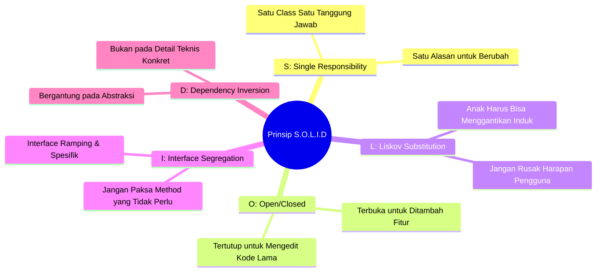

# 💎 Modul 12: Prinsip S.O.L.I.D untuk Pemula

Selamat datang di Modul 12! Jika 4 Pilar OOP (Encapsulation, Inheritance, Polymorphism, Abstraction) adalah **batu bata** dari pemrograman berorientasi objek, maka **Prinsip S.O.L.I.D** adalah **ilmu arsitektur sipil** yang memastikan bangunan kode Anda tidak roboh saat bertambah besar.

Konsep ini diperkenalkan oleh Robert C. Martin ("Uncle Bob") pada awal tahun 2000-an dan telah menjadi standar baku bagi developer profesional di seluruh dunia. 

Banyak pemula merasa minder dengan singkatan SOLID karena penjelasannya sering kali penuh jargon akademis yang rumit. Di modul ini, kita akan membedah kelima prinsip tersebut menggunakan **analogi kehidupan sehari-hari yang sangat ramah awam**!

---

## 🎯 Target Pembelajaran
Setelah menyelesaikan modul ini, Anda akan mampu:
1. Memahami esensi dari masing-masing huruf dalam singkatan **S-O-L-I-D**.
2. Mengidentifikasi "kode busuk" (*code smell*) yang melanggar prinsip desain.
3. Melakukan *refactoring* dari kode kaku menjadi arsitektur modular yang tahan uji.
4. Mengetahui kapan harus menerapkan SOLID dan kapan harus waspada terhadap bahaya *over-engineering*.

---

## 🧭 Peta Singkat S.O.L.I.D



---

## 🧩 1. [S] - Single Responsibility Principle (SRP)
> *"A class should have one, and only one, reason to change."*  
> (Sebuah class hanya boleh memiliki satu tugas utama, dan hanya satu alasan untuk diubah).

### 🍳 Analogi Ramah Awam:
Pernahkah Anda melihat pisau lipat *Swiss Army* yang memiliki 50 bilah sekaligus (ada pisau, gunting kuku, pembuka botol, gergaji, senter, sendok)?  
* Saat dipakai memotong daging, pisaunya tidak nyaman.
* Jika gunting kukunya patah, seluruh pisau lipat harus dibongkar dan Anda kehilangan alat lainnya.
* Di restoran bintang lima, koki memiliki **pisau daging khusus**, **pisau roti khusus**, dan **pisau buah khusus**. Masing-masing memiliki satu spesialisasi sempurna.

### ❌ Pelanggaran SRP (Class Rakus / God Object):
```python
# KODE BURUK: Class ini mengerjakan SEMUA hal!
class KelolaPesanan:
    def hitung_total(self): pass        # 1. Logika Keuangan
    def simpan_ke_database(self): pass  # 2. Logika Database
    def kirim_email_invoice(self): pass # 3. Logika Notifikasi
```
Jika format email berganti, kita mengedit class ini. Jika database migrasi dari MySQL ke PostgreSQL, kita mengedit class ini lagi. Class ini terlalu rentan rusak!

### ✅ Solusi SRP (Pemisahan Tanggung Jawab):
Pecah menjadi 3 class spesialis yang independen:
1. `Pesanan`: Hanya mengurus data barang dan hitung total harga.
2. `PesananRepository`: Hanya mengurus simpan/baca database.
3. `EmailInvoiceNotifier`: Hanya mengurus pengiriman email.

---

## 🚪 2. [O] - Open/Closed Principle (OCP)
> *"Software entities should be open for extension, but closed for modification."*  
> (Perangkat lunak harus terbuka untuk penambahan fitur baru, tetapi tertutup dari pengubahan kode yang sudah berjalan aman).

### 🔌 Analogi Ramah Awam:
Lihatlah **port USB** di laptop Anda.  
Ketika perusahaan teknologi menciptakan mouse baru atau keyboard mekanikal baru dengan lampu RGB, apakah Anda harus **membongkar casing laptop dan menyolder ulang motherboard laptop Anda?**  
Tentu tidak! Laptop Anda **tertutup dari modifikasi mesin dalam**, tetapi **terbuka untuk ekstensi perangkat baru** melalui colokan standar USB.

### ❌ Pelanggaran OCP (Rantai if-elif yang Menyeramkan):
```python
class KalkulatorDiskon:
    def hitung(self, tipe_user, nominal):
        if tipe_user == "REGULER":
            return nominal * 0.05
        elif tipe_user == "VIP":
            return nominal * 0.15
        elif tipe_user == "SUPER_VIP":  # Setiap ada promo baru,
            return nominal * 0.25      # kita WAJIB mengubah kode lama ini!
```
Setiap kali ada tipe membership baru, Anda harus mengotak-atik file yang sudah stabil di produksi. Risiko menimbulkan bug pada pelanggan lama sangat tinggi!

### ✅ Solusi OCP (Gunakan Polimorfisme / Abstraksi):
Buat antarmuka dasar, lalu buat class baru untuk setiap jenis diskon:
```python
class StrategiDiskon(ABC):
    @abstractmethod
    def hitung_diskon(self, nominal: int) -> int: pass

class DiskonReguler(StrategiDiskon):
    def hitung_diskon(self, nominal: int) -> int: return int(nominal * 0.05)

class DiskonVIP(StrategiDiskon):
    def hitung_diskon(self, nominal: int) -> int: return int(nominal * 0.15)

# Ingin diskon baru? CUKUP BUAT CLASS BARU tanpa menyentuh satu huruf pun kode lama!
class DiskonFlashSale(StrategiDiskon):
    def hitung_diskon(self, nominal: int) -> int: return int(nominal * 0.50)
```

---

## 🦆 3. [L] - Liskov Substitution Principle (LSP)
> *"Subtypes must be substitutable for their base types without altering the correctness of the program."*  
> (Objek anak harus bisa menggantikan posisi objek induknya tanpa membuat program error atau bertingkah aneh).

Prinsip ini dicetuskan oleh ilmuwan komputer wanita legendaris, Barbara Liskov.

### 🛁 Analogi Ramah Awam:
*"Jika sesuatu terlihat seperti bebek dan bersuara seperti bebek, tetapi butuh baterai agar bisa berbunyi... Anda salah memilih class induk!"*  
Bayangkan ada fungsi `mandikan_bebek(bebek)`. Jika Anda memasukkan `BebekHidup`, fungsi berjalan lancar. Tetapi jika Anda memasukkan `BebekKaretBaterai`, bebeknya konslet dan meledak! Subclass tidak boleh merusak ekspektasi perilaku yang dijanjikan oleh class induk.

### ❌ Pelanggaran LSP (Kasus Burung & Burung Unta):
```python
class Burung:
    def terbang(self):
        print("Mengepakkan sayap dan terbang tinggi di angkasa!")

class BurungUnta(Burung):
    def terbang(self):
        # 💥 Burung Unta tidak bisa terbang! 
        raise NotImplementedError("Burung unta tidak bisa terbang!")
```
Jika ada fungsi `def terbangkan_semua_burung(daftar_burung):`, aplikasi akan *crash* saat giliran burung unta tiba!

### ✅ Solusi LSP:
Jangan paksakan method `terbang()` di induk tertinggi jika tidak semua burung bisa terbang:
* Class `Burung`: Memiliki method `bersuara()` dan `berjalan()`.
* Class `BurungBisaTerbang(Burung)`: Menambahkan method `terbang()`.
* `Merpati` mewarisi `BurungBisaTerbang`.
* `BurungUnta` dan `Penguin` mewarisi `Burung` biasa.

---

## ✂️ 4. [I] - Interface Segregation Principle (ISP)
> *"Clients should not be forced to depend upon interfaces that they do not use."*  
> (Jangan paksa sebuah class mengimplementasikan fungsi-fungsi yang sebenarnya tidak ia butuhkan).

### 🍽️ Analogi Ramah Awam:
Bayangkan Anda pergi ke warung makan dan memesan menu vegetarian. Tetapi kasir berkata: *"Di sini tidak bisa beli sayur saja. Anda wajib membayar paket komplit yang mencakup steak daging sapi wagyu dan susu murni!"*  
Anda dipaksa membayar dan menerima makanan yang tidak Anda makan. Jauh lebih baik jika warung menyediakan **menu terpisah yang ramping**.

### ❌ Pelanggaran ISP (Interface Raksasa yang Gemuk):
```python
class PekerjaInterface(ABC):
    @abstractmethod
    def koding_aplikasi(self): pass
    @abstractmethod
    def desain_antarmuka(self): pass
    @abstractmethod
    def hitung_laporan_keuangan(self): pass
```
Jika kita membuat class `Programmer`: dia dipaksa mengimplementasikan `hitung_laporan_keuangan()` yang sama sekali bukan tugasnya!

### ✅ Solusi ISP:
Pecah interface raksasa menjadi antarmuka-antarmuka kecil yang spesifik:
* `BisaKoding(ABC)` $\rightarrow$ method: `tulis_kode()`
* `BisaDesain(ABC)` $\rightarrow$ method: `buat_mockup()`
* `BisaAkuntansi(ABC)` $\rightarrow$ method: `audit_buku_kas()`

Sebuah class bisa mewarisi beberapa interface kecil sesuai keahlian aslinya!

---

## 🔌 5. [D] - Dependency Inversion Principle (DIP)
> *"High-level modules should not depend on low-level modules. Both should depend on abstractions."*  
> (Modul tingkat tinggi tidak boleh bergantung langsung pada modul teknis tingkat rendah. Keduanya harus bergantung pada abstraksi/kontrak).

### 💡 Analogi Ramah Awam:
Perhatikan **colokan stopkontak listrik di dinding kamar Anda**.  
Apakah lampu tidur atau charger laptop Anda disolder langsung dengan kawat mati ke kabel tiang listrik PLN di pinggir jalan? Tentu tidak!  
* PLN menyediakan antarmuka standar: **Stopkontak 2 lubang 220V (Abstraksi)**.
* Lampu Anda memasang colokan standar 2 kaki.
* Anda bisa mengganti lampu meja dengan kipas angin kapan saja tanpa perlu memanggil teknisi PLN untuk membongkar kabel jalanan!

### ❌ Pelanggaran DIP (Ketergantungan Kaku pada Database Spesifik):
```python
class DatabaseMySQL:
    def simpan_data(self, data):
        print("Menyimpan ke MySQL...")

class LayananCheckout:
    def __init__(self):
        # ⚠️ Sangat kaku! LayananCheckout terikat mati pada MySQL!
        self.db = DatabaseMySQL()
```
Jika suatu hari kantor ingin migrasi ke MongoDB atau PostgreSQL, Anda terpaksa merombak kode `LayananCheckout`.

### ✅ Solusi DIP (Dependency Injection lewat Abstraksi):
```python
class DatabaseInterface(ABC):
    @abstractmethod
    def simpan(self, data): pass

class MySQLDatabase(DatabaseInterface):
    def simpan(self, data): print("Simpan ke MySQL")

class MongoDatabase(DatabaseInterface):
    def simpan(self, data): print("Simpan ke MongoDB")

class LayananCheckout:
    # Menerima database apapun ASAL mematuhi DatabaseInterface!
    def __init__(self, db: DatabaseInterface):
        self.db = db
```

---

## ⚠️ 6. Awas Jebakan Pemula! (Common Pitfalls)

### ❌ Jebakan 1: *Over-Engineering* (Mabuk Abstraksi)
Banyak pemula yang baru belajar SOLID langsung membuat 20 interface dan 30 file class hanya untuk membuat program kalkulator 2 angka!  
*Ingat:* **SOLID adalah obat untuk mengobati kompleksitas, bukan tujuan akhir**. Terapkan SOLID ketika sistem Anda mulai berkembang atau sering mengalami perubahan kebutuhan bisnis.

### ❌ Jebakan 2: SRP yang Terlalu Ekstrem
Memecah kode hingga setiap fungsi 2 baris ditaruh di file class terpisah justru akan membuat kode sulit dibaca (*fragmentation nightmare*). Kelompokkan tanggung jawab berdasarkan alasan perubahan logika bisnis, bukan jumlah baris.

### ❌ Jebakan 3: Mengira DIP Sama dengan Dependency Injection (DI)
Banyak pemula menyamakan DIP dan DI:
* **Dependency Inversion Principle (DIP)** adalah **prinsip arsitektur** (aturan filosofis tingkat tinggi: *"Bergantunglah pada abstraksi, bukan detail konkret"*).
* **Dependency Injection (DI)** adalah **teknik / cara implementasi** untuk mewujudkan prinsip tersebut (yaitu menyuntikkan objek lewat parameter constructor `__init__(self, service)`). DI adalah kendaraan untuk mencapai DIP.

### ❌ Jebakan 4: Mengabaikan Kontrak Interface di Bahasa Dinamis
Karena Python bersifat dinamis (*duck typing*), pemula sering malas membuat class `ABC`. Akibatnya:
* Tidak ada panduan jelas method apa saja yang wajib ada bagi developer lain.
* Error baru meledak saat program sudah berjalan di server (*runtime crash*).
* Gunakanlah `abc.ABC` atau `typing.Protocol` untuk mendefinisikan kontrak ISP secara tegas.

### ❌ Jebakan 5: Kapan Boleh Tidak Menggunakan SOLID?
Jika Anda sedang membuat skrip otomatisasi satu kali pakai (*one-off migration script*), eksperimen data science cepat di Jupyter Notebook, atau prototipe hackathon 1 hari: Anda **tidak perlu** menerapkan SOLID secara ketat!  
Gunakan prinsip **YAGNI (You Aren't Gonna Need It)**. Terapkan SOLID ketika kode tersebut akan dipelihara oleh tim, memiliki aturan bisnis jangka panjang, atau sering mengalami perubahan kebutuhan (*evolving production software*).

---

## 🧠 7. Kuis Uji Pemahaman

1. **Huruf apa dalam S.O.L.I.D yang dilanggar jika kita memiliki fungsi kalkulasi diskon dengan 10 blok `elif` yang harus terus diedit setiap kali ada jenis diskon baru?**
<details>
<summary>👁️ Lihat Jawaban</summary>
<strong>Prinsip 'O' (Open/Closed Principle)</strong>. Kode tersebut tidak 'tertutup dari modifikasi' karena setiap penambahan jenis diskon baru memaksa kita mengotak-atik file lama yang sudah berjalan.
</details>

2. **Apa tanda utama terjadinya pelanggaran Liskov Substitution Principle (LSP)?**
<details>
<summary>👁️ Lihat Jawaban</summary>
Ketika sebuah class anak (subclass) menolak method warisan dari induknya dengan cara melempar <code>raise NotImplementedError</code> atau membiarkan method tersebut kosong (pass) karena tidak sanggup menjalankan janji perilaku dari induk.
</details>

3. **Bagaimana cara menerapkan Dependency Inversion Principle (DIP) dalam constructor class di Python?**
<details>
<summary>👁️ Lihat Jawaban</summary>
Dengan menerapkan pola <strong>Dependency Injection</strong>: constructor menerima objek ketergantungan (misal: koneksi database atau pengirim notifikasi) lewat parameter fungsi yang bertipe interface/abstraksi, daripada membuat objek konkretnya di dalam constructor itu sendiri.
</details>

4. **Apa manfaat utama mematuhi Interface Segregation Principle (ISP) bagi pengembang perangkat lunak?**
<details>
<summary>👁️ Lihat Jawaban</summary>
Mencegah terjadinya <i>fat/bloated interface</i> (antarmuka gemuk). Class turunan hanya perlu mengimplementasikan method-method yang benar-benar relevan dengan peran aslinya, sehingga kode menjadi lebih ramping, minim efek samping, dan tidak dipaksa menyediakan implementasi kosong/dummy.
</details>

---

## 📂 Berkas Praktik pada Modul Ini
Silakan pelajari dan jalankan berkas-berkas berikut secara bertahap:
1. [`01_srp_ocp_lsp.py`](file:///c:/Users/anton/vibecoding/OOP/04_hero_level/modul_12_solid_principles/01_srp_ocp_lsp.py): Praktik mendalam 3 pilar pertama (SRP, OCP, LSP) dengan contoh kasir dan burung.
2. [`02_isp_dip.py`](file:///c:/Users/anton/vibecoding/OOP/04_hero_level/modul_12_solid_principles/02_isp_dip.py): Praktik antarmuka ramping (ISP) dan Dependency Injection (DIP) pada sistem checkout multi-database.
3. [`03_latihan_mandiri.py`](file:///c:/Users/anton/vibecoding/OOP/04_hero_level/modul_12_solid_principles/03_latihan_mandiri.py): Lembar kerja refactoring sistem "God Object" e-commerce yang melanggar SOLID.
4. [`04_solusi_latihan.py`](file:///c:/Users/anton/vibecoding/OOP/04_hero_level/modul_12_solid_principles/04_solusi_latihan.py): Kunci jawaban resmi hasil refactoring elegan standar industri.
