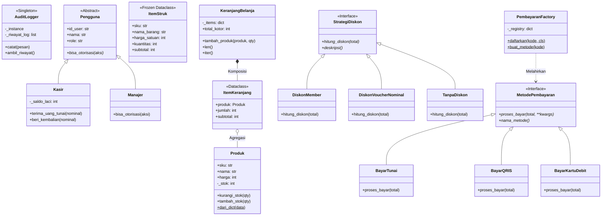
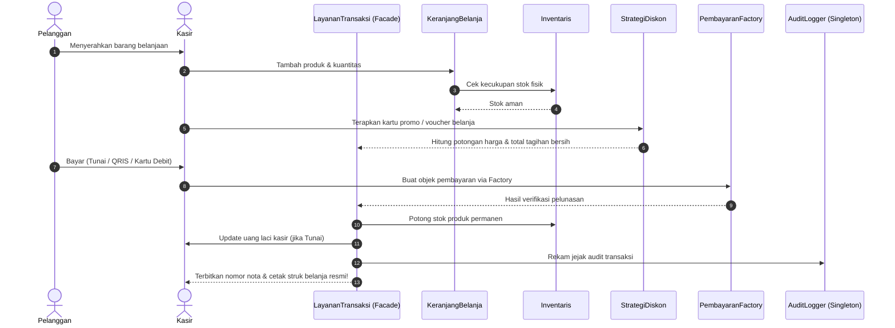

# 🏆 Modul 14 (Capstone Project): SmartPOS System
> **Panduan Lengkap Proyek Akhir Berstandar Industri: Menyatukan Seluruh 13 Modul OOP ke dalam Sistem Kasir Retail Nyata**

Selamat datang di **Puncak Pembelajaran (Hero Level)**!  
Di modul pamungkas ini, kita tidak lagi belajar konsep sepotong-sepotong. Kita akan menyatukan **seluruh 13 modul** yang telah kita pelajari sebelumnya ke dalam satu aplikasi nyata berskala industri: **SmartPOS (Smart Point of Sale & Retail Management System)**.

---

## 🛠️ Peralatan yang Kita Butuhkan (Menggunakan Apa?)

Agar Anda tidak bingung harus menyiapkan perangkat lunak apa saja di komputer Anda, proyek ini dirancang agar **sangat ringan dan mudah dijalankan**:

| Peralatan | Kebutuhan | Fungsi & Keterangan |
| :--- | :---: | :--- |
| **Python 3.8+** | **Wajib** | Mesin eksekusi program. Cek versi di terminal dengan perintah `python --version`. |
| **Terminal / CLI** | **Wajib** | PowerShell, Command Prompt (CMD), atau Terminal macOS/Linux untuk menjalankan aplikasi kasir. |
| **Code Editor** | **Opsional** | VS Code, PyCharm, atau editor teks favorit Anda untuk membaca dan membedah struktur file `.py`. |
| **Library Pihak Ketiga (`pip`)** | **SAMA SEKALI TIDAK PERLU** | **Zero Dependency!** Seluruh kode 100% menggunakan Python Standard Library (`dataclasses`, `abc`, `typing`, `datetime`, `random`, `sys`). Anda tidak perlu `pip install` apa pun! |

---

## 🧭 Apa yang Harus Kita Lakukan? (Panduan Aksi Pembaca)

Sebagai pembelajar, Anda memiliki **4 Pilihan Aksi** yang dapat dicoba secara bertahap sesuai kebutuhan:

```
┌────────────────────────────────────────────────────────────────────────┐
│                        4 PILIHAN AKSI PEMBELAJAR                       │
├────────────────────────────────────────────────────────────────────────┤
│ 🚀 Aksi 1: Demonstrasi Cepat (Simulasi Otomatis 1-Klik)               │
│ 🧪 Aksi 2: Pengujian Mesin (Menjalankan Automated Unit Tests)          │
│ 🛒 Aksi 3: Menjadi Kasir Sungguhan (Mode Interaktif Meja Kasir)        │
│ 🔍 Aksi 4: Tur Kode Terpandu & Lab Modifikasi Mandiri                  │
└────────────────────────────────────────────────────────────────────────┘
```

---

### 🚀 Aksi 1: Demonstrasi Cepat (Simulasi Otomatis 1-Klik)
> **Tujuan:** Melihat seluruh sistem POS bekerja secara otomatis di terminal tanpa perlu mengetik input keyboard manual.

Buka terminal di folder utama repositori, lalu jalankan perintah berikut:

```bash
python 05_capstone_project/smart_pos_system/app.py --demo
```
*(Atau jika terminal Anda sudah berada di dalam folder `smart_pos_system`, cukup ketik: `python app.py --demo`)*

**Apa yang terjadi dalam simulasi ini?**
1. Sistem otomatis mendaftarkan 6 produk katalog ke dalam `Inventaris`.
2. Kasir `Siti Rahma` membuka transaksi dan memasukkan 2x Kopi Susu Aren dan 1x Croissant Butter ke `KeranjangBelanja`.
3. Menerapkan strategi diskon **Member Gold (15%)**.
4. Memproses pembayaran tunai Rp 60.000 via `PembayaranFactory`.
5. Menghitung kembalian, memotong stok fisik barang, memperbarui saldo laci kasir, mencatat log audit ke `AuditLogger` (Singleton), dan **mencetak struk belanja resmi di layar terminal Anda!**

---

### 🧪 Aksi 2: Pengujian Mesin (Automated Test Suite)
> **Tujuan:** Membuktikan bahwa seluruh prinsip OOP, pembatasan stok, keamanan kasir, formula diskon, dan kekebalan struk bekerja 100% tanpa celah bug.

Jalankan perintah pengujian berikut di terminal Anda:

```bash
python 05_capstone_project/smart_pos_system/test_pos.py
```

**8 Skenario Pengujian yang Diuji Otomatis:**
* `[1/8]` Proteksi stok & penolakan stok habis (`StokHabisError`).
* `[2/8]` Hirarki otorisasi pengguna (`Kasir` vs `Manajer`) & perlindungan laci uang (`SaldoKasirKurangError`).
* `[3/8]` Kekebalan data struk belanja dari manipulasi ilegal (`@dataclass(frozen=True)`).
* `[4/8]` Akurasi perhitungan diskon Strategy Pattern (Reguler, Member Gold/Silver, Voucher Flat).
* `[5/8]` Validasi Factory Method & pembayaran (Tunai, QRIS, validasi PIN Debit 6 digit).
* `[6/8]` Pengujian Dunder Methods pada keranjang (`len(keranjang)` dan iterasi `for item in keranjang`).
* `[7/8]` Eksekusi checkout terintegrasi via Facade `LayananTransaksi`.
* `[8/8]` Keutuhan objek tunggal `AuditLogger` (Singleton identity `logger1 is logger2`).

---

### 🛒 Aksi 3: Menjadi Kasir Sungguhan (Mode Interaktif)
> **Tujuan:** Memainkan simulasi kasir retail modern secara langsung layaknya di minimarket.

Jalankan aplikasi dalam mode interaktif penuh:

```bash
python 05_capstone_project/smart_pos_system/app.py
```

Anda akan disambut oleh Menu Utama terminal:
```text
=================================================================
          SMART POS RETAIL - TOKO SERBA ADA MODERN
 Kasir Aktif : Siti Rahma (KSR-101) | Saldo Laci: Rp 250,000
=================================================================
1. 📋 Lihat Katalog Produk & Stok Etalase
2. 🛒 Buka Meja Kasir / Transaksi Belanja Baru
3. 📦 Manajemen Inventaris Toko (Restock Barang)
4. 💵 Informasi Laci Kasir & Jejak Audit Logger
5. 🚪 Keluar dari Aplikasi
```

**Panduan Mencoba Menu:**
* **Ketik `1`:** Melihat daftar SKU, nama barang, harga, dan sisa stok fisik di etalase.
* **Ketik `2`:** Masuk ke meja transaksi. Ketik SKU (misal `KOP-02`), masukkan jumlah beli, ketik `SELESAI`, pilih jenis diskon (Member Gold/Silver/Voucher), pilih metode bayar (Tunai/QRIS/Debit), dan struk belanja Anda langsung tercetak!
* **Ketik `3`:** Menambah stok barang yang menipis (*Restock*).
* **Ketik `4`:** Memeriksa saldo uang tunai yang terkumpul di laci kasir serta memeriksa seluruh catatan peristiwa di `AuditLogger`.

---

## 🗺️ Peta Integrasi: Menghubungkan Modul 0 hingga 13

Lihat bagaimana setiap modul yang pernah Anda pelajari memiliki peran vital dalam membangun **SmartPOS**:

| Modul | Konsep OOP | Implementasi Nyata di SmartPOS |
| :---: | :--- | :--- |
| **0 & 1** | Class, Object, `__init__`, `self` | Objek dasar `Produk`, `Kasir`, dan `ItemKeranjang`. |
| **2** | Instance vs Class Attribute | Format otomatis nomor nota transaksi global (`cls._counter_invoice`). |
| **3** | Encapsulation & `@property` | Proteksi stok tidak boleh minus (`_stok`) & proteksi saldo laci kasir (`_saldo_laci`). |
| **4** | Inheritance, `super()`, Mixins | Hirarki pengguna: `Pengguna(ABC)` $\rightarrow$ `Kasir` & `Manajer`. |
| **5** | Polymorphism & Duck Typing | Berbagai saluran pembayaran memproses tagihan dengan antarmuka seragam. |
| **6** | Abstraction (`abc.ABC`) | Kontrak baku gerbang pembayaran (`MetodePembayaran(ABC)`). |
| **7** | Dunder Methods (`__len__`, `__iter__`, dll.) | Menghitung fisik barang keranjang (`len(keranjang)`), iterasi belanja (`for item in keranjang`). |
| **8** | `@classmethod` & `@staticmethod` | Alternative constructor `Produk.dari_dict()` untuk muat data katalog. |
| **9** | Custom Exception Hierarchy | Hirarki error: `StokHabisError`, `SaldoKasirKurangError`, `PembayaranGagalError`. |
| **10** | `@dataclass` & Type Hinting | Data struk ringkas yang *immutable* (`@dataclass(frozen=True)` `ItemStruk`). |
| **11** | Object Relationships | Komposisi: `KeranjangBelanja` memiliki `ItemKeranjang`; Agregasi: `Toko` menampung `Kasir`. |
| **12** | Prinsip S.O.L.I.D | Struktur kode modular, SRP, OCP, LSP, ISP, dan DIP. |
| **13** | Design Patterns Populer | **Singleton** (`AuditLogger`), **Strategy** (`StrategiDiskon`), **Factory** (`PembayaranFactory`). |

---

## 🏛️ Arsitektur Sistem (Class Diagram)



---

## 🔄 Alur Transaksi Kasir (Sequence Diagram)



---

## 📁 Struktur & Tur Kode Terpandu

Proyek SmartPOS dipecah menjadi 7 berkas modular yang saling bekerja sama secara harmonis:

```text
smart_pos_system/
├── MATERI.md             <-- Panduan arsitektur & panduan aksi pembaca (File Ini)
├── exceptions.py         <-- Kamus hirarki error kustom (Modul 9)
├── models.py             <-- Entitas inti: Produk, Pengguna, Kasir, Dataclass Struk
├── strategies.py         <-- Algoritma promo diskon (Strategy Pattern - Modul 13)
├── payments.py           <-- Factory & saluran bayar (Factory Pattern - Modul 6 & 13)
├── services.py           <-- Singleton Logger, Inventaris, Keranjang, Facade Checkout
├── app.py                <-- Aplikasi Kasir Interaktif CLI & Runner Demo
└── test_pos.py           <-- Pengujian otomatis menyeluruh (Automated Unit Tests)
```

### Urutan Terbaik Membaca Kode (Bagi Pembelajar):
1. **[`exceptions.py`](file:///c:/Users/anton/vibecoding/OOP/05_capstone_project/smart_pos_system/exceptions.py)**: Mulai dari memahami jenis-jenis kesalahan bisnis yang bisa terjadi (`StokHabisError`, `SaldoKasirKurangError`, dll.).
2. **[`models.py`](file:///c:/Users/anton/vibecoding/OOP/05_capstone_project/smart_pos_system/models.py)**: Pahami bagaimana `Produk` melindungi stoknya (`@property`), bagaimana `Kasir` mengelola laci uang, dan bagaimana `@dataclass(frozen=True)` mengunci struk belanja.
3. **[`strategies.py`](file:///c:/Users/anton/vibecoding/OOP/05_capstone_project/smart_pos_system/strategies.py)**: Lihat bagaimana berbagai formula promo diskon dipisahkan ke dalam class mandiri tanpa rantai `if-else`.
4. **[`payments.py`](file:///c:/Users/anton/vibecoding/OOP/05_capstone_project/smart_pos_system/payments.py)**: Pelajari pembuatan objek pembayaran yang dinamis menggunakan *Dictionary Registry* pada `PembayaranFactory`.
5. **[`services.py`](file:///c:/Users/anton/vibecoding/OOP/05_capstone_project/smart_pos_system/services.py)**: Pelajari `AuditLogger` (Singleton), `KeranjangBelanja` (Dunder `__len__` & `__iter__`), dan `LayananTransaksi` sebagai *Facade* yang merajut seluruh alur checkout.
6. **[`app.py`](file:///c:/Users/anton/vibecoding/OOP/05_capstone_project/smart_pos_system/app.py)**: Amati bagaimana antarmuka terminal berinteraksi dengan layanan bisnis tanpa mencampurkan logika bisnis ke dalam kode tampilan.
7. **[`test_pos.py`](file:///c:/Users/anton/vibecoding/OOP/05_capstone_project/smart_pos_system/test_pos.py)**: Pelajari cara menulis pengujian otomatis berbasis `assert` standar Python.

---

## 🧪 Lab Modifikasi Mandiri: 3 Misi Pengembang (*Hands-on Challenges*)

Untuk menguji apakah Anda sudah benar-benar menguasai arsitektur OOP, cobalah selesaikan 3 misi berikut dengan mengedit kode SmartPOS:

### 🎯 Misi 1: Menambahkan Saluran Pembayaran Baru (ShopeePay / GoPay)
Supermarket ingin menambah metode pembayaran digital baru bernama `BayarShopeePay`.
* **Tugas Anda:** Buka [`payments.py`](file:///c:/Users/anton/vibecoding/OOP/05_capstone_project/smart_pos_system/payments.py), buat class `BayarShopeePay` yang mewarisi `MetodePembayaran`, lalu daftarkan ke `PembayaranFactory` dengan kode `"shopeepay"`.
* **Keajaiban OCP:** Anda sama sekali tidak perlu mengubah kode di `services.py` atau `models.py`!

<details>
<summary>👁️ Lihat Petunjuk & Kunci Jawaban Misi 1</summary>

Tambahkan kode ini di akhir `payments.py`:
```python
class BayarShopeePay(MetodePembayaran):
    def proses_bayar(self, total_tagihan: int, **kwargs) -> Dict[str, Any]:
        return {
            "status": "SUKSES",
            "metode": self.nama_metode(),
            "total_tagihan": total_tagihan,
            "uang_diterima": total_tagihan,
            "kembalian": 0,
            "referensi": "SHOPEEPAY-INSTANT"
        }

    def nama_metode(self) -> str:
        return "ShopeePay Digital Wallet"

# Daftarkan ke Factory:
PembayaranFactory.daftarkan("shopeepay", BayarShopeePay)
```
</details>

---

### 🎯 Misi 2: Menambahkan Strategi Promo Baru (Diskon Cashback)
Departemen marketing ingin promo baru: `DiskonCashback(persen: float)` di mana pembeli tetap bayar penuh (diskon Rp 0), tetapi mendapatkan voucher cashback untuk kunjungan berikutnya.
* **Tugas Anda:** Buka [`strategies.py`](file:///c:/Users/anton/vibecoding/OOP/05_capstone_project/smart_pos_system/strategies.py), buat class `DiskonCashback(StrategiDiskon)`.

<details>
<summary>👁️ Lihat Petunjuk & Kunci Jawaban Misi 2</summary>

```python
class DiskonCashback(StrategiDiskon):
    def __init__(self, persen: float = 10.0):
        self.persen = persen

    def hitung_diskon(self, total_kotor: int) -> int:
        return 0  # Potongan langsung tetap 0

    def deskripsi(self) -> str:
        return f"Promo Cashback {int(self.persen)}% (Poin Masa Depan)"
```
</details>

---

### 🎯 Misi 3: Menambahkan Pajak Restoran / PPN (PB1 10%)
Toko diwajibkan memungut pajak PB1 sebesar 10% dari total belanja bersih.
* **Tugas Anda:** Modifikasi method `hitung_rincian()` di dalam `KeranjangBelanja` ([`services.py`](file:///c:/Users/anton/vibecoding/OOP/05_capstone_project/smart_pos_system/services.py)) agar menghitung nilai `pajak = int(total_setelah_diskon * 0.10)` dan menambahkan nilai tersebut ke `total_bersih`.

---

## ⚠️ Awas 5 Jebakan Pemula dalam Proyek Skala Besar!

1. **Jebakan 1: Cyclic Import (Saling Impor Antar File)**  
   * *Masalah*: File `A.py` mengimpor `B.py`, lalu `B.py` mengimpor `A.py`. Program akan langsung crash dengan error `ImportError: cannot import name ...`.  
   * *Solusi*: Selalu pisahkan entitas data murni (`models.py`) dan exception (`exceptions.py`) ke file yang berdiri sendiri dan tidak pernah mengimpor layer logika bisnis di atasnya.
2. **Jebakan 2: Validasi Stok di Tempat yang Salah**  
   * Jangan validasi stok di antarmuka kasir (`app.py`). Validasi stok **WAJIB** dibungkus rapat di dalam method class `Produk.kurangi_stok()` menggunakan encapsulation agar tidak ada celah kode yang bisa membobolnya menjadi minus.
3. **Jebakan 3: Melupakan Penjaga Singleton `_terinisialisasi`**  
   * Jika Singleton Logger dipanggil berulang kali di berbagai modul, pastikan `__init__` tidak mereset list log yang sudah terkumpul.
4. **Jebakan 4: Pelanggaran Law of Demeter pada Keranjang Belanja**  
   * Hindari kode seperti: `keranjang.daftar_item[0].produk.kategori.nama_induk`. Bungkus aksi ke dalam method delegasi yang rapi seperti `keranjang.total_kotor`.
5. **Jebakan 5: Mencampur Kode Tampilan (`print`) ke dalam Model Bisnis**  
   * Class `Produk`, `KeranjangBelanja`, dan `LayananTransaksi` tidak boleh melakukan `input()` dari keyboard pengguna. Biarkan layer UI (`app.py`) yang menangani interaksi pengguna, sementara layer model hanya fokus mengolah data.

---

## 🧠 Kuis Uji Pemahaman Arsitektur

1. **Mengapa `ItemStruk` lebih cocok menggunakan `@dataclass(frozen=True)` daripada class biasa?**
<details>
<summary>👁️ Lihat Jawaban</summary>
Karena struk belanja adalah dokumen bukti hukum dan akuntansi yang tidak boleh diubah-ubah nilainya (immutable) setelah transaksi dicetak. <code>frozen=True</code> secara otomatis mencegah siapapun memodifikasi harga, nama barang, atau kuantitas setelah struk terbit.
</details>

2. **Jika bulan depan supermarket ingin menambah metode pembayaran baru (misal: ShopeePay atau GoPay), bagian kode mana saja yang perlu diubah?**
<details>
<summary>👁️ Lihat Jawaban</summary>
Berkat <strong>Factory Method Pattern</strong> dan prinsip <strong>Open/Closed Principle (OCP)</strong>, kita HANYA perlu membuat satu class baru yang mewarisi <code>MetodePembayaran</code> lalu mendaftarkannya ke <code>PembayaranFactory</code>. Kode keranjang, kalkulasi harga, dan sistem kasir sama sekali tidak perlu diubah!
</details>

3. **Mengapa relasi antara `KeranjangBelanja` dan `ItemKeranjang` disebut Komposisi (*Composition*), sedangkan dengan `Produk` disebut Agregasi (*Aggregation*)?**
<details>
<summary>👁️ Lihat Jawaban</summary>
Jika transaksi kasir dibatalkan dan <code>KeranjangBelanja</code> dihapus dari RAM, maka seluruh <code>ItemKeranjang</code> di dalamnya ikut lenyap (hubungan hidup-mati = Komposisi). Namun, fisik <code>Produk</code> di etalase toko tetap ada dan tidak ikut terhapus dari katalog toko (hubungan lepas = Agregasi).
</details>

4. **Apa bahaya fatal jika kita memotong stok produk di memori sebelum proses pembayaran selesai diverifikasi?**
<details>
<summary>👁️ Lihat Jawaban</summary>
Jika pembayaran gagal (misal: PIN kartu salah atau uang tunai kurang), stok toko sudah terlanjur berkurang di sistem padahal barang tidak jadi dibeli! Di dalam <code>LayananTransaksi.proses_checkout()</code>, pembayaran selalu diverifikasi terlebih dahulu sebelum stok dipotong secara permanen.
</details>

5. **Mengapa `AuditLogger` harus mengimplementasikan Singleton Pattern?**
<details>
<summary>👁️ Lihat Jawaban</summary>
Agar seluruh catatan peristiwa dari berbagai file (transaksi kasir, restock barang, error sistem) berkumpul di satu buku catatan yang sama di memori RAM, bukan tersebar ke objek-objek logger yang berbeda-beda.
</details>

---

## 🎯 Status Selesai & Checklist Kelulusan Capstone

Selamat! Jika Anda sudah berhasil menjalankan simulasi demo, menjalankan unit test, dan mencoba mode kasir interaktif, Anda telah resmi menamatkan **seluruh kurikulum Python OOP (From Zero to Hero)**! 🎓

Tandai capaian akhir Anda pada checklist berikut:

- [x] Memahami arsitektur modular skala enterprise (pemisahan models, services, strategies, payments)
- [x] Berhasil menjalankan simulasi demo otomatis (`python app.py --demo`)
- [x] Berhasil memverifikasi seluruh 8 unit & integration test (`python test_pos.py`)
- [x] Berhasil mencoba mode kasir interaktif penuh (`python app.py`)
- [x] Memahami integrasi 4 pilar OOP, Dunder methods, Custom Exceptions, Dataclasses, SOLID, dan Design Patterns dalam satu proyek utuh

Sekarang Anda bukan lagi sekadar pembuat kode pemula—Anda telah memiliki pola pikir **Perancang Arsitektur Perangkat Lunak Berorientasi Objek (Software Architect)** yang siap membangun proyek skala industri! 🚀
