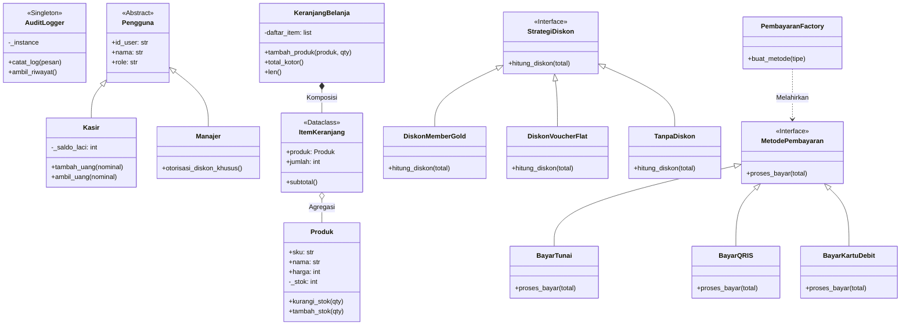
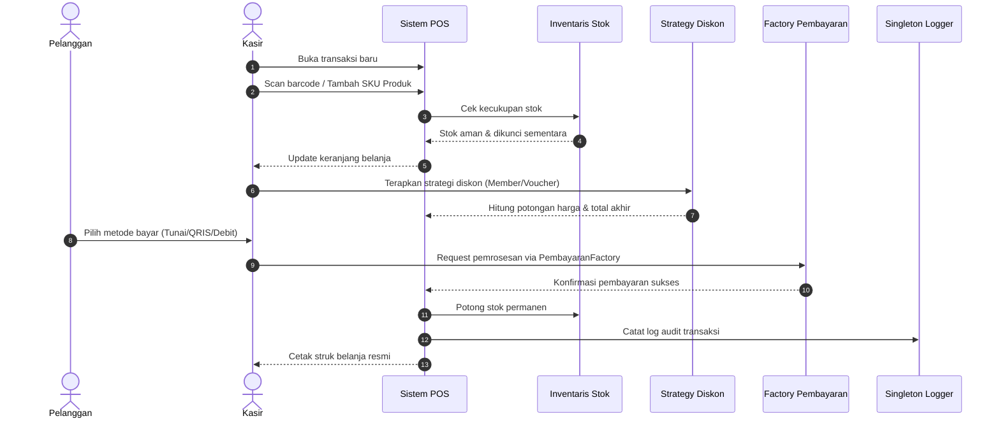

# 🏆 Modul 14 (Capstone Project): SmartPOS System

Selamat datang di **Puncak Pembelajaran (Hero Level)**!  
Di modul pamungkas ini, kita tidak lagi belajar konsep sepotong-sepotong. Kita akan menyatukan **seluruh 13 modul** yang telah kita pelajari sebelumnya ke dalam satu aplikasi nyata berskala industri: **SmartPOS (Smart Point of Sale & Retail Management System)**.

---

## 🎯 Mengapa Proyek Kasir (POS)?
Sistem Kasir Retail adalah miniatur sempurna dari arsitektur perangkat lunak enterprise modern. Di dalam aplikasi kasir terdapat:
* **Entitas Data**: Barang, Stok, Harga, Kasir, Pelanggan.
* **Keamanan Finansial**: Pencegahan manipulasi uang kas dan stok minus.
* **Fleksibilitas Bisnis**: Berbagai macam promo diskon dan berbagai saluran pembayaran.
* **Audit & Pelaporan**: Jejak audit riwayat transaksi yang tidak boleh hilang.

---

## 🗺️ Peta Integrasi: Menghubungkan Modul 0 hingga 13

Lihat bagaimana setiap modul yang pernah Anda pelajari memiliki peran vital dalam membangun **SmartPOS**:

| Modul | Konsep OOP | Implementasi Nyata di SmartPOS |
| :---: | :--- | :--- |
| **0 & 1** | Class, Object, `__init__`, `self` | Objek dasar `Produk`, `Kasir`, dan `ItemKeranjang`. |
| **2** | Instance vs Class Attribute | Format otomatis nomor struk invoice global (`cls._counter_struk`). |
| **3** | Encapsulation & `@property` | Proteksi stok tidak boleh minus & saldo laci kasir terlindungi. |
| **4** | Inheritance, `super()`, Mixins | Hirarki pengguna: `Pengguna` $\rightarrow$ `Kasir` & `Manajer`. |
| **5** | Polymorphism & Duck Typing | Berbagai jenis pencetak struk (`StrukTerminal`, `StrukFile`). |
| **6** | Abstraction (`abc.ABC`) | Kontrak baku gerbang pembayaran (`MetodePembayaran(ABC)`). |
| **7** | Dunder Methods (`__len__`, `__str__`, serialization) | Menghitung jumlah item keranjang (`len(keranjang)`), ekspor ke Dictionary/JSON. |
| **8** | `@classmethod` & `@staticmethod` | Pembuatan produk dari format data JSON (`Produk.dari_dict()`) & format rupiah. |
| **9** | Custom Exception Hierarchy | Hirarki error: `StokHabisError`, `SaldoKurangError`, `AksesDitolakError`. |
| **10** | `@dataclass` & Type Hinting | Data struk ringkas yang *immutable* (`@dataclass(frozen=True)` `ItemStruk`). |
| **11** | Object Relationships | Komposisi: `Keranjang` memiliki `ItemKeranjang`; Agregasi: `Toko` menampung `Kasir`. |
| **12** | Prinsip S.O.L.I.D | Struktur kode modular, SRP, OCP, LSP, ISP, dan DIP. |
| **13** | Design Patterns Populer | **Singleton** (`AuditLogger`), **Strategy** (`StrategiDiskon`), **Factory** (`PembayaranFactory`). |

---

## 🏛️ Arsitektur Sistem (Class Diagram)



---

## 🔄 Alur Transaksi Kasir (Transaction Flow)



---

## 📁 Struktur Berkas Proyek SmartPOS

Proyek ini disusun rapi ke dalam berkas-berkas modular:

```text
smart_pos_system/
├── MATERI.md             <-- Panduan arsitektur & konsep (Dokumen ini)
├── exceptions.py         <-- Hirarki error kustom (Modul 9)
├── models.py             <-- Entitas Produk, Pengguna, Dataclass Struk (Modul 1, 2, 3, 4, 10)
├── strategies.py         <-- Strategy Pattern diskon belanja (Modul 13)
├── payments.py           <-- Factory & Interface Pembayaran (Modul 6, 13)
├── services.py           <-- Inventaris, Keranjang, Singleton Logger (Modul 7, 11, 13)
├── app.py                <-- Aplikasi Kasir Interaktif CLI (Siap dijalankan)
└── test_pos.py           <-- Pengujian otomatis menyeluruh (Automated Unit Tests)
```

---

## ⚠️ Awas Jebakan Pemula dalam Proyek Skala Besar!

1. **Jebakan 1: Cyclic Import (Saling Impor Antar File)**  
   * *Masalah*: File `A.py` mengimpor `B.py`, lalu `B.py` mengimpor `A.py`. Program akan langsung crash dengan error `ImportError: cannot import name ...`.  
   * *Solusi*: Selalu pisahkan entitas data murni (`models.py`) dan exception (`exceptions.py`) ke file yang berdiri sendiri dan tidak mengimpor layer logika bisnis di atasnya.
2. **Jebakan 2: Stok Minus Akibat Validasi di Tempat yang Salah**  
   * Jangan validasi stok di antarmuka kasir (UI). Validasi stok HARUS dibungkus rapat di dalam method class `Produk.kurangi_stok()` menggunakan encapsulation agar tidak ada kode nakal yang bisa membobolnya.
3. **Jebakan 3: Melupakan Penjaga Singleton `_terinisialisasi`**  
   * Jika Singleton Logger dipanggil berulang kali di berbagai modul, pastikan `__init__` tidak mereset list log yang sudah terkumpul.

---

## 🧠 Kuis Uji Pemahaman Arsitektur

1. **Mengapa `ItemStruk` lebih cocok menggunakan `@dataclass(frozen=True)` daripada class biasa?**
<details>
<summary>👁️ Lihat Jawaban</summary>
Karena struk belanja adalah dokumen bukti hukum dan akuntansi yang tidak boleh diubah-ubah nilainya (immutable) setelah transaksi dicetak. <code>frozen=True</code> secara otomatis mencegah siapapun memodifikasi harga, nama barang, atau kuantitas setelah struk terbit.
</details>

2. **Jika bulan depan supermarket ingin menambah metode pembayaran baru (misal: ShopeePay atau GoPay), bagian kode mana saja yang perlu diubah?**
<details>
<summary>👁️ Lihat Jawaban</summary>
Berkat <strong>Factory Method Pattern</strong> dan prinsip <strong>Open/Closed Principle (OCP)</strong>, kita HANYA perlu membuat satu class baru yang mewarisi <code>MetodePembayaran</code> lalu mendaftarkannya ke <code>PembayaranFactory</code>. Kode keranjang, kalkulasi harga, dan sistem kasir sama sekali tidak perlu diubah!
</details>

3. **Mengapa relasi antara `KeranjangBelanja` dan `ItemKeranjang` disebut Komposisi (*Composition*), sedangkan dengan `Produk` disebut Agregasi (*Aggregation*)?**
<details>
<summary>👁️ Lihat Jawaban</summary>
Jika transaksi kasir dibatalkan dan <code>KeranjangBelanja</code> dihapus dari RAM, maka seluruh <code>ItemKeranjang</code> di dalamnya ikut lenyap (hubungan hidup-mati = Komposisi). Namun, fisik <code>Produk</code> di etalase toko tetap ada dan tidak ikut terhapus dari katalog toko (hubungan lepas = Agregasi).
</details>

---

## 🚀 Langkah Selanjutnya
Silakan buka direktori [`smart_pos_system/`](file:///c:/Users/anton/vibecoding/OOP/05_capstone_project/smart_pos_system/) dan jalankan aplikasi kasirnya!
